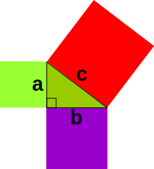
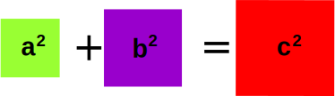

# Labeled Statements

<!-- TOC -->

- [1. Labeled statement in String class](#1-labeled-statement-in-string-class)
- [2. Example](#2-example)
  - [2.1. Pythagoras' Theorem](#21-pythagoras-theorem)
- [3. Reference](#3-reference)

<!-- /TOC -->

Java **labeled blocks** are logically similar to to `goto` statements in C/C++.

A label is any valid java identifier followed by a **colon**. e.g. `outer:`, `inner:`, `inner123:`, `inner_:` etc.

## 1. Labeled statement in String class

How many times, we have been told that “goto” statements are evil. I myself have read about this so called **evil** through many respected authors of our time. But, if you look at the sourcecode of `String.java`, and read the sourcecode of `public String toLowerCase(Locale locale)` method, you will something like this:

```java
scan :
    for (firstUpper = 0 ; firstUpper &lt; count; ) 
    {
        char c = value[offset+firstUpper];
        if ((c >= Character.MIN_HIGH_SURROGATE) &amp;&amp;
            (c <= Character.MAX_HIGH_SURROGATE)) {
            int supplChar = codePointAt(firstUpper);
            if (supplChar != Character.toLowerCase(supplChar)) {
                break scan;
            }
            firstUpper += Character.charCount(supplChar);
        } else {
            if (c != Character.toLowerCase(c)) {
                break scan;
            }
            firstUpper++;
        }
    }
    return this;
}
```

What is this “scan:”. This is the labeled block which we are going to learn about today. Well, they always told us not to use them and used it in perhaps most used class in JDK distribution. 🙂

接下来，我试着去理解一下这段代码。首先，我做的一件事情，就是“简化代码”

```java
public String toLowerCase(Locale locale) {

    final int len = value.length;

    /* Now check if there are any characters that need to be changed. */
    scan: {
        for (int firstUpper = 0 ; firstUpper < len; firstUpper++;) {
            char c = value[firstUpper];
            if (c != Character.toLowerCase(c)) {
                break scan;
            }
        }
        return this;
    }
    ...
}
```

这个方法（`toLowerCase`）的作用是转换成小写字母。但是，让我们想一种情况：如果原来的字符串中包含的都是小写字母，那就不需要进行转换了，直接返回就好了。而这段代码的作用就是“检查原来的字符串是否全部为由小写字母组成”。

## 2. Example

### 2.1. Pythagoras' Theorem





```java
public static void discovering_pythagorean_triples() {
    int MAX_NUM = 100;
    String format = "(%s,%s,%s): %s + %s = %s";
    int count = 0;
    OUTER:
    for (int i = 1; i < MAX_NUM; i++) {
        for (int j = i + 1; j < MAX_NUM; j++) {
            for (int k = j + 1; k < MAX_NUM; k++) {
                int power_i = i * i;
                int power_j = j * j;
                int power_k = k * k;
                if ((power_i + power_j) == (power_k)) {
                    String line = String.format(format, i, j, k, power_i, power_j, power_k);
                    System.out.println(line);
                    count++;
                    if (count == 5) break OUTER;
                }
            }
        }
    }
    System.out.println("count = " + count);
}
```

## 3. Reference

- [Labeled Statements in Java](https://howtodoinjava.com/java/basics/labeled-statements-in-java/)
- []()
