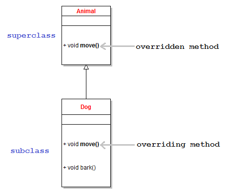
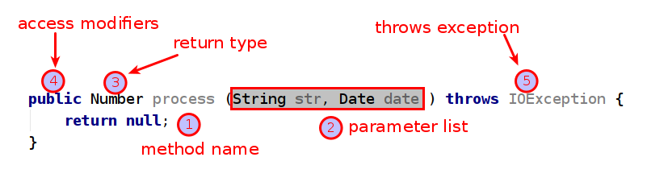

# Overriding Rules

<!-- TOC -->

- [1. What is Overriding in Java?](#1-what-is-overriding-in-java)
- [2. Methods for Overriden](#2-methods-for-overriden)
  - [2.1. What methods can be overridden?](#21-what-methods-can-be-overridden)
  - [2.2. What methods that cannot be overridden?](#22-what-methods-that-cannot-be-overridden)
- [3. Requirements for the overriding method](#3-requirements-for-the-overriding-method)
  - [3.1. same argument list](#31-same-argument-list)
  - [3.2. return type](#32-return-type)
  - [3.3. access modifier](#33-access-modifier)
  - [3.4. throw exceptions](#34-throw-exceptions)
- [4. Other Related](#4-other-related)
  - [4.1. Overriding and constructor](#41-overriding-and-constructor)
  - [4.2. Overriding and abstract method](#42-overriding-and-abstract-method)
  - [4.3. Overriding and static method](#43-overriding-and-static-method)
  - [4.4. Overriding and synchronized method](#44-overriding-and-synchronized-method)
  - [4.5. Overriding and strictfp method](#45-overriding-and-strictfp-method)
- [5. Reference](#5-reference)

<!-- /TOC -->

**Overriding** is a core concept in Object Oriented Programming as well as in Java programming language. Understanding what it is, how it works and what the rules are is very important for every Java programmer. Therefore, this tutorial compiles a comprehensive summary of concepts and rules regarding overriding in the Java language, with easy-to-understand code examples.

## 1. What is Overriding in Java?

**Overriding** refers to the ability of a subclass to re-implement an instance method inherited from a superclass. Let’s take a look at the following class diagram:



Here, `Animal` is the superclass and `Dog` is the subclass, thus `Dog` inherits the `move()` method from `Animal`. However, `Dog` re-implements the `move()` method for some behaviors which are specific to only dogs (like walk and run). In this respect:

- The Dog’s `move()` method is called the **overriding method**.
- The Animal’s `move()` method is called the **overridden method**.

Basically, **the overriding method** must have **same name** and **same arguments list** as **the overridden one**. It’s the way by which a subtype extends or re-defines behaviors of its supertype.

## 2. Methods for Overriden

### 2.1. What methods can be overridden?

- Rule #1:Only inherited methods can be overridden.

Because overriding happens when a subclass re-implements a method inherited from a superclass, so **only inherited methods can be overridden**, that’s straightforward. That means only methods declared with the following access modifiers: `public`, `protected` and `default` (in the same package) can be overridden. That also means `private` methods cannot be overridden.

In the following example, the `Dog` and `Animal` classes are in different packages. Thus **it isn’t considered an overriding** because the `Dog` class does not inherit the `Animal`’s `move()` method:

```java
package net.codejava.animal;

public class Animal {

    void move() {
        // Animal moving code...
    }
}
```

```java
package net.codejava.dog;

import net.codejava.core.animal.Animal;

public class Dog extends Animal {

    void move() {
        // Dog moving code...
    }
}
```

Here, the Dog’s `move()` method is just **a new method**, not an overriding one.

In the following example, the Animal’s `move()` method is `private`, so the Dog’s `move()` method is just **a new method**, not an overriding one:

```java
public class Animal {

    private void move() {
        // Animal moving code...
    }
}
```

```java
public class Dog extends Animal {

    public void move() {
        // Dog moving code...
    }
}
```

### 2.2. What methods that cannot be overridden?

- Rule #2:Final and static methods cannot be overridden.

A `final` method means that it cannot be re-implemented by a subclass, thus it cannot be overridden.

In case of `static` method, because a static method is available to all instances of the superclass and its subclasses, so it’s not permissible to re-implement the static method in a particular subclass.

## 3. Requirements for the overriding method



### 3.1. same argument list

- Rule #3: The overriding method must have same argument list.

### 3.2. return type

- Rule #4: The overriding method must have same return type (or subtype).

Suppose that a `Food` class has a subclass called `DogFood`, the following example shows a correct overriding:

```java
public class Animal {

    protected Food seekFood() {
        // animal seeking for food code...
        return new Food();
    }
}
```

```java
public class Dog extends Animal {

    protected Food seekFood() {
        // dog seeking for food code...
        return new DogFood();
    }
}
```

It’s possible to modify the return type of the Dog’s `seekFood()` method to `DogFood` - a subclass of `Food`, as shown below:

```java
protected DogFood seekFood() {
    // dog seeking for food code...
    return new DogFood();
}
```

That’s perfectly a legal overriding, and the return type of Dog’s `seekFood()` method is known as **covariant return type**.

### 3.3. access modifier

- Rule #5: The overriding method must not have more restrictive access modifier.

This rule can be understood as follows:

- If the overridden method is has `default` access, then the overriding one must be `default`, `protected` or `public`.
- If the overridden method is `protected`, then the overriding one must be `protected` or `public`.
- If the overridden method is `public`, then the overriding one must be only `public`.

In other words, **the overriding method may have less restrictive (more relaxed) access modifier**.

### 3.4. throw exceptions

- Rule #6: The overriding method must not throw new or broader checked exceptions.

In other words, the overriding method may throw fewer or narrower checked exceptions, or any unchecked exceptions.

Consider the following superclass - `Animal`:

```java
public class Animal {

    protected void move() throws IOException {
        // animal moving code...
    }
}
```

The following subclass - `Dog`, correctly overrides the `move()` method because the `FileNotFoundException` is a subclass of the `IOException`:

```java
public class Dog extends Animal {

    protected void move() throws FileNotFoundException {
        // Dog moving code...
    }
}
```

The following example shows **an illegal overriding** attempt because the `InterruptedException` is a new and checked exception:

```java
public class Dog extends Animal {

    protected void move() throws IOException, InterruptedException {
        // Dog moving code...
    }
}
```

However, the following example is **a legal overriding**, because the `IllegalArgumentException` is an unchecked exception:

```java
public class Dog extends Animal {

    protected void move() throws IOException, IllegalArgumentException {
        // Dog moving code...
    }
}
```

And in the example below, the Dog class **won’t compile** because its `move()` method throws `Exception` which is superclass (broader) of the `IOException`:

```java
public class Dog extends Animal {

    protected void move() throws Exception {
        // Dog moving code...
    }
}
```

## 4. Other Related

### 4.1. Overriding and constructor

- Rule #8:Constructors cannot be overridden.

Because constructors are not methods and a subclass’ constructor cannot have same name as a superclass’ one, so there’s nothing relates between constructors and overriding.

### 4.2. Overriding and abstract method

- Rule #9: Abstract methods must be overridden by the first concrete (non-abstract) subclass.

### 4.3. Overriding and static method

- Rule #10: A `static` method in a subclass may hide another static one in a superclass, and that’s called **hiding**.

Consider the following example:

```java
public class Animal {
    static void sleep() {
        System.out.println("Animal sleeps");
    }
}
```

```java
public class Dog extends Animal {

    static void sleep() {
        System.out.println("Dog sleeps");
    }
}
```

Here, the `sleep()` method of the `Dog` class is said to **hide** the `sleep()` method of the `Animal` class. When a static method of the superclass is hidden, it requires the subclass to use a fully qualified class name of the superclass to invoke the hidden method, as shown in the `doSomething()` method of the `Dog` class below:

```java
public class Dog extends Animal {

    static void sleep() {
        System.out.println("Dog sleeps");
    }

    void doSomething() {
        sleep();    // this calls the hiding method

        // because the Animal's sleep() is hidden, it requires to use
        // a fully qualified class name to access it.
        Animal.sleep();
    }
}
```

Note that the rules of overriding are still applied for the hiding method.

### 4.4. Overriding and synchronized method

- Rule #11: The `synchronized` modifier has no effect on the rules of overriding.

The `synchronized` modifier relates to the acquiring and releasing of a monitor object in multi-threaded context, therefore it has totally no effect on the rules of overriding. That means a `synchronized` method can override a **non-synchronized** one and vice versa.

### 4.5. Overriding and strictfp method

- Rule #12: The `strictfp` modifier has no effect on the rules of overriding.

That means the presence or absence of the `strictfp` modifier has absolutely no effect on the rules of overriding: it’s possible that a FP-strict method can override a non-FP-strict one and vice-versa.

## 5. Reference

- [12 Rules of Overriding in Java You Should Know](https://www.codejava.net/java-core/the-java-language/12-rules-of-overriding-in-java-you-should-know)
