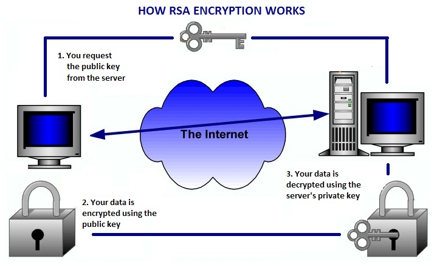
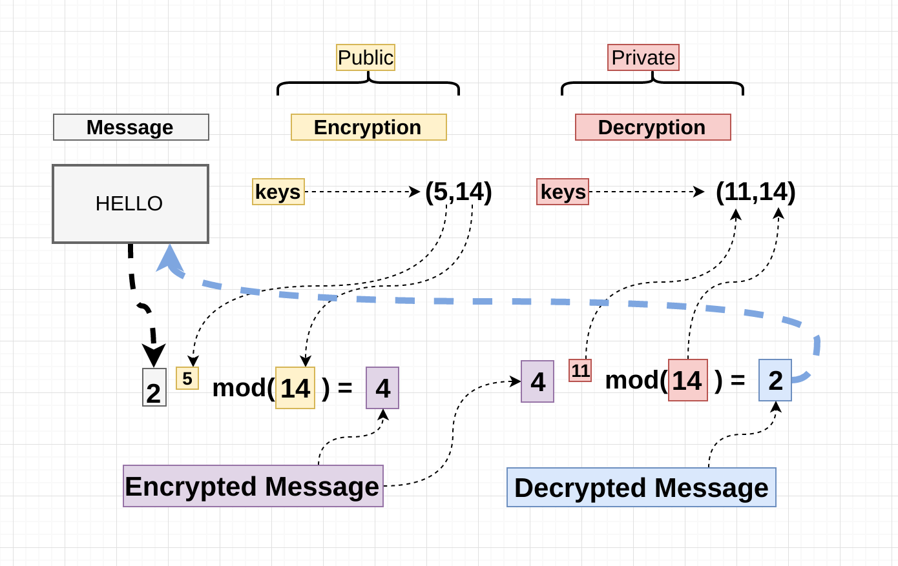

# RSA (cryptosystem)

URL:

- https://www.pagedon.com/rsa-explained-simply/programming
- https://simple.wikipedia.org/wiki/RSA_algorithm
- https://hackernoon.com/how-does-rsa-work-f44918df914b

## 1. Introduction

### 1.1 RSA的名字由来

The acronym **RSA** is made of the initial letters of the surnames(姓，姓氏) of **Ron Rivest**, **Adi Shamir**, and **Leonard Adleman**, who first publicly described the algorithm in 1978. 

> RSA名字的由来


### 1.2 RSA是非对称加密

`RSA` (**Rivest-Shamir-Adleman**) is one of the first **public-key cryptosystems** and is widely used for **secure data transmission**. 

> RSA属于public-key cryptosystems，用于安全数据传输。

**Public-key cryptography**, also known as **asymmetric cryptography**, uses two different but **mathematically linked keys**, one **public** and one **private**.

> **public-key cryptosystems**，也就是非对称加密  
> 使用public key和private key

The **public key** can be shared with everyone, whereas the **private key** must be kept secret.



In RSA cryptography, both the **public** and the **private** keys can encrypt a message; **the opposite key** from **the one** used to encrypt a message is used to decrypt it.


### 1.3 RSA的原理（因数分解）

In **RSA**, this asymmetry is based on the practical difficulty of the **factorization** of the **product** of **two large prime numbers**, the "factoring problem". 

> RSA所基于的原理： factoring problem  

Multiplying these two numbers is easy, but determining the original prime numbers from the total -- **factoring** -- is considered infeasible(不可行的；不可实行的) due to the time it would take even using today’s super computers.

> 将两个较大的prime numbers相乘，比较容易；  
> 将一个较大数进行质数分解，则比较困难，即使是使用超级计算机，也是很难做到的。

**The public and the private key-generation algorithm** is the most complex part of **RSA** cryptography.

> RSA中最复杂的部分是生成public key和private key

**Two large prime numbers**, `p` and `q`, are generated using the Rabin-Miller primality test algorithm. **A modulus**(系数；绝对值) `n` is calculated by multiplying `p` and `q`. This number is used by both the public and private keys and provides the link between them. Its length, usually expressed in **bits**, is called **the key length**. **The public key** consists of the modulus `n`, and a **public exponent**, `e`, which is normally set at `65537`, as it's a prime number that is not too large. The `e` figure doesn't have to be a secretly selected prime number as the public key is shared with everyone. **The private key** consists of the modulus `n` and the **private exponent** `d`, which is calculated using the Extended Euclidean algorithm to find the multiplicative inverse with respect to the **totient** of `n`.

> modulus n.【数,物】模数；系数；绝对值；率  
> In number theory, the **totient** of a positive integer is **the number of integers** smaller than `n` which are coprime to `n` (they share no factors except `1`).  


## 2. RSA Encryption Explained Simply

RSA encryption is an Algorithm understood by so few people and used by many. 



### 2.1 GENERATE A PUBLIC KEY AND PRIVATE KEY

First we need our keys: 

- **A private key** that the server will keep and 
- **a public key** that can be given away.

We need 2 prime numbers: `p` and `q`, 

```txt
p = 29
q = 31
```

Calculate `n = p * q = 29 * 31 = 899`

Calculate `t = (p -1) * (q – 1) = (29 – 1) * (31 – 1) = 840`

Choose a prime number `e`. `e` needs to be relatively prime to `t`. (`t` cannot be divisible by `e`) Lets pick `11`

We now need to find a `d`. We will use the formula: `d * e [=] 1 mod t`

This means (`d * 11) / t` will give us a remainder of `1`. You have to find the inverse of `e mod t`. Since we are dealing with such small numbers we can sort of guess our `d` until we find one that works.

`(611 * 11) = 6721`, `6721 / 840 = 8` with remainder `1`. So `611` works! We now have everything we need for a **private** and **public** key to encrypt our data.

- `p` – 29
- `q` – 31
- `n` – 899
- `t` – 840
- `e` – 11
- `d` – 611

Our **public key** becomes `n` and `e`.
Our **private key** becomes `n` and `d`.


### 2.2 ENCRYPTING OUR MESSAGE

We give our **public key** numbers to the person that wants to send us their message. They will encrypt the message with the formula:

<code>C = M<sup>e</sup> mod n</code>

Parameter Explained: 

- `C` is our encrypted Message. 
- `M` is our original message.

So if we took the letter ‘`w`’ whose ascii value is `119`.

`C = 11911 mod 899 = 595` 

We now send `595` to the server.


### 2.3 DECRYPTING OUR MESSAGE

In order to decrypt the message we need our **private key**: `n` and `d`.

> Keep in mind we don’t give anybody our private key.

We use the formula <code>M = C<sup>d</sup> mod n</code>, 
so `M = 595611 mod 899 = 119`. 
`M = 119` whose character value is ‘`w`’ our original message!


## 3. Read More: 

- How to do [fast modular exponentiation](http://www.pagedon.com/modular-exponentiation/cprogramming/)
