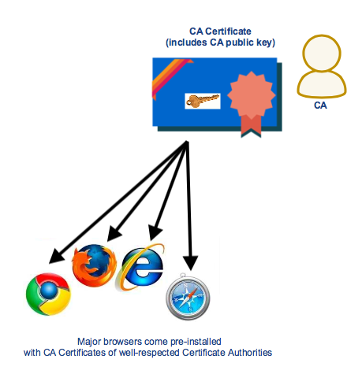
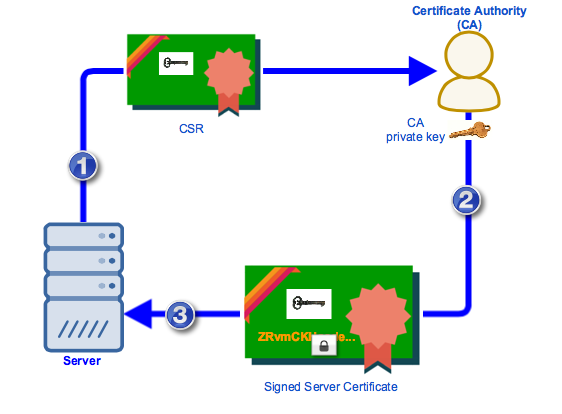
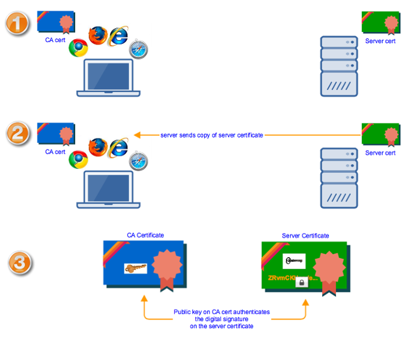

# Certificates

URL： https://www.jscape.com/blog/an-overview-of-how-digital-certificates-work

## 1. Server Certificates 

There are **different types of digital certificates** but we'll be focusing on the **server certificates** used in secure web servers since they're the most common. 

> 这段理解出2个意思：  
> （1）存在不同类型的数字证书（digital certificates）  
> （2）最常见的是server certificates（这是我们要关注的类型）

You come across these kinds of certificates on the Web everyday, particularly when you connect to sites that support HTTPS. A CA-signed **server certificate** is the kind of certificate you would need to deploy if you don't want Web browsers to display a warning when users attempt to connect to your secure file transfer server.

> 这段理解出3个意思：  
> （1） server certificate是带有CA签名的证书  
> （2） 需要将server certificate部署到Web Server上  
> （3） 如果没有部署正确的server certificate，则会出现下面的警告  

## 2. CA Certificates - the certificates in your browser

Before any major Web browser like `Chrome`, `Firefox`, `Safari` or `Internet Explorer` connects to your server via HTTPS, it already has in its possession **a set of certificates** that can be used to verify **the digital signature** that will be found on your server certificate. These certificates are called **CA (Certificate Authority) certificates**. On these certificates is a copy of the public key of the CA who might issue (sign) your server certificate. 

> 这段理解出3个意思：  
> （1）主流浏览器(Chrome/FireFox/IE)，默认情况下，就预安装了一批证书，这些证书称之为 CA certificate。  
> （2）每一个CA certificate上都包含了CA的public key  
> （3）CA在对server certificate进行签名的时候，使用的是CA的private key

**CA certificates** of widely accepted **certificate authorities** are already pre-installed on popular Web browsers, so we don't worry about installing them anymore. **The private keys** that are used for signing the **server certificates** already have their corresponding **public key pairs** on our users' Web browsers. 

在Chrome的`Settings->Advanced->Privacy and security->Manage certificates`可以查看**CA证书**。

## 3. Generating CSRs and having your cert signed by a CA

You usually start by **generating a private key / public key pair**, followed by a **CSR (Certificate Signing Request)**. The **CSR** would contain a copy of **the public key** and **some basic information about the subject**. Once you've generated a CSR, you would then **submit that CSR to a CA**. 

这段显示的3个步骤：

- (1) generating a **private key / public key pair**
- (2) **CSR** (**Certificate Signing Request**)
    - the public key
    - some basic information about the subject
- (3) submit that **CSR** to a **CA**

Once the **CA** is done signing the cert, the **CA** would then return **the cert** to you and you would then import **that signed certificate** to your server. 

**The signed cert** would contain some basic information regarding **the subject (your site)**, **the issuer**, **the validity period**, **the public key (of your site)**, and **a digital signature of the cert signed using the CA's private key**. 

The signed cert包含以下信息：

- the subject (your site) 证书接收者
- the issuer 证书颁发者
- the validity period 证书的有效期
- the public key (of your site) 两个key pair中的公钥
- **a digital signature** of **the cert** signed using **the CA's private key**

In summary,

- (1) You generate a **private key / public key pair** and submit a **CSR** to a **Certificate Authority**. The contents of the CSR will form part of the final server certificate.
- (2) The **CA** verifies whether the information on the certificate is correct and then signs it using its **(the CA's) private key**. It then returns **the signed server certificate** to you.
- (3) You import **the signed server certificate** unto(施于) your server.

## 4. Sending of server certificate during SSL Handshake

Before **a browser** and **an HTTPS server** can exchange data over an encrypted connection, they first engage in a process known as the **SSL handshake**. 

> a browser和 HTTPS server之间有一个过程，称之为SSL handshake。

One important part in the **SSL handshake** is the sending of **the server certificate** to **the web browser**. It's here when the Web browser is able to authenticate the identity of the server it's connecting to.

> 在SSL handshake过程中，HTTPS server会将server certificate传送给web browser

As soon as **the browser** receives a copy of **the server certificate**, it checks which **CA** signed the server cert and then retrieves the **CA certificate** of that particular **Certificate Authority**. It then uses **the public key** on that **CA certificate** to verify **the digital signature** on **the server cert**.

> 进行验证的过程：  
> （1） the browser接收到server certificate之后，会从server certificate中读取issuer信息  
> （2） 根据issuer信息，找到browser中预安装的CA certificate  
> （3） 从CA certificate中读取出CA的public key信息
> （4） 使用public key来验证server certificate上的digital signature信息。

Once **the digital signature** has been authenticated, the **browser** and **server** can proceed with the rest of the SSL process. 
