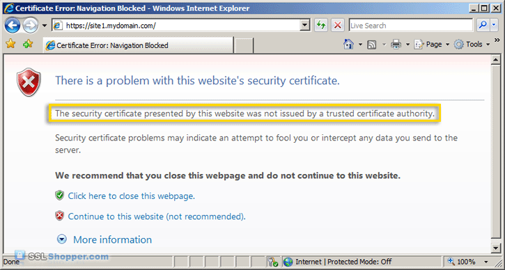

# keytool

https://sites.google.com/site/ddmwsst/create-your-own-certificate-and-ca

- key generate
- keystore
- cert

Java Keytool is a **key** and **certificate** management utility. It stores the **keys** and **certificates** in what is called a **keystore**. 

By default the Java **keystore** is implemented as a **file**. It protects **private keys** with a **password**. Each **certificate** in a Java **keystore** is associated with **a unique alias**. 

When creating a Java **keystore** you will first create the `.jks` file that will initially only contain **the private key**. 

You will then generate a **CSR** and have a **certificate** generated from it. Then you will import the certificate to the keystore including any root certificates. 

Java Keytool also several other functions that allow you to **view the details of a certificate** or **list the certificates contained in a keystore** or **export a certificate**.

## Java Keytool Commands for Creating and Importing

These commands allow you to generate a new Java Keytool **keystore** file, **create a CSR**, and **import certificates**. Any root or intermediate certificates will need to be imported before importing the primary certificate for your domain.

- Generate a Java keystore and key pair

```bash
keytool -genkey -alias mydomain -keyalg RSA -keystore keystore.jks -keysize 2048
```

- Generate a certificate signing request (CSR) for an existing Java keystore

```bash
keytool -certreq -alias mydomain -keystore keystore.jks -file mydomain.csr
```

- Import a root or intermediate CA certificate to an existing Java keystore

```java
keytool -import -trustcacerts -alias root -file Thawte.crt -keystore keystore.jks
```

Import a signed primary certificate to an existing Java keystore
keytool -import -trustcacerts -alias mydomain -file mydomain.crt -keystore keystore.jks

Generate a keystore and self-signed certificate (see How to Create a Self Signed Certificate using Java Keytoolfor more info)
keytool -genkey -keyalg RSA -alias selfsigned -keystore keystore.jks -storepass password -validity 360 -keysize 2048


## set up your own CA using OpenSSL tool

## sign a certificate


You can also use `keytool` to generate a **server certificate**. Because `keytool` does not have the capability to sign a **certificate**, you must use **a 3rd-party certification authority (CA)** in this case.

> 这段理解2个意思：  
> （1） keytool可以生成certificate  
> （2） 但是，keytool不能对certificate进行sign，需要借助于第三方CA。

If a CA certificate already resides in the Java trust store, you do not need to import it into the key store. **The default Java trust store** is the file `jrehome/lib/security/cacerts`. If some or all of the CA certificates are in this file, add the option “`-trustcacerts`” to the command line when you import the signed server certificate. This tells `keytool` to look in the trust store for any CA certificate that is not in the key store being updated.

> 两个概念：  
> （1） CA certificate  
> （2） Java trust store


- key pair
- certificate
    - self signed certificate
    - a trusted third party signed certificate

我不明白，还区分 普通certificate 和 SSL certificate吗？ 又一个相关的问题，http协议，需要有certificate吗？

## self signed certificate

A **self signed certificate** is a certificate that is **signed by itself** rather than **a trusted authority**.

> self signed certificate的定义

Since any attacker can create **a self signed certificate** and launch a man-in-the-middle attack, a user can't know whether they are sending their encrypted information to the server or an attacker. Because of this, you will almost never want to use a self signed certificate on a public Java server that requires anonymous visitors to connect to your site. 

> self signed certificate不好的地方

However, self signed certificates have their place:

> self signed certificate应用场景

- **An Intranet**. When clients only have to go through a local Intranet to get to the server, there is virtually no chance of a man-in-the-middle attack.
- **A Java development server**. There is no need to spend extra cash **buying a trusted certificate** when you are just developing or testing an application.
- **Personal sites with few visitors**. If you have a small personal site that transfers non-critical information, there is very little incentive for someone to attack the connection.

Just keep in mind that visitors will see **a warning** in their browsers (like the one below) when connecting to a server that uses **a self signed certificate** until it is permanently stored in their **certificate store**.



### Generate a Self Signed Certificate using Java Keytool

Run the following command (where validity is the number of days before the certificate will expire):

```bash
keytool -genkey -keyalg RSA -alias selfsigned -keystore keystore.jks -storepass password -validity 360 -keysize 2048
```

> **Never use a self signed certificate** on an e-commerce site or any site that transfers valuable personal information like credit cards, social security numbers, etc.

## a trusted third party signed certificate

An **SSL certificate** serves **two essential purposes**: **distributing the public key** and **verifying the identity of the server** so users know they aren't sending their information to the wrong server. It can only properly verify **the identity of the server** when it is signed by **a trusted third party**.


