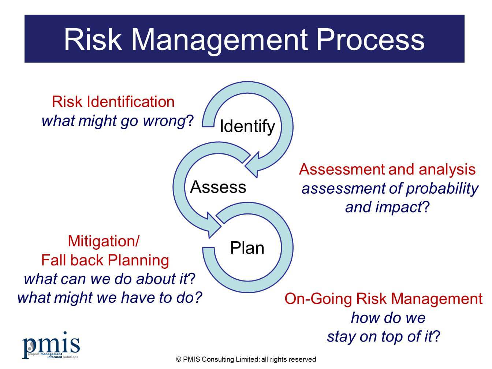

# Exception

<!-- TOC -->

- [1. Risk Management](#1-risk-management)
  - [1.1. What is Risk Management on Projects?](#11-what-is-risk-management-on-projects)
  - [1.2. How to Manage Risk](#12-how-to-manage-risk)
- [2. Risk to Exception](#2-risk-to-exception)

<!-- /TOC -->

## 1. Risk Management

### 1.1. What is Risk Management on Projects?

Project risk management is the process of identifying, analyzing and then responding to any risk that arises over the life cycle of a project to help the project remain on track and meet its goal. Risk management isn’t reactive only; it should be part of the planning process to figure out risk that might happen in the project and how to control that risk if it in fact occurs.

A risk is anything that could potentially impact your project’s timeline, performance or budget. Risks are potentialities, and in a project management context, if they become realities, they then become classified as “issues” that must be addressed. So risk management, then, is the process of identifying, categorizing, prioritizing and planning for risks before they become issues.

Risk management can mean different things on different types of projects. On large-scale projects, risk management strategies might include extensive detailed planning for each risk to ensure mitigation strategies are in place if issues arise. For smaller projects, risk management might mean a simple, prioritized list of high, medium and low priority risks.

### 1.2. How to Manage Risk

To begin with, it’s crucial to start with a clear and precise definition of what your project has been tasked to deliver. In other words, write a very detailed project charter, with your project vision, objectives, scope and deliverables. This way risks can be identified at every stage of the project. Then you’ll want to engage your team early in identifying any and all risks.

## 2. Risk to Exception

要完成一件事情，可能有的人做的多，那么经验可能也相应的多；有的人可能做的少或者没有做过，那么就经验少。从常规的角度来说，对于一件事情，经验多的人成功的机率相对比较大，而经验少的成功的机率比较小。

从常规上来说（应该有例外的情况存在），为什么经验多的人，做事情成功的机率比较大呢？ 其中一部分原因是这样的：因为有经验的人能够对将来要发生的问题有一定程度的“先见之明”，也就是能够预料到未来可能会出现什么样的问题，对将来要发生的问题有所“预期”(expected problems)，能够提前想办法应对处理；相应的，意料之外的问题(unexpected problems)就会相对较少。另外，有些问题，是可以解决的，而另外一些问题在目前是无法解决的，就需要想别的办法或者避而远之。

总结一下就是：

- 问题的严重程度：有些问题是可以解决的，有些问题是解决不了的
- 问题的预测：有些问题是可以意料之中的，有些问题是意料之外的

Java Designer（Java语言设计者）是一个有“较多编程经验”的人，他把“可以解决的问题”（solvable）和“不能解决的问题”（unsolvable）这两个概念“具象化”到**Java语言**中，就是Exception和Error。其中，Exception就是“可以解决且需要解决的问题”，而Error是“无法解决的问题”。

Java Designer（Java语言设计者）把“意料之中的问题”（expected problem）和“意料之外的问题”（unexpected problem）这两个概念“实现”到了**Java编译器**（Compiler）当中。对于expected problem，Java编译器就会进行检查（check），检查什么呢？就是Java编译器会检查programmer写的source code当中有没有对expected problem进行处理呢？举个例子，在读取一个文件内容的时候，很可能磁盘上并没有这个文件，就会出现`FileNotFoundException`，这个时候Java编译器就会检查source code当中有没有处理这个`FileNotFoundException`的相关内容。expected problem需要Java编译器进行检查（check），就成为了Checked Exception；而对于unexpected problem，Java编译器不会进行检查（check），就成为Unchecked Exception。

问题：`FileNotFoundException`是Checked Exception，而`ArithmeticException`是Unchecked Exception，这两种Exception的区分的标准是什么呢？换句话说，就我个人感觉而言，我认为`ArithmeticException`也是在我的“预期范围”之内的，那`ArithmeticException`为什么不是Checked Exception呢？

