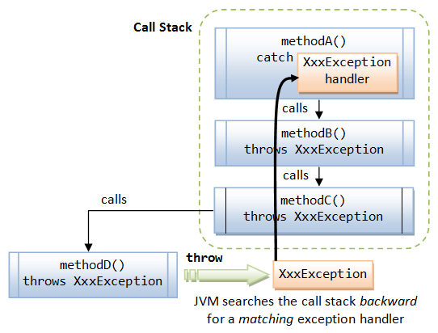

# Exception & Call Stack

<!-- TOC -->

- [1. Method Call Stack](#1-method-call-stack)
- [2. Exception & Call Stack](#2-exception--call-stack)
- [3. Reference](#3-reference)

<!-- /TOC -->

## 1. Method Call Stack

A typical application involves many levels of method calls, which is managed by a so-called **method call stack**. A stack is a last-in-first-out queue. In the following example, `main()` method invokes `methodA()`; `methodA()` calls `methodB()`; `methodB()` calls `methodC()`.

```java
public class MethodCallStackDemo {
   public static void main(String[] args) {
      System.out.println("Enter main()");
      methodA();
      System.out.println("Exit main()");
   }
 
   public static void methodA() {
      System.out.println("Enter methodA()");
      methodB();
      System.out.println("Exit methodA()");
   }
 
   public static void methodB() {
      System.out.println("Enter methodB()");
      methodC();
      System.out.println("Exit methodB()");
   }
 
   public static void methodC() {
      System.out.println("Enter methodC()");
      System.out.println("Exit methodC()");
   }
}
```


## 2. Exception & Call Stack

When an exception occurs inside a Java method, the method creates an `Exception` object and passes the `Exception` object to the JVM (in Java term, the method "throw" an `Exception`). The `Exception` object contains the type of the exception, and the state of the program when the exception occurs. The JVM is responsible for finding an **exception handler** to process the `Exception` object. It searches backward through **the call stack** until it finds a matching exception handler for that particular class of `Exception` object (in Java term, it is called "catch" the `Exception`). **If the JVM cannot find a matching exception handler in all the methods in the call stack, it terminates the program**.

This process is illustrated as follows. Suppose that `methodD()` encounters an abnormal condition and throws a `XxxException` to the JVM. The JVM searches backward through the call stack for a matching exception handler. It finds `methodA()` having a `XxxException` handler and passes the exception object to the handler. Notice that `methodC()` and `methodB()` are required to declare "`throws XxxException`" in their method signatures in order to compile the program.



## 3. Reference

- [Exception & Call Stack](https://www.ntu.edu.sg/home/ehchua/programming/java/J5a_ExceptionAssert.html)
