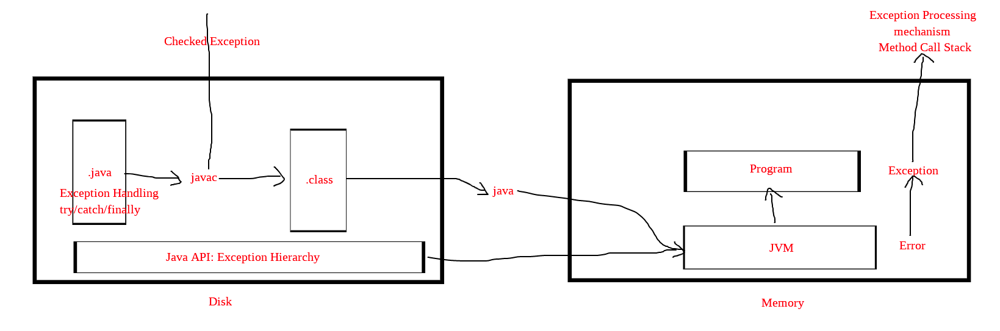

# Mind Map

<!-- TOC -->

- [1. Java](#1-java)
  - [1.1. Four Component](#11-four-component)
  - [1.2. Java API](#12-java-api)
    - [1.2.1. Exception Hierarchy](#121-exception-hierarchy)
    - [1.2.2. Why so many exception classes](#122-why-so-many-exception-classes)
  - [1.3. Java Language](#13-java-language)
    - [1.3.1. Exception Handling](#131-exception-handling)
- [2. Disk](#2-disk)
  - [2.1. `.java` File(programmer)](#21-java-fileprogrammer)
    - [2.1.1. Unchecked Exception](#211-unchecked-exception)
    - [2.1.2. Checked Exception](#212-checked-exception)
  - [2.2. javac](#22-javac)
  - [2.3. `.class` File](#23-class-file)
- [3. Memory](#3-memory)
  - [3.1. Program](#31-program)
    - [3.1.1. Exception](#311-exception)
    - [3.1.2. Method Call Stack](#312-method-call-stack)
    - [3.1.3. Exception Processing Mechanism](#313-exception-processing-mechanism)
  - [3.2. JVM](#32-jvm)
    - [3.2.1. Error](#321-error)

<!-- /TOC -->



## 1. Java

### 1.1. Four Component

Java = JVM + Class File + Java API + Java Language

`.java`文件是Java Language的载体。

```txt
如果有一张图来表示，就更形象了
.java  --> javac --> .class
Java API --> .class
.class --> JVM
```

### 1.2. Java API

#### 1.2.1. Exception Hierarchy


- Throwable
  - Exception
    - RuntimeException
    - Other Exception(Checked Exception)
  - Error

#### 1.2.2. Why so many exception classes

**Errors** are used to represent those conditions which occur outside the application, such as crash of the system.

**Runtime exceptions** are usually occur by fault in the application logic. You can't do anything in these situations. **When runtime exception occur, you have to re-write your program code**. So, these are not checked by compiler. These runtime exceptions will uncover in development, and testing period. Then we have to refactor our code to remove these errors.

**Checked exceptions** are useful when the programmer (you or your co-workers) did everything right, validated the input, ran tests, and all the code is perfect, but the code connects to a third party webservice that may be down ( or a file you were using was deleted by another external process etc ) . The webservice may even be validate before the connection is attempted, but during the data transfer something went wrong.

In that scenario there is nothing that you or your co-workers can do to help it. But still you have to do something and not let the application just die and disappear in the eyes of the user. You use a checked exception for that and handle the exception, what can you do when that happens?, most of the time , just to attempt to log the error, probably save your work ( the app work ) and present a message to the user. ( The site blabla is down, please retry later etc. )

### 1.3. Java Language

#### 1.3.1. Exception Handling

- try
- catch
- finally
- try-with-resource

Errors are used to represent those conditions which occur outside the application, such as crash of the system. Runtime exceptions are usually occur by fault in the application logic. You can't do anything in these situations. When runtime exception occur, you have to re-write your program code. So, these are not checked by compiler. These runtime exceptions will uncover in development, and testing period. Then we have to refactor our code to remove these errors.

## 2. Disk


### 2.1. `.java` File(programmer)


#### 2.1.1. Unchecked Exception

两种方式都是属于可选的。

Unchecked exceptions are used to let the system **fail fast** which is a good thing. **Fail-fast systems** are usually designed to stop normal operation rather than attempt to continue a possibly flawed process.

#### 2.1.2. Checked Exception


When an checked exception occurs, you have to either **catch and handle the exception**, or **tell compiler that you can't handle it by declaring that your method throws that exception**, then the code that uses your method will have to handle that exception (even it also may choose to declare that it throws the exception if it can't handle it).

二者选其一。

第一种：catch and handle

```java
public void test() {
    try {
        //...
    }
    catch(XxxException ex) { // catch exception
        // handle the exception
    }
}
```

第二种：declare exception

```java
public void test()
    throws Exception { // declare exception
    //...
}
```

### 2.2. javac

From a philosophical point of view, **a method call** is a contract to some degree between **the caller** and **the called**. Since **the compiler** enforces the types of parameters that are passed in, it seems symmetrical to let it enforce the types on the way out. That is, **return values** or **exceptions**.

Compiler will check that we have done one of the two things (**catch**, or **declare**). So these are called **Checked exceptions**. But **Errors**, and **Runtime Exceptions** are not checked for by compiler (even though you can choose to catch, or declare, it is not required). So, these two are called **Unchecked exceptions**.

### 2.3. `.class` File

在`.class`当中，处理Exception的bytecode究竟是怎么样存储的。


## 3. Memory

### 3.1. Program

#### 3.1.1. Exception

在进入到Memory（内存）之后，更确切的说是进行JVM之后，Checked Exception和Runtime Exception已经不再重要了，它们都被统一的合并成一个概念，就是Exception。因为无论是Checked Exception和Runtime Exception，在进行处理的时候的逻辑是一样的。

#### 3.1.2. Method Call Stack

#### 3.1.3. Exception Processing Mechanism

### 3.2. JVM

#### 3.2.1. Error
