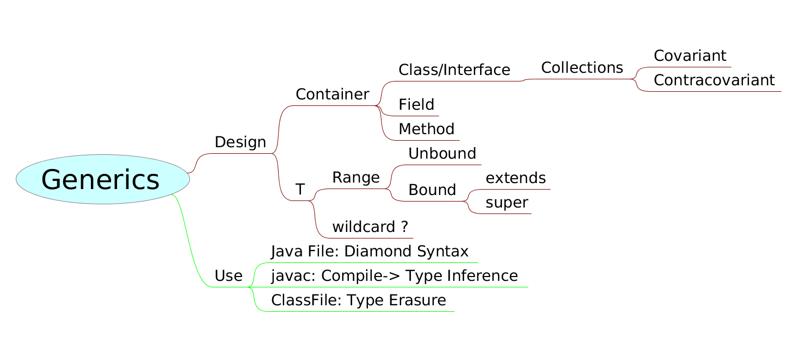

# Generics

**The idea of generics represents the abstraction over types**. It is a very powerful concept that allows to develop abstract algorithms and data structures and to provide concrete types to operate on later.

> 泛型，最核心的思想就是对type进行抽象（abstraction），可以将type作为参数传递。

Interestingly, generics were not present in the early versions of Java and were added along the way only in Java 5 release.(泛型是在Java 5引入的) And since then, it is fair to say that generics revolutionized the way Java programs are being written, delivering much stronger type guaranties and making code significantly safer.

Collections that have all elements of the same type are called **homogeneous**, while the collections that can have elements of potentially different types are called **heterogeneous** (or sometimes “mystery meat collections”).



Use Case:

问题一：对于一个`.class`文件来说，它可以分成多个部分：Magic Number、Version、Constant Pool、Class Info、Fields、Methods和Attributes。那么，泛型`<T>`可以应用到哪些地方？

我的回答：

- Class Info，分成三个地方：this_class、super_class、interfaces
- Fields
- Methods，分成两种：一种是依赖于Class的，另一种是独立的

问题二：Generics和Collections之间是什么样的关系呢？

我的回答：

- 从时间上来说，Collections是在Java 1.2加入的，而Generics是在Java 5加入的，以前的Collections的代码需要经过重构才能支持泛型，而泛型在实现上也是不完全的，它采用了Type Erase的方式来实现对过去的代码的兼容性
- 从我现在的理解来说，Generics是对Type的参数化，现在的Collections和Generics进行结合之后，就是对Collections内的Class、Field和Methods中的Type的进行一种有效的约束。

## Which language features are related to Java generics?

**Features for definition and use of generic types and methods**.

Java Generics support definition and use of generic types and methods. It provides language features for the following purposes: 

- definition of a generic type
- definition of a generic method

---

- type parameters
  - type parameter bounds
- type arguments
  - wildcards
  - wildcard bounds
  - wildcard capture
- instantiation of a generic type = parameterized type
  - raw type
  - concrete instantiation
  - wildcard instantiation
- instantiation of a generic method
  - automatic type inference
  - explicit type argument specification

## Concept

| Term                    | Example                            |
| ----------------------- | ---------------------------------- |
| Parameterized type      | `List<String>`                     |
| Actual type parameter   | `String`                           |
| Generic type            | `List<E>`                          |
| Formal type parameter   | `E`                                |
| Unbounded wildcard type | `List<?>`                          |
| Raw type                | `List`                             |
| Bounded type parameter  | `<E extends Number>`               |
| Recursive type bound    | `<T extends Comparable<T>>`        |
| Bounded wildcard type   | `List<? extends Number>`           |
| Generic method          | `static <E> list<E> asList(E[] a)` |
| Type token              | `String.class`                     |

A class or interface whose declaration has one or more **type parameters** is a **generic class or interface**. Generic classes and interfaces are collectively known as **generic types**.

Each **generic type** defines a set of **parameterized types**, which consist of the class or interface name followed by an angle-bracketed list of **actual type parameters** corresponding to the generic type’s **formal type parameters**.

Finally, each **generic type** defines a **raw type**, which is the name of the generic type used without any accompanying **actual type parameters**.

## Are there any types that cannot have type parameters?

**All types, except enum types, anonymous inner classes and exception classes, can be generic**.

Almost all reference types can be generic.  This includes classes, interfaces, nested (static) classes, nested interfaces, inner (non-static) classes, and local classes.

The following types cannot be generic:

**Anonymous inner classes**. They can implement a parameterized interface or extend a parameterized class, but they cannot themselves be generic classes. A generic anonymous class would be nonsensical.  Anonymous classes do not have a name, but the name of a generic class is needed for declaring an instantiation of the class and providing the type arguments.  Hence, generic anonymous classes would be pointless.

**Exception types**. A generic class must not directly or indirectly be derived from class `Throwable`. Generic exception or error types are disallowed because the exception handling mechanism is a runtime mechanism and the Java virtual machine does not know anything about Java generics. The JVM would not be capable of distinguishing between different instantiations of a generic exception type. Hence, generic exception types would be pointless.

**Enum types**. Enum types cannot have type parameters.  Conceptually, an enum type and its enum values are static.  Since type parameters cannot be used in any static context, the parameterization of an enum type would be pointless.

Annotation. 这是我自己测试的结果。

```java
// 会编译出错，提示@interface may not have type parameters
public @interface HelloWorld<T> {
    Class<T> value();
}
```

## Can I cast to a parameterized type?

**Yes, you can, but under certain circumstances it is not type-safe and the compiler issues an "unchecked" warning**.

All instantiations of a generic type share the same runtime type representation, namely the representation of the raw type. For instance, the instantiations of a generic type `List`,  such as `List<Date>`, `List<String>`, `List<Long>`, etc. have different static types at **compile time**, but the same dynamic type `List` at **runtime**.

A cast consists of two parts:

- a **static type check** performed by the compiler at **compile time** and
- a **dynamic type check** performed by the virtual machine at **runtime**.

**The static part** sorts out nonsensical casts, that cannot succeed, such as the cast from `String` to `Date` or from `List<String>` to `List<Date>`.

**The dynamic part** uses the runtime type information and performs a type check at runtime. It raises a `ClassCastException` if the dynamic type of the object is not the target type (or a subtype of the target type) of the cast. Examples of casts with a dynamic part are the cast from `Object` to `String` or from `Object` to `List<String>`.  These are the so-called downcasts, from a supertype down to a subtype.

**Not all casts have a dynamic part**. Some casts are just static casts and require no type check at runtime.  Examples are the **casts between primitive types**, such as the cast from `long` to `int` or `byte` to `char`. Another example of static casts are the so-called **upcasts**, from a subtype up to a supertype, such as the casts from `String` to `Object` or from `LinkedList<String>` to `List<String>`. Upcasts are casts that are permitted, but not required. They are automatic conversions that the compiler performs implicitly, even without an explicit cast expression in the source code, which means, the cast is not required and usually omitted.  However, if an upcast appears somewhere in the source code then it is a purely static cast that does not have a dynamic part.

Type casts with a dynamic part are potentially unsafe, when the target type of the cast is a parameterized type.  The runtime type information of a parameterized type is non-exact, because all instantiations of the same generic type share the same runtime type representation. The virtual machine cannot distinguish between different instantiations of the same generic type. Under these circumstances the dynamic part of a cast can succeed although it should not.

Example (of unchecked cast):

```java
void m1() {
  List<Date> list = new ArrayList<Date>();
  ...
  m2(list);
}
void m2(Object arg) {
  ...
  List<String> list = (List<String>) arg;    // unchecked warning
  ...
  m3(list);
  ...
}
void m3(List<String> list) {
  ...
  String s = list.get(0);      // ClassCastException
  ...
}
```

The cast from `Object` to `List<String>` in method `m2` looks like a cast to `List<String>`, but actually is a cast from `Object` to the raw type `List`. It would succeed even if the object referred to were a `List<Date>` instead of a `List<String>`.

After this successful cast we have a reference variable of type `List<String>` which refers to an object of type `List<Date>`. When we retrieve elements from that list we would expect `String`s, but in fact we receive `Date`s - and a `ClassCastException` will occur in a place where nobody had expected it.

We are prepared to cope with `ClassCastException` s when there is a cast expression in the source code, but we do not expect `ClassCastException`s when we extract an element from a list of strings. This sort of unexpected `ClassCastException` is considered a violation of the type-safety principle. In order to draw attention to the potentially unsafe cast the compiler issues an **"unchecked" warning** when it translates the dubious cast expression.

As a result, the compiler emits "unchecked" warnings for every dynamic cast whose target type is a parameterized type.  Note that an upcast whose target type is a parameterized type does not lead to an "unchecked" warning, because the upcast has no dynamic part.

乌鸦的故事：上帝要捡最美丽的鸟作禽类的王，乌鸦把孔雀的长毛披在身上，插在尾巴上，到上帝前面去应选，果然为上帝挑中，其它鸟类大怒，把它插上的毛羽都扯下来，依然现出乌鸦的本相。这就是说：披着长头发的，未必就真是艺术家；反过来说，秃顶无发的人，当然未必是学者或思想家，寸草也不生的头脑，你想还会产生什麽旁的东西？这个寓言也不就此结束，这只乌鸦借来的羽毛全给人家拔去，现了原形，老羞成怒，提议索性大家把自己天生的毛羽也拔个干净，到那时候，大家光着身子，看真正的孔雀、天鹅等跟乌鸦有何分别。这个遮羞的方法至少人类是常用的。——钱钟书《读〈伊索寓言〉》
