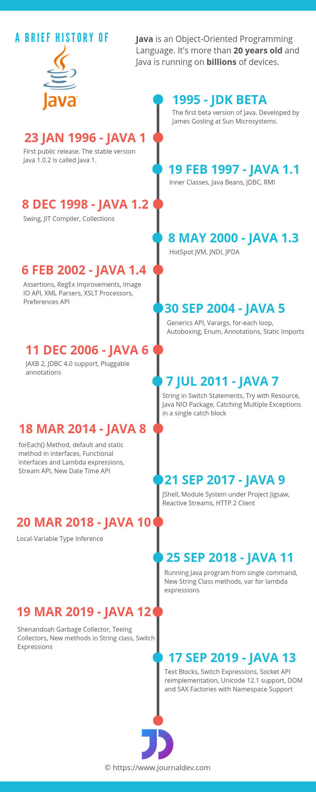

# Java Feature

<!-- TOC -->

- [1. History](#1-history)
- [2. Java 5](#2-java-5)
- [3. Java 8](#3-java-8)

<!-- /TOC -->

Java is a general-purpose programming language. It was first made available for public use in 1996. It has evolved a lot during this long period of 20+ years of use. The below infographic shows the version history of Java programming language.

## 1. History

- 1996, Java 1.0
- 2011, Java 7

## 2. Java 5

- `Java 5`: Generics, Enum, Annotation, Java Agent

The idea of **generics** represents the abstraction over types(提供了对type的抽象). It is a very powerful concept that allows to develop abstract algorithms and data structures(借用generics的概念，可以来编写抽象的算法，或者定义抽象的数据结构) and to provide concrete types to operate on later（在后续使用泛型方法或数据结构的时候，再提供具体的type）. Interestingly, generics were not present in the early versions of Java and were added along the way only in Java 5 release. And since then, it is fair to say that generics revolutionized the way Java programs are being written, delivering **much stronger type guaranties** and making code significantly safer.

Another two great features introduced into the language as part of Java 5 release along with **generics**: **enums** (or enumerations) and **annotations**. **Enums could be treated as a special type of classes and annotations as a special type of interfaces**.

**The idea of enums** is simple, but quite handy: it represents a fixed, constant set of values. What it means in practice is that enums are often used to design the concepts which have a constant set of possible states. For example, the days of week are a great example of the enums: they are limited to Monday, Tuesday, Wednesday, Thursday, Friday, Saturday and Sunday.

From the other side, **annotations are a special kind of metadata** which could be associated with different elements and constructs of the Java language. Interestingly, annotations have contributed a lot into the elimination of boilerplate XML descriptors used in Java ecosystem mostly everywhere. They introduced the new, type-safe and robust way of configuration and customization techniques.

## 3. Java 8

lambda expressions, method references, streams, and default methods

