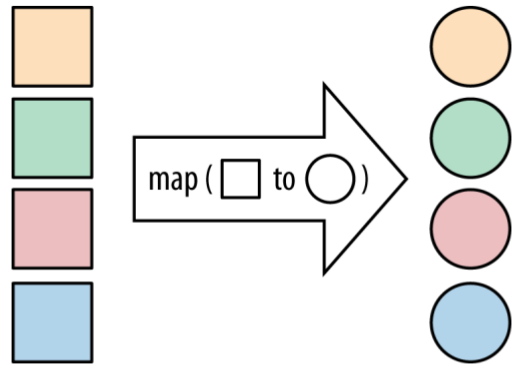
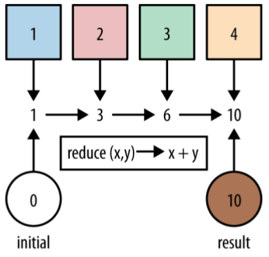

# Stream

<!-- TOC -->

- [1. What are streams?](#1-what-are-streams)
- [2. Stream operations](#2-stream-operations)
  - [2.1. Intermediate operations](#21-intermediate-operations)
  - [2.2. Terminal operations](#22-terminal-operations)
- [3. Common Stream Operations](#3-common-stream-operations)
  - [3.1. collect(toList())](#31-collecttolist)
  - [3.2. map](#32-map)
  - [3.3. filter](#33-filter)
  - [3.4. flatMap](#34-flatmap)
  - [3.5. max and min](#35-max-and-min)
  - [3.6. reduce](#36-reduce)
- [4. Higher-Order Functions](#4-higher-order-functions)
- [5. Good Use of Lambda Expressions](#5-good-use-of-lambda-expressions)
- [6. Element Ordering](#6-element-ordering)
  - [6.1. the source of the data](#61-the-source-of-the-data)
  - [6.2. operations change encounter order](#62-operations-change-encounter-order)
  - [6.3. eliminating ordering](#63-eliminating-ordering)

<!-- /TOC -->

## 1. What are streams?

To summarize, the Streams API in Java 8 lets you write code that’s

- **Declarative**— More concise and readable
- **Composable**— Greater flexibility
- **Parallelizable**— Better performance

So first, **what exactly is a stream?** A short definition is “a **sequence of elements** from a **source** that supports **data processing operations**.”

Let’s break down this definition step by step:

- **Sequence of elements**— Like a collection, a stream provides an interface to a sequenced set of values of a specific element type. Because **collections** are **data structures**, they’re mostly about storing and accessing elements with specific time/space complexities (for example, an `ArrayList` vs. a `LinkedList`). But **streams** are about **expressing computations** such as **filter**, **sorted**, and **map**. **Collections are about data; streams are about computations**.
- **Source**— Streams consume from a data-providing source such as collections, arrays, or I/O resources. Note that generating a stream from an ordered collection preserves the ordering. The elements of a stream coming from a list will have the same order as the list.
- **Data processing operations**— Streams support database-like operations and common operations from functional programming languages to manipulate data, such as filter, map, reduce, find, match, sort, and so on. Stream operations can be executed either sequentially or in parallel.

In addition, **stream operations** have two important characteristics:

- **Pipelining**— Many stream operations return a stream themselves, allowing operations to be chained and form a larger pipeline. This enables certain optimizations, such as laziness and short-circuiting. A pipeline of operations can be viewed as a database-like query on the data source.
- **Internal iteration**— In contrast to collections, which are iterated explicitly using an iterator, stream operations do the iteration behind the scenes for you.

## 2. Stream operations

The `Stream` interface in `java.util.stream.Stream` defines many operations. They can be classified into two categories.

- `filter`, `map`, and `limit` can be connected together to form a pipeline.
- `collect` causes the pipeline to be executed and closes it.

Stream operations that can be connected are called **intermediate operations**, and operations that close a stream are called **terminal operations**.

It’s very easy to figure out whether an operation is **eager** or **lazy**: look at what it returns. If it gives you back a `Stream`, it’s **lazy**; if it gives you back another value or `void`, then it’s **eager**.<sub>区分两种operation的方式</sub> This makes sense because the preferred way of using these methods is to form a sequence of lazy operations chained together and then to have a single eager operation at the end that generates your result.<sub>两种operation的常用方式</sub>

I’m sure you’re asking, “Why would we want to have the differentiator between **lazy** and **eager** options?” By waiting until we know more about what result and operations are needed, we can perform the computations more efficiently. It also means that we can string together lots of different operations over our collection and iterate over the collection only once.

### 2.1. Intermediate operations

Intermediate operations such as filter or sorted return another stream as the return type. This allows the operations to be connected to form a query. What’s important is that **intermediate operations** don’t perform any processing until a **terminal operation** is invoked on the stream pipeline—they’re lazy. This is because **intermediate operations** can usually be merged and processed into a single pass by the **terminal operation**.

### 2.2. Terminal operations

Terminal operations produce a result from a stream pipeline. A result is any nonstream value such as a `List`, an `Integer`, or even `void`.

To summarize, working with streams in general involves three items:

- A **data source** (such as a collection) to perform a query on
- **A chain of intermediate operations** that form a stream pipeline
- **A terminal operation** that executes the stream pipeline and produces a result

```java
Stream.iterate(0, n -> n+2)
    .limit(10)
    .forEach(System.out::println);
```

Note that this operation produces an infinite stream—the stream doesn’t have an end because values are computed on demand and can be computed forever. We say the stream is unbounded. As we discussed earlier, this is a key difference between a stream and a collection.

## 3. Common Stream Operations

### 3.1. collect(toList())

`collect(toList())` is an eager operation that generates a list from the values in a `Stream`.

```java
List<String> list = Stream.of("a", "b", "c").collect(Collectors.toList());
System.out.println(list);
```

Out:

```txt
[a, b, c]
```

### 3.2. map

If you’ve got a function that converts a value of one type into another, `map` lets you apply this function to **a stream of values**, producing **another stream of the new values**.



```java
List<String> list = Stream.of("a", "b", "c")
        .map(str -> str.toUpperCase())
        .collect(Collectors.toList());
System.out.println(list);
```

Out:

```txt
[A, B, C]
```

### 3.3. filter

Any time you’re looping over some data and checking each element, you might want to think about using the new `filter` method on `Stream`.


```java
List<String> list = Stream.of("friend", "fiend", "legend")
        .filter(str -> str.length() > 5)
        .collect(Collectors.toList());
System.out.println(list);
```

Out:

```txt
[friend, legend]
```

### 3.4. flatMap

`flatMap` lets you replace a value with a `Stream` and concatenates all the streams together.


```java
List<String> list = Stream.of(Arrays.asList("A", "B"), Arrays.asList("C", "D"))
        .peek(System.out::println)
        .flatMap(ch -> ch.stream())
        .collect(Collectors.toList());
System.out.println(list);
```

Out:

```txt
[A, B]
[C, D]
[A, B, C, D]
```

### 3.5. max and min

A pretty common operation that we might want to perform on streams is finding the **maximum** or **minimum** element. Fortunately, this case is very well covered by the `max` and `min` operations that are provided by the Streams API.

```java
List<Track> tracks = Arrays.asList(
        new Track("Bakai", 524),
        new Track("Violets for Your Furs", 378),
        new Track("Time Was", 451));
Track shortestTrack = tracks.stream()
        .min(Comparator.comparing(track -> track.getLength()))
        .get();
System.out.println(shortestTrack);
```

Out:

```txt
Track{name='Violets for Your Furs', length=378}
```

### 3.6. reduce

Use the `reduce` operation when you’ve got a collection of values and you want to generate a single result.

In earlier examples, we used the `count`, `min`, and `max` methods, which are all in the standard library because they are **common use cases**. All of these are forms of **reduction**.



```java
int sum = Stream.of(1, 2, 3)
        .reduce(0, (acc, element) -> acc += element);
System.out.println(sum);
```

Out:

```txt
6
```

## 4. Higher-Order Functions

A **higher-order function** is a function that either **takes another function as an argument** or **returns a function as its result**. It’s very easy to spot a higher-order function: just look at its signature. If a **functional interface** is used as a **parameter** or **return type**, you have a higher-order function.

`map` is a higher-order function because its `mapper` argument is a function. In fact, nearly all the functions that we’ve encountered on the `Stream` interface are higher-order functions.<sub>示例一：map方法，接收一个functional interface类型的parameter</sub>

```java
<R> Stream<R> map(Function<? super T, ? extends R> mapper);
```

`Comparator.comparing()` not only took another function in order to extract an index value, but also returns a new `Comparator`. You might think of a `Comparator` as an object, but it has only a single abstract method, so it’s a **functional interface**.<sub>示例二：comparing方法，接收一个functional interface类型的parameter，同时将functional interface作为return type。</sub>

```java
public static <T, U extends Comparable<? super U>> Comparator<T> comparing(Function<? super T, ? extends U> keyExtractor)
```

## 5. Good Use of Lambda Expressions

**Functions with no side effects** don’t change the state of anything else in the program or the outside world.

The following lambda expression had side effects because it printed some output on the console—an observable side effect of the function.<sub>示例一：它的side effect是改变了System.out的状态</sub>

```java
Stream.of("a", "b", "c")
        .map(str -> {
            System.out.println(str);
            return str.toUpperCase();
        });
```

What about the following example? Here we save away the `event` parameter into a field. This is **a more subtle way of generating a side effect: assigning to variables**. You may not see it directly in the output of your program, but it does change the program’s state.<sub>示例二：它的side effect是改变了类中field的状态</sub>

```java
private ActionEvent lastEvent;
private void registerHandler() {
    button.addActionListener((ActionEvent event) -> {
        this.lastEvent = event;
    });
}
```

Take a look at the assignment to `localEvent` in this code snippet:

```java
ActionEvent localEvent = null;
button.addActionListener(event -> {
    localEvent = event;
});
```

I know this won’t actually compile! That’s actually a deliberate choice on behalf of the designers: **an attempt to encourage people to use lambda expressions to capture values rather than capturing variables**. Capturing values encourages people to write code that is free from side effects by making it harder to do so. Even though local variables don’t need the `final` keyword in order to be used in lambda expressions, they still need to be **effectively final**.

Whenever you pass **lambda expressions** into the **higher-order functions** on the `Stream` interface, you should seek to avoid **side effects**. The only exception to this is the `forEach` method, which is a terminal operation.

## 6. Element Ordering

A `Stream` intuitively presents an order because each element is operated upon, or encountered, in turn. We call this the **encounter order**. How the **encounter order** is defined depends on both **the source of the data** and **the operations performed on the `Stream`**.

### 6.1. the source of the data

When you create a `Stream` from a collection with **a defined order**, the `Stream` has a defined encounter order.

```java
List<Integer> list = Arrays.asList(29, 50, 70, 95);
List<Integer> newList = list.stream().collect(Collectors.toList());
System.out.println(newList);
```

Out:

```txt
[29, 50, 70, 95]
```

If there’s no defined order to begin, the `Stream` produced by that source **doesn’t have a defined order**. A `HashSet` is an example of a collection without a defined ordering

```java
Set<Integer> set = new HashSet<>(Arrays.asList(29, 50, 70, 95));
List<Integer> list = set.stream().collect(Collectors.toList());
System.out.println(list);
```

Out:

```txt
[50, 70, 29, 95]
```

### 6.2. operations change encounter order

The purpose of streams isn’t just to convert from one collection to another; it’s to be able to provide a common set of operations over data. These operations may create an **encounter order** where there wasn’t one to begin with.<sub>有一些operations能够改变encounter order</sub>

```java
Set<Integer> set = new HashSet<>(Arrays.asList(29, 50, 70, 95));
List<Integer> list = set.stream()
        .sorted()
        .collect(Collectors.toList());
System.out.println(list);
```

Out:

```txt
[29, 50, 70, 95]
```

### 6.3. eliminating ordering

Some operations are more expensive on **ordered streams**. This problem can be solved by **eliminating ordering**. To do so, call the stream’s `unordered` method. Most operations, however, such as `filter`, `map`, and `reduce`, can operate very efficiently on ordered streams.

This can cause unexpected behavior, for example, `forEach` provides no guarantees as to encounter order if you’re using parallel streams.
