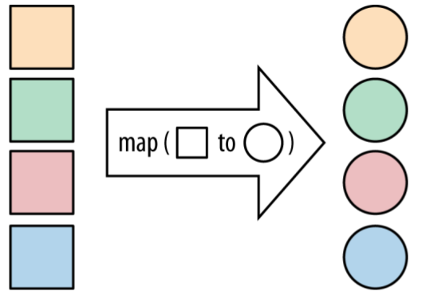
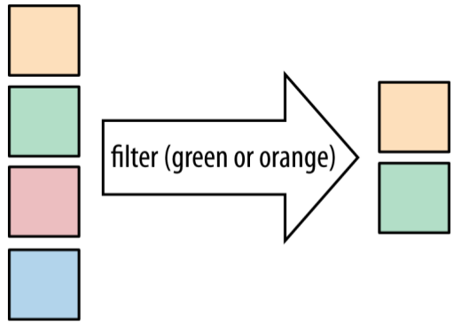
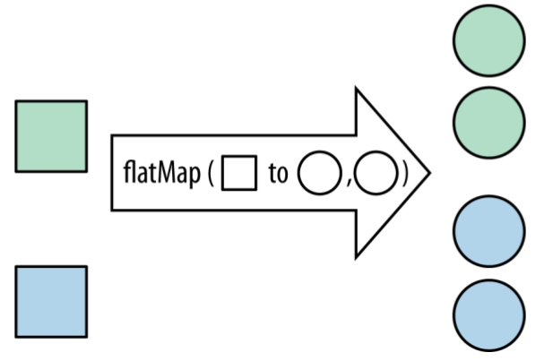
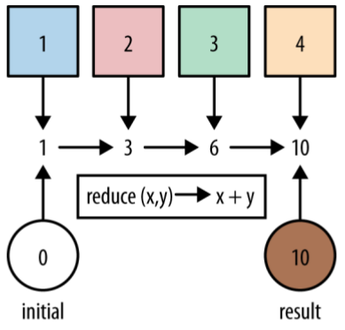

# Common Stream Operations

<!-- TOC -->

- [1. collect(toList())](#1-collecttolist)
- [2. map](#2-map)
- [3. filter](#3-filter)
- [4. flatMap](#4-flatmap)
- [5. max and min](#5-max-and-min)
- [6. reduce](#6-reduce)

<!-- /TOC -->

## 1. collect(toList())

`collect(toList())` is an eager operation that generates a list from the values in a `Stream`.

```java
List<String> list = Stream.of("a", "b", "c").collect(Collectors.toList());
System.out.println(list);
```

Out:

```txt
[a, b, c]
```

## 2. map

If you’ve got a function that converts a value of one type into another, `map` lets you apply this function to **a stream of values**, producing **another stream of the new values**.



```java
List<String> list = Stream.of("a", "b", "c")
        .map(str -> str.toUpperCase())
        .collect(Collectors.toList());
System.out.println(list);
```

Out:

```txt
[A, B, C]
```

## 3. filter

Any time you’re looping over some data and checking each element, you might want to think about using the new `filter` method on `Stream`.



```java
List<String> list = Stream.of("friend", "fiend", "legend")
        .filter(str -> str.length() > 5)
        .collect(Collectors.toList());
System.out.println(list);
```

Out:

```txt
[friend, legend]
```

## 4. flatMap

`flatMap` lets you replace a value with a `Stream` and concatenates all the streams together.



```java
List<String> list = Stream.of(Arrays.asList("A", "B"), Arrays.asList("C", "D"))
        .peek(System.out::println)
        .flatMap(ch -> ch.stream())
        .collect(Collectors.toList());
System.out.println(list);
```

Out:

```txt
[A, B]
[C, D]
[A, B, C, D]
```

## 5. max and min

A pretty common operation that we might want to perform on streams is finding the **maximum** or **minimum** element. Fortunately, this case is very well covered by the `max` and `min` operations that are provided by the Streams API.

```java
List<Track> tracks = Arrays.asList(
        new Track("Bakai", 524),
        new Track("Violets for Your Furs", 378),
        new Track("Time Was", 451));
Track shortestTrack = tracks.stream()
        .min(Comparator.comparing(track -> track.getLength()))
        .get();
System.out.println(shortestTrack);
```

Out:

```txt
Track{name='Violets for Your Furs', length=378}
```

## 6. reduce

Use the `reduce` operation when you’ve got a collection of values and you want to generate a single result.

In earlier examples, we used the `count`, `min`, and `max` methods, which are all in the standard library because they are **common use cases**. All of these are forms of **reduction**.



```java
int sum = Stream.of(1, 2, 3)
        .reduce(0, (acc, element) -> acc += element);
System.out.println(sum);
```

Out:

```txt
6
```
