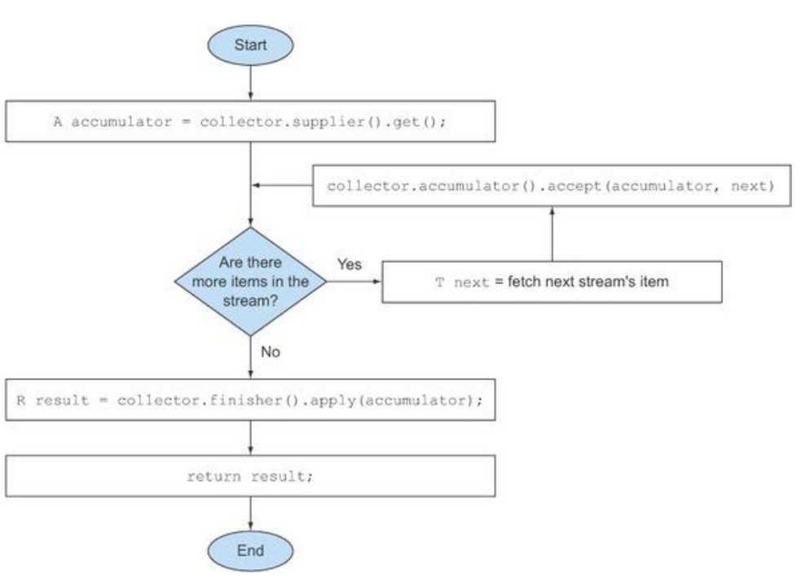
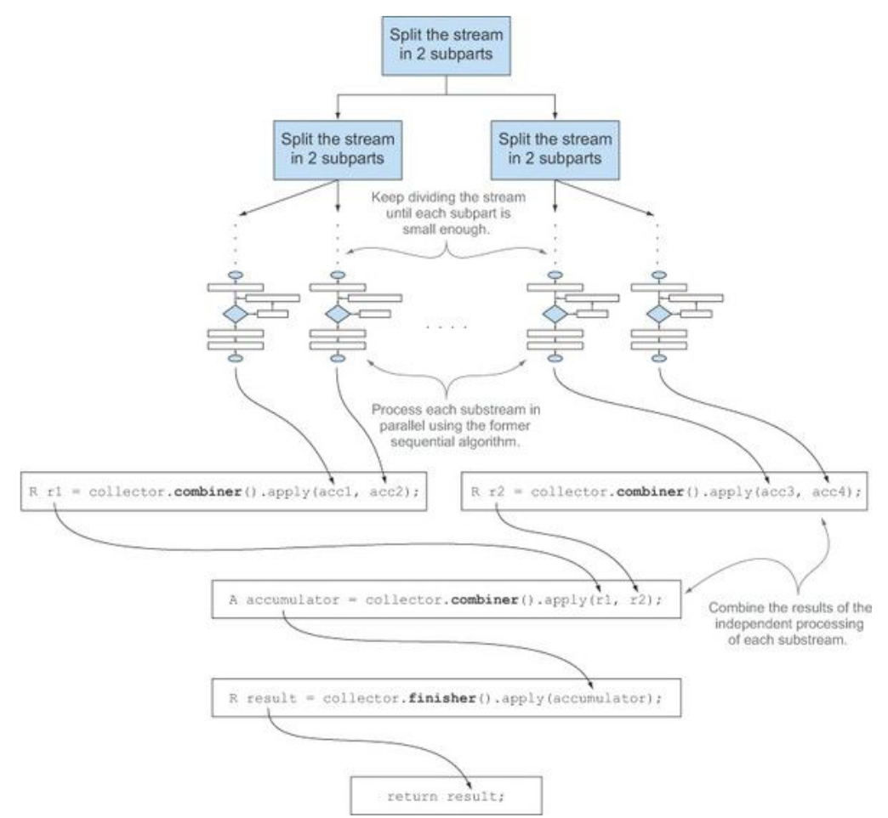

# The Collector interface

<!-- TOC -->

- [1. the definition of the Collector interface](#1-the-definition-of-the-collector-interface)
- [2. Making sense of the methods declared by Collector interface](#2-making-sense-of-the-methods-declared-by-collector-interface)
  - [2.1. Making a new result container: the supplier method](#21-making-a-new-result-container-the-supplier-method)
  - [2.2. Adding an element to a result container: the accumulator method](#22-adding-an-element-to-a-result-container-the-accumulator-method)
  - [2.3. Applying the final transformation to the result container: the finisher method](#23-applying-the-final-transformation-to-the-result-container-the-finisher-method)
  - [2.4. Merging two result containers: the combiner method](#24-merging-two-result-containers-the-combiner-method)
  - [2.5. Characteristics method](#25-characteristics-method)
- [3. Putting them all together](#3-putting-them-all-together)

<!-- /TOC -->

The `Collector` interface consists of a set of methods that provide a blueprint for how to implement specific reduction operations (that is, collectors). You’ve seen **many collectors that implement the `Collector` interface**, such as `toList` or `groupingBy`. This also implies that you’re free to create customized reduction operations by providing **your own implementation of the `Collector` interface**.

To get started with the `Collector` interface, we focus on one of the first collectors you encountered at the beginning of this chapter: the `toList` factory method, which **gathers all the elements of a stream in a List**. We said that you’ll frequently use this collector in your day-to-day job, but it’s also one that, at least conceptually, is straightforward to develop. Investigating in more detail **how this collector is implemented** is a good way to understand **how the `Collector` interface is defined** and **how the functions returned by its methods are internally used by the `collect` method**.

## 1. the definition of the Collector interface

```java
public interface Collector<T, A, R> {
    Supplier<A> supplier();
    BiConsumer<A, T> accumulator();
    Function<A, R> finisher();
    BinaryOperator<A> combiner();
    Set<Characteristics> characteristics();
}
```

In this listing, the following definitions apply:

- `T` is the generic type of the items in the stream to be collected.
- `A` is the type of the accumulator, the object on which the partial result will be accumulated during the collection process.
- `R` is the type of the object (typically, but not always, the collection) resulting from the `collect` operation.

## 2. Making sense of the methods declared by Collector interface

We can now analyze one by one the five methods declared by the `Collector` interface. When we do so, you’ll notice that **each of the first four methods** returns **a function** that will be invoked by the `collect` method, whereas **the fifth one**, characteristics, provides a set of characteristics that’s a list of hints used by the `collect` method itself to know which optimizations (for example, parallelization) it’s allowed to employ while performing the reduction operation.

### 2.1. Making a new result container: the supplier method

The `supplier` method has to return a `Supplier` of an empty result—a parameterless function that when invoked **creates an instance of an empty accumulator** used during **the collection process**.

Clearly, for a collector returning the accumulator itself as result, like our `ToListCollector`, this empty accumulator will also represent the result of the collection process when performed on an empty stream. In our `ToListCollector` the `supplier` will then return an empty List as follows:

```java
public Supplier<List<T>> supplier() {
    return () -> new ArrayList<T>();
}
```

Note that you could also just pass a constructor reference:

```java
public Supplier<List<T>> supplier() {
    return ArrayList::new;
}
```

### 2.2. Adding an element to a result container: the accumulator method

The `accumulator` method returns the function that performs the **reduction operation**. When traversing the `n`th element in the stream, this function is applied with two arguments, the **accumulator** being the result of the reduction (after having collected the first `n–1` items of the stream) and **the `n`th element itself**. The function returns `void` because the accumulator is modified in place, meaning that its internal state is changed by the function application to reflect the effect of the traversed element.

For `ToListCollector`, this function merely has to add the current item to the list containing the already traversed ones:

```java
public BiConsumer<List<T>, T> accumulator() {
    return (list, item) -> list.add(item);
}
```

You could instead use a method reference, which is more concise:

```java
public BiConsumer<List<T>, T> accumulator() {
    return List::add;
}
```

### 2.3. Applying the final transformation to the result container: the finisher method

The `finisher` method has to return a function that’s invoked at the end of the **accumulation process**, after having completely traversed the stream, in order to transform **the accumulator object** into **the final result** of the whole collection operation.

Often, as in the case of the `ToListCollector`, the **accumulator object** already coincides with **the final expected result**. As a consequence, there’s no need to perform a transformation, so the finisher method just has to return the `identity` function:

```java
public Function<List<T>, List<T>> finisher() {
    return Function.identity();
}
```

**These first three methods** are enough to execute a sequential reduction of the stream that, at least from a logical point of view, could proceed as in following figure. The implementation details are a bit more difficult in practice due to both the lazy nature of the stream, which could require a pipeline of other intermediate operations to execute before the `collect` operation, and the possibility, in theory, of performing the reduction in parallel.



### 2.4. Merging two result containers: the combiner method

The `combiner` method, the last of the four methods that return a function used by the reduction operation, defines how the accumulators resulting from **the reduction of different subparts of the stream are combined when the subparts are processed in parallel**.

In the `toList` case, the implementation of this method is simple; just add the list containing the items gathered from the second subpart of the stream to the end of the list obtained when traversing the first subpart:

```java
public BinaryOperator<List<T>> combiner() {
    return (list1, list2) -> {
        list1.addAll(list2);
        return list1;
        }
}
```

The addition of this fourth method allows **a parallel reduction of the stream**. This uses the **fork/join** framework introduced in Java 7 and the `Spliterator` abstraction. It follows a process similar to the one shown in following figure and described in
detail here:



### 2.5. Characteristics method

The last method, characteristics, returns an immutable set of `Characteristics`, defining the behavior of the collector—in particular providing hints about whether the stream can be reduced in parallel and which optimizations are valid when doing so. `Characteristics` is an enumeration containing three items:

- **UNORDERED** —The result of the reduction isn’t affected by the order in which the items in the stream are traversed and accumulated.
- **CONCURRENT** —The accumulator function can be called concurrently from multiple threads, and then this collector can perform a parallel reduction of the stream. If the collector isn’t also flagged as `UNORDERED`, it can perform a parallel reduction only when it’s applied to an unordered data source.
- **IDENTITY_FINISH** —This indicates the function returned by the `finisher` method is the identity one, and its application can be omitted. In this case, **the accumulator object** is directly used as **the final result of the reduction process**. This also implies that it’s safe to do an unchecked cast from the accumulator `A` to the result `R`.

The `ToListCollector` developed so far is `IDENTITY_FINISH`, because the List used to accumulate the elements in the stream is already the expected final result and doesn’t need any further transformation, but it isn’t `UNORDERED` because if you apply it to an ordered stream you want this ordering to be preserved in the resulting List. Finally, it’s `CONCURRENT`, but following what we just said, the stream will be processed in parallel only if its underlying data source is unordered.

## 3. Putting them all together

```java
import java.util.*;
import java.util.function.BiConsumer;
import java.util.function.BinaryOperator;
import java.util.function.Function;
import java.util.function.Supplier;
import java.util.stream.Collector;

import static java.util.stream.Collector.Characteristics.CONCURRENT;
import static java.util.stream.Collector.Characteristics.IDENTITY_FINISH;

public class ToListCollector<T> implements Collector<T, List<T>, List<T>> {
    @Override
    public Supplier<List<T>> supplier() {
        return ArrayList::new;
    }

    @Override
    public BiConsumer<List<T>, T> accumulator() {
        return List::add;
    }

    @Override
    public BinaryOperator<List<T>> combiner() {
        return (list1, list2) -> {
            list1.addAll(list2);
            return list1;
        };
    }

    @Override
    public Function<List<T>, List<T>> finisher() {
        return Function.identity();
    }

    @Override
    public Set<Characteristics> characteristics() {
        return Collections.unmodifiableSet(EnumSet.of(IDENTITY_FINISH, CONCURRENT));
    }
}
```
