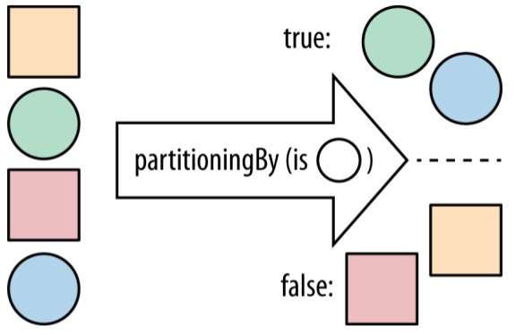

# Collectors

The collectors are statically imported from the `java.util.stream.Collectors` class.

## To Collections

Some collectors just build up collections. You’ve already seen the `toList` collector, which produces `java.util.List` instances. There’s also a `toSet` collector and a `toCollection` collector, which produce instances of `Set` and `Collection`.

```java

```

## To Values

It’s also possible to collect into **a single value** using a collector. There are `maxBy` and `minBy` collectors that let you obtain a single value according to some ordering.

### maxBy and minBy

- maxBy
- minBy

Finding the band with the most members

```java
public Optional<Artist> biggestGroup(Stream<Artist> artists) {
    Function<Artist,Long> getCount = artist -> artist.getMembers().count();
    return artists.collect(maxBy(comparing(getCount)));
}
```

### averagingInt

- averagingInt
- averagingLong
- averagingDouble

Finding the average number of tracks for a list of albums

```java
public double averageNumberOfTracks(List<Album> albums) {
    return albums.stream()
        .collect(averagingInt(album -> album.getTrackList().size()));
}
```

## Partitioning the Data

There is a collector, `partitioningBy`, that takes a stream and partitions its contents into **two groups**. It uses a `Predicate` to determine whether an element should be part of the **true group** or the **false group** and returns a `Map` from `Boolean` to a `List` of values. So, the `Predicate` returns `true` for all the values in the true List and `false` for the other List .



Partitioning a stream of artists into bands and solo artists

```java
public Map<Boolean, List<Artist>> bandsAndSoloRef(Stream<Artist> artists) {
    return artists.collect(partitioningBy(Artist::isSolo));
}
```

## Grouping the Data

There’s a natural way to **generalize partitioning** through altering the grouping operation. It’s more general in the sense that instead of splitting up your data into `true` and `false` groups, you can use whatever values you want.

```java
public static <T, K> Collector<T, ?, Map<K, List<T>>> groupingBy(Function<? super T, ? extends K> classifier) {
    return groupingBy(classifier, toList());
}

public static <T, K, A, D> Collector<T, ?, Map<K, D>> groupingBy(Function<? super T, ? extends K> classifier,
                                        Collector<? super T, A, D> downstream) {
    return groupingBy(classifier, HashMap::new, downstream);
}

public static <T, K, D, A, M extends Map<K, D>>
Collector<T, ?, M> groupingBy(Function<? super T, ? extends K> classifier,
                                Supplier<M> mapFactory,
                                Collector<? super T, A, D> downstream) {
    // 省略代码
}
```

### groupingBy(classifier)

Grouping albums by their main artist

```java
public Map<Artist, List<Album>> albumsByArtist(Stream<Album> albums) {
    return albums.collect(groupingBy(album -> album.getMainMusician()));
}
```

### groupingBy(classifier, downstream)

A naive approach to counting the number of albums for each artist

```java
Map<Artist, List<Album>> albumsByArtist = albums.collect(groupingBy(album -> album.getMainMusician()));

Map<Artist, Integer> numberOfAlbums = new HashMap<>();
for(Entry<Artist, List<Album>> entry : albumsByArtist.entrySet()) {
    numberOfAlbums.put(entry.getKey(), entry.getValue().size());
}
```

Hmm, it might have sounded like a simple approach, but it got a bit messy. This code is also imperative and doesn’t automatically parallelize.

What we want here is actually another collector that tells `groupingBy` that instead of building up a `List` of albums for each artist, it should just count them. Conveniently, this is already in the core library and is called `counting`. So, we can rewrite the example

```java
public Map<Artist, Long> numberOfAlbums(Stream<Album> albums) {
    return albums.collect(groupingBy(album -> album.getMainMusician(),counting()));
}
```

This form of `groupingBy` divides elements into **buckets**. Each bucket gets associated with the key provided by the `classifier` function: `getMainMusician`. The `groupingBy` operation then uses the `downstream` collector to collect each bucket and makes a map of the results.

A naive approach to finding the names of every album that an artist has produced

```java
public Map<Artist, List<String>> nameOfAlbumsDumb(Stream<Album> albums) {
    Map<Artist, List<Album>> albumsByArtist = albums.collect(groupingBy(album ->album.getMainMusician()));

    Map<Artist, List<String>> nameOfAlbums = new HashMap<>();
    for(Entry<Artist, List<Album>> entry : albumsByArtist.entrySet()) {
        nameOfAlbums.put(entry.getKey(), entry.getValue()
            .stream()
            .map(Album::getName)
            .collect(toList()));
    }
    return nameOfAlbums;
}
```

In this case, what we’re really trying to do is perform a **map operation** on the list from the `Artist` to the **album name**. We can’t just use the `map` method on streams because this list is created by the `groupingBy` collector. We need a way of telling the `groupingBy` collector to map its list values as it’s building up the result.

Thankfully, the boffins(研究员) at Oracle have thought of this use case and provided a collector called `mapping`. The `mapping` collector allows you to perform a **map-like operation** over your collector’s container.

```java
public Map<Artist, List<String>> nameOfAlbums(Stream<Album> albums) {
    return albums.collect(groupingBy(Album::getMainMusician,
                                     mapping(Album::getName, toList())));
}
```

## Strings

A very common reason for collecting streams of data is to generate strings at the end.

Formatting artist names using a for loop

```java
StringBuilder builder = new StringBuilder("[");
for (Artist artist : artists) {
    if (builder.length() > 1)
        builder.append(", ");
    String name = artist.getName();
    builder.append(name);
}
builder.append("]");
String result = builder.toString();
```

Formatting artist names using streams and collectors

```java
String result = artists.stream()
        .map(Artist::getName)
        .collect(Collectors.joining(", ", "[", "]"));
```


