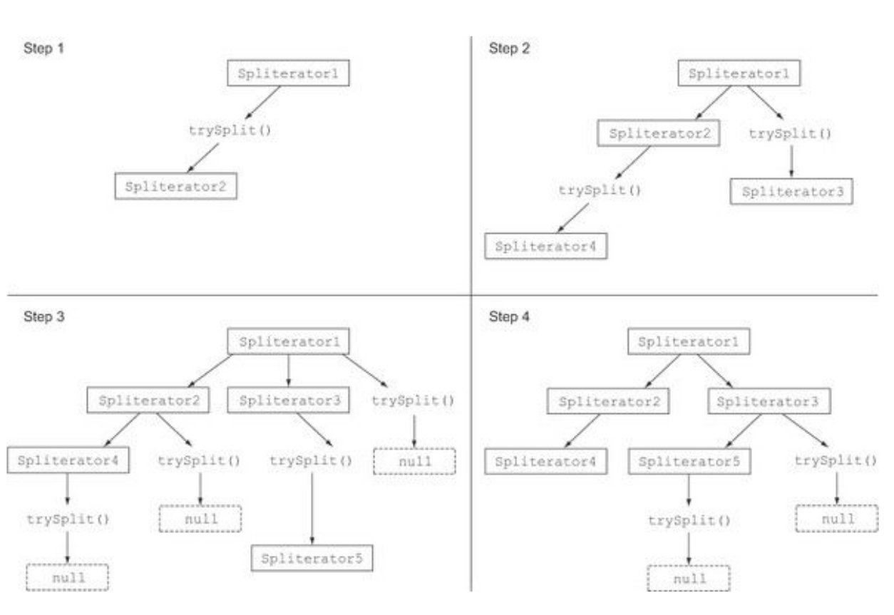

# Splitting a stream of data using a Spliterator

<!-- TOC -->

- [1. The Spliterator interface](#1-the-spliterator-interface)
  - [1.1. The splitting process](#11-the-splitting-process)
  - [1.2. The Spliterator characteristics](#12-the-spliterator-characteristics)
- [2. Implementing your own Spliterator](#2-implementing-your-own-spliterator)

<!-- /TOC -->

The `Spliterator` is another new interface added to Java 8; its name stands for “splitable iterator.” Like Iterators, Spliterators are used to **traverse the elements of a source**, but **they’re also designed to do this in parallel**. Although you may not have to develop your own `Spliterator` in practice, understanding how to do so will give you a wider understanding about how parallel streams work.

Java 8 already provides a default `Spliterator` implementation for all the data structures included in its Collections Framework. Collections now implements the interface `Spliterator`, which provides a method `spliterator`.

```java
public interface Collection<E> extends Iterable<E> {
    @Override
    default Spliterator<E> spliterator() {
        return Spliterators.spliterator(this, 0);
    }
}
```

## 1. The Spliterator interface

```java
public interface Spliterator<T> {
    boolean tryAdvance(Consumer<? super T> action);
    Spliterator<T> trySplit();
    long estimateSize();
    int characteristics();
}
```

As usual, `T` is the type of the elements traversed by the `Spliterator`.

- The `tryAdvance` method behaves in a way similar to a normal `Iterator` in the sense that it’s used to sequentially consume the elements of the `Spliterator` one by one, returning `true` if there are still other elements to be traversed.
- But the `trySplit` method is more specific to the `Spliterator` interface because it’s used to partition off some of its elements to a second `Spliterator` (the one returned by the method), allowing the two to be processed in parallel.
- A `Spliterator` may also provide an estimation of the number of the elements remaining to be traversed via its `estimateSize` method, because even an inaccurate but quick-to-compute value can be useful to split the structure more or less evenly.
- This splitting process can be influenced by the characteristics of the `Spliterator` itself, which are declared via the `characteristics` method.

It’s important to understand **how this splitting process is performed internally** in order to take control of it when required. Therefore, we analyze it in more detail in the next section.

### 1.1. The splitting process

The algorithm that splits a Stream into multiple parts is a recursive process.

In the first step `trySplit` is invoked on the first Spliterator and generates a second one. Then in step 2 it’s called again on these two Spliterators, which results in a total of four. The framework keeps invoking the method `trySplit` on a `Spliterator` until it returns `null` to signal that the data structure that it’s processing is no longer divisible, as shown in step 3. Finally, this recursive splitting process terminates in step 4 when all Spliterators have returned `null` to a `trySplit` invocation.



### 1.2. The Spliterator characteristics

The last abstract method declared by the `Spliterator` interface is `characteristics`, which returns an `int` encoding the set of characteristics of the `Spliterator` itself. The `Spliterator` clients can use these characteristics to better control and optimize its usage.

- `ORDERED`: Elements have a defined order (for example, a `List`), so the `Spliterator` enforces this order when traversing and partitioning them.
- `DISTINCT`: For each pair of traversed elements `x` and `y`, `x.equals(y)` returns `false`.
- `SORTED`: The traversed elements follow a predefined sort order.
- `SIZED`: This `Spliterator` has been created from a source with a known size (for example, a `Set`), so the value returned by `estimatedSize()` is precise.
- `NONNULL`: It’s guaranteed that the traversed elements won’t be `null`.
- `IMMUTABLE`: The source of this `Spliterator` can’t be modified. This implies that no elements can be added, removed, or modified during their traversal.
- `CONCURRENT`: The source of this `Spliterator` may be safely concurrently modified by other threads without any synchronization.
- `SUBSIZED`: Both this `Spliterator` and all further `Spliterator`s resulting from its split are `SIZED`.

Now that you’ve seen what the `Spliterator` interface is and which methods it defines, you can try to develop your own implementation of a `Spliterator`.

## 2. Implementing your own Spliterator

```java
public static final String SENTENCE =
        "Nel    mezzo del cammin    di nostra vita " +
        "mi ritrovai in una selva oscura" +
        " ché la dritta via era    smarrita ";

public static int countWordsIteratively(String s) {
    int counter = 0;
    boolean lastSpace = true;
    for (char c : s.toCharArray()) {
        if (Character.isWhitespace(c)) {
            lastSpace = true;
        } else {
            if (lastSpace) counter++;
            lastSpace = false;
        }
    }
    return counter;
}

System.out.println("Found " + countWordsIteratively(SENTENCE) + " words");
```

Out:

```txt
Found 19 words
```

```java
public class WordCounter {
    private final int counter;
    private final boolean lastSpace;

    public WordCounter(int counter, boolean lastSpace) {
        this.counter = counter;
        this.lastSpace = lastSpace;
    }

    public WordCounter accumulate(Character c) {
        if (Character.isWhitespace(c)) {
            return lastSpace ?
                    this :
                    new WordCounter(counter, true);
        } else {
            return lastSpace ?
                    new WordCounter(counter + 1, false) :
                    this;
        }
    }

    public WordCounter combine(WordCounter wordCounter) {
        return new WordCounter(counter + wordCounter.counter, wordCounter.lastSpace);
    }

    public int getCounter() {
        return counter;
    }
}

private static int countWords(Stream<Character> stream) {
    WordCounter wordCounter = stream.reduce(new WordCounter(0, true),
            WordCounter::accumulate,
            WordCounter::combine);
    return wordCounter.getCounter();
}

Stream<Character> stream = IntStream.range(0, SENTENCE.length())
        .mapToObj(SENTENCE::charAt);
System.out.println("Found " + countWords(stream) + " words");
```

Out:

```txt
Found 19 words
```

You could try to speed up the word-counting operation using **a parallel stream**, as follows:

```java
Stream<Character> stream = IntStream.range(0, SENTENCE.length())
        .mapToObj(SENTENCE::charAt);
System.out.println("Found " + countWords(stream.parallel()) + " words");
```

Out:

```txt
Found 41 words
```

Evidently something has gone wrong, but what? The problem isn’t hard to discover. Because the original String is split at arbitrary positions, sometimes a word is divided in two and then counted twice. In general, this demonstrates that going from **a sequential stream** to **a parallel one** can lead to **a wrong result** if this result may be affected by the position where the stream is split.

How can you fix this issue? The solution consists of ensuring that the String isn’t split at a random position but only at the end of a word. To do this, you’ll have to implement a `Spliterator` of `Character` that splits a String only between two words, and then creates the parallel stream from it.

```java
import java.util.Spliterator;
import java.util.function.Consumer;

public class WordCounterSpliterator implements Spliterator<Character> {
    private final String string;
    private int currentChar = 0;

    public WordCounterSpliterator(String string) {
        this.string = string;
    }

    @Override
    public boolean tryAdvance(Consumer<? super Character> action) {
        action.accept(string.charAt(currentChar++));
        return currentChar < string.length();
    }

    @Override
    public Spliterator<Character> trySplit() {
        int currentSize = string.length() - currentChar;
        if (currentSize < 10) {
            return null;
        }
        for (int splitPos = currentSize / 2 + currentChar;
             splitPos < string.length(); splitPos++) {
            if (Character.isWhitespace(string.charAt(splitPos))) {
                Spliterator<Character> spliterator =
                        new WordCounterSpliterator(string.substring(currentChar, splitPos));
                currentChar = splitPos;
                return spliterator;
            }
        }
        return null;
    }

    @Override
    public long estimateSize() {
        return string.length() - currentChar;
    }

    @Override
    public int characteristics() {
        return ORDERED + SIZED + SUBSIZED + NONNULL + IMMUTABLE;
    }
}
```

