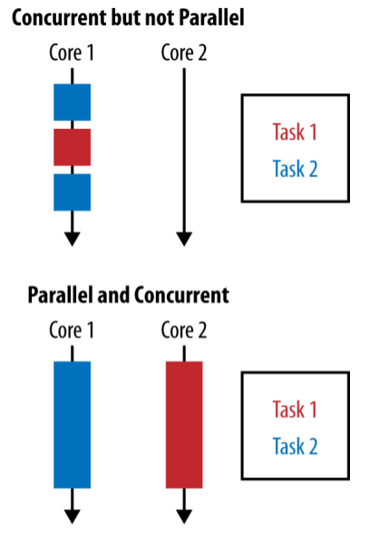
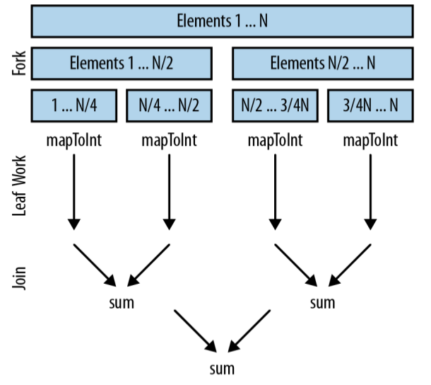

# Data Parallelism

<!-- TOC -->

- [1. Parallelism Versus Concurrency](#1-parallelism-versus-concurrency)
- [2. Why Is Parallelism Important?](#2-why-is-parallelism-important)
- [3. Performance](#3-performance)
  - [3.1. First: Data size](#31-first-data-size)
  - [3.2. Second: Source data structure](#32-second-source-data-structure)
  - [3.3. Third: Packing](#33-third-packing)
  - [3.4. Forth: Number of cores](#34-forth-number-of-cores)
  - [3.5. Fifth: Cost per element](#35-fifth-cost-per-element)
  - [3.6. Under the hood](#36-under-the-hood)
  - [the nature of the initial source](#the-nature-of-the-initial-source)
  - [stateless vs stateful](#stateless-vs-stateful)
- [Parallel Array Operations](#parallel-array-operations)

<!-- /TOC -->

The big shift between **external** and **internal iteration** did make it easier to write simple and clean code, but here’s the other big benefit: now we don’t have to manually control the iteration. It doesn’t need to be performed sequentially.

The changes to your code are surprisingly unobtrusive, so the majority of this chapter won’t be talking about how your code changes. Instead, I’ll explain why you might want to go parallel and when you’ll get performance improvements. It’s also worth noting that this chapter isn’t a general text on performance in Java; we’ll just be looking at the easy wins provided in Java 8.

## 1. Parallelism Versus Concurrency

Concurrency and parallelism are different things that can be leveraged to achieve different aims.

**Concurrency** arises when two tasks are making progress at overlapping time periods. **Parallelism** arises when two tasks are happening at literally the same time, such as on a multicore CPU. If a program is undertaking two tasks and they are being given small slices of a single CPU core’s time, then it is exhibiting concurrency but not parallelism.



我的总结：

- Concurrency可能更注重从“时间”角度上来说，两个Task在时间上有overlap（重叠）部分。
- Parallelism可能更注重于“空间”角度上来说，需要在“空间”上分开“运行”。当然，它也包含了“时间”上的重叠。
- 我觉得，这两个概念是随着硬件（由一核CPU到多核CPU）的发展而先后出现的，为了是描述Java在运行过程中如何最大限度的利用硬件的CPU资源。

The goal of parallelism is to reduce the runtime of a specific task<sub>使用parallelism，目的是减少Task的运行时间</sub> by breaking it down into smaller components and performing them in parallel. This doesn’t mean that you won’t do as much work as you would if you were running them sequentially—you are just getting more horses to pull the same cart for a shorter time period.<sub>使用parallelism，并不意味着“工作总量减少”，而是多人分摊之后，个人的工作量减少</sub> In fact, it’s usually the case that running a task in parallel requires more work to be done by the CPU than running it sequentially would.<sub>事实上来说，使用parallelism后“工作问题”常常是增多了，因为它需要多个CPU之间进行协调</sub>

In this chapter, we’re looking at a very specific form of parallelism called **data parallelism**.<sub>data parallelism是一种特殊形式的parallelism</sub> In **data parallelism**, we achieve parallelism by splitting up the data to be operated on and assigning **a single processing unit**(这里可能指的是Fork/Join里的一个线程) to each chunk of data. If we’re to extend our horses-pulling-carts analogy, it would be like taking half of the goods inside our cart and putting them into another cart for another horse to pull, with both horses taking an identical route to the destination.

Data parallelism works really well when you want to perform the same operation on a lot of data. **The problem needs be decomposed in a way that will work on subsections of the data**, and then the answers from each subsection can be composed at the end.

读了这段之后，我的感触就是：使用“旧”的或者“传统”的方式来解决问题，可能存在着某种不足之处。但是，当你采用新的方式的时候，不要一味的乐观，因为它也会带来相应的问题。就比如说，以前使用sequential的方式来运行程序，那程序运行完了，就结束了；现在使用parallelism，就需要将data进行分割成多个部分（这是以前的方法不需要处理的），分开之后再进行计算，计算完成之后需要将结果进行汇总（这也是以前的方法不需要处理的）。将data进行分割成多个部分，也是要注意“逻辑的正确性”，就像一个人可能需要10个月左右生下一个孩子，但是十个人不可能用一个月来生下一个孩子，所以它强调了一句“The problem needs be decomposed in a way that will work on subsections of the data”。

**Data parallelism** is often contrasted with **task parallelism**, in which **each individual thread of execution** can be doing **a totally different task**. Probably the most commonly encountered task parallelism is a Java EE application container. Each thread not only can be dealing with processing a different user, but also could be performing different tasks for a user, such as logging in or adding an item to a shopping cart.

## 2. Why Is Parallelism Important?

Historically, we could all rely on the clock frequency of a CPU getting faster over time. Intel’s 8086 processor, introduced in 1979, started at a 5 MHz clock rate, and by the time the Pentium chip was introduced in 1993 speeds had reached 60 MHz. Improved sequential performance continued through the early 2000s.<sub>单核CPU的运行能力增强</sub>

Over the last decade, however, mainstream chip manufacturers have been moving increasingly toward heavily **multicore processors**. At the time of writing, it’s not uncommon for servers to be shipping with 32 or 64 cores spread over several physical processing units. This trend shows no sign of abating soon.<sub>近些年，多核CPU的趋势越来越流行</sub>

**This influences the design of software**. Instead of being able to rely on improved CPU clock speeds to increase the computational capacity of existing code, we need to be able to take advantage of modern CPU architectures. **The only way to do this is by writing parallel programs**.<sub>硬件的格局变化，导致了软件的设计方面发生改变；为了使用multicore processors，软件方面的应对策略是parallel programs</sub>

Amdahl’s Law(阿姆达尔定律) is a simple rule that predicts the theoretical maximum speedup of a program on a machine with multiple cores.<sub>这个定律是为了测试在multiple cores的环境下，理论上能够使一个program运行的最大效率</sub> If we take a program that is entirely serial and parallelize(使平行；并行化) only half of it, then the maximum speedup possible, regardless of how many cores we throw at the problem, is `2X`.<sub>如果一个program只能对50%的工作并行化，那么它运行的最大速度只能是2倍，即使加再多的CPU，也不能让运行速度提高。</sub> Given a large number of cores, **the execution time of a problem** is going to be dominated by **the serial part of that problem**.<sub>如果有足够多的CPU，那么运行一个program的最快时间，是由这个program中serial部分来决定的。</sub>

When you start to think of **performance** in these terms, **optimizing any job that is bound by computational work** rapidly becomes a matter of ensuring that **it effectively utilizes the available hardware**.<sub>对于“计算型”为主的工作来说，performance就意味着最大化的有效利用硬件资源</sub> Of course, not every job is bound by computational work, but in this chapter we’ll be focusing on that kind of problem.

## 3. Performance

There are **five important factors** that influence **parallel streams performance**.

### 3.1. First: Data size

There is a difference in the efficiency of the parallel speedup due to **the size of the input data**. There’s an overhead to decomposing the problem to be executed in parallel and merging the results<sub>注：将problem进行分解，再将各个小的problem的结果进行合并，这两个步骤，都需要耗费一定的时间</sub>. This makes it worth doing only when there’s enough data that execution of a streams pipeline takes a while.<sub>注：数据要足够多，才能使program运行时间足够长，才能弥补“分解problem”和“合并各个子结果”所造成的额外时间开销，让parallel真正变得有意义。</sub>

### 3.2. Second: Source data structure

Each pipeline of operations operates on some initial data source; this is usually a collection. It’s easier to split out subsections of different data sources, and this cost affects how much parallel speedup you can get when executing your pipeline.<sub>说实话，我没有看懂在讲什么意思。我想到是这样一个情景，就是ArrayList和LinkedList，由于结构的不同，可能ArrayList由于索引能直接定位，所以分割起来更快一些，而LinkedList需要一个一个遍历，因此可能分割的慢一些</sub>

### 3.3. Third: Packing

Primitives are faster to operate on than boxed values.

### 3.4. Forth: Number of cores

The extreme case here is that you have only a single core available to operate upon, so it’s not worth going parallel. **Obviously, the more cores you have access to, the greater your potential speedup is**. In practice, what counts isn’t just the number of cores allocated to your machine; it’s the number of cores that are available for your machine to use at runtime. This means factors such as other processes executing simultaneously or thread affinity (forcing threads to execute on certain cores or CPUs) will affect performance.

### 3.5. Fifth: Cost per element

Like data size, this is part of the battle between **time spent executing in parallel** and **overhead of decomposition and merging**. The more time spent operating on each element in the stream, the better performance you’ll get from going parallel.

### 3.6. Under the hood

When using the parallel streams framework, it can be helpful to understand how problems are decomposed and merged. This gives us a good insight into what is going on under the hood without having to understand all the details of the framework.

Under the hood, parallel streams back onto **the fork/join framework**. The **fork** stage recursively splits up a problem. Then each chunk is operated upon in parallel. Finally, the **join** stage merges the results back together.

```java
private int addIntegers(List<Integer> values) {
    return values.parallelStream()
                 .mapToInt(i -> i)
                 .sum();
}
```



### the nature of the initial source

Given the way problems are decomposed, **the nature of the initial source** is extremely important in influencing the performance of this decomposition. Intuitively, the ease with which we can repeatedly split a data structure in half corresponds to how fast it can be operated upon. Splitting in half also means that the values to be operated upon need to split equally.

We can split up **common data sources** from **the core library** into **three main groups** by performance characteristics:

- **The good**: An `ArrayList` , an array, or the `IntStream.range` constructor. These data sources all support random access, which means they can be split up arbitrarily with ease.
- **The okay**: The `HashSet` and `TreeSet`. You can’t easily decompose these with perfect amounts of balance, but most of the time it’s possible to do so.
- **The bad**: Some data structures just don’t split well; for example, they may take O(N) time to decompose. Examples here include a `LinkedList` , which is computationally hard to split in half. Also, `Streams.iterate` and `BufferedReader.lines` have unknown length at the beginning, so it’s pretty hard to estimate when to split these sources.

### stateless vs stateful

Ideally, once the streams framework has decomposed the problem into smaller chunks, we’ll be able to operate on each chunk in its own thread, with no further communication or contention between threads. Unfortunately, reality can get the way of the ideal at times!

When we’re talking about the kinds of operations in our stream pipeline that let us operate on chunks individually, we can differentiate between **two types of stream operations**: **stateless** and **stateful**. Stateless operations need to maintain no concept of state over the whole operation; stateful operations have the overhead and constraint of maintaining state.

If you can get away with using **stateless operations**, then you will get better parallel performance. Examples of stateless operations include `map`, `filter`, and `flatMap`; `sorted`, `distinct`, and `limit` are stateful.


## Parallel Array Operations

Java 8 includes a couple of other **parallel array operations** that utilize lambda expressions outside of the streams framework. Like the operations on the streams framework, these are **data parallel operations**. Let’s look at how we can use these operations to solve problems that are hard to do in the streams framework.

These operations are all located on the utility class `Arrays`, which also contains a bunch of other useful **array-related functionality** from previous Java versions.

- `parallelPrefix`: Calculates running totals of the values of an array given an arbitrary function
- `parallelSetAll`: Updates the values in an array using a lambda expression
- `parallelSort`: Sorts elements in parallel

Initializing an array using a parallel array operation

```java
public static double[] parallelInitialize(int size) {
    double[] values = new double[size];
    Arrays.parallelSetAll(values, i -> i);
    return values;
}
```

The `parallelPrefix` operation, on the other hand, is much more useful for performing **accumulation-type calculations over time series of data**. It mutates an array, replacing each element with the **sum** of that element and its predecessors. I use the term “sum” loosely—it doesn’t need to be addition; it could be any `BinaryOperator`.

Calculating a simple moving average

```java
public static double[] simpleMovingAverage(double[] values, int n) {
    double[] sums = Arrays.copyOf(values, values.length);
    Arrays.parallelPrefix(sums, Double::sum);
    int start = n - 1;
    return IntStream.range(start, sums.length)
            .mapToDouble(i -> {
                double prefix = i == start ? 0 : sums[i - n];
                return (sums[i] - prefix) / n;
            })
            .toArray();
}
```

