# JavaMail邮件开发：环境搭建 #

本文主要是进行JavaMail邮件开发的准备工作，即Email Server环境搭建。

## 1、搭建一个邮件服务器 ##

- 操作系统：Win7 64位操作系统
- IP地址：192.168.80.128
- 易邮服务器：`eyoumailserversetup.exe`

（1）双击运行`eyoumailserversetup.exe`

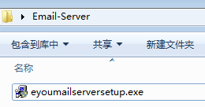

（2）点击“是”

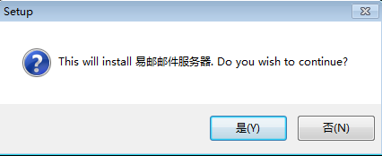

（3）点击“Next >”

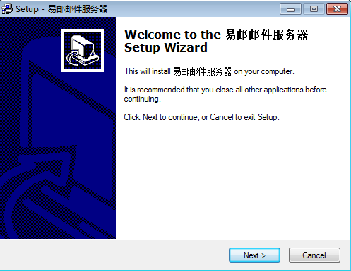

（4）点击“Next >”

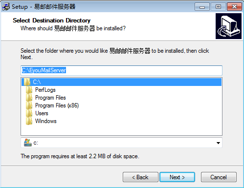

（5）点击“Next >”

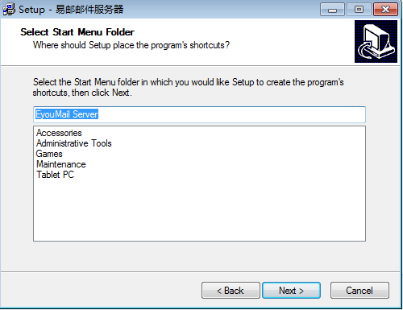

（6）点击“Install”

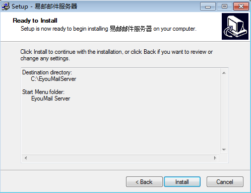

（7）点击“Finish”

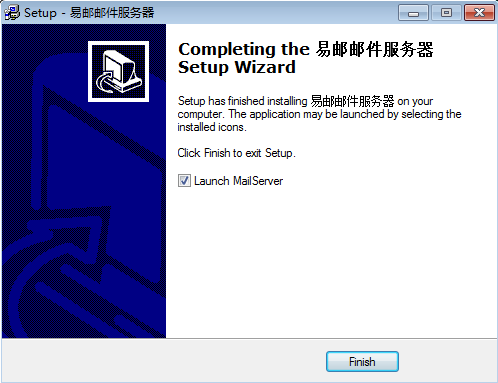

（8）报了个“警告”，不管它

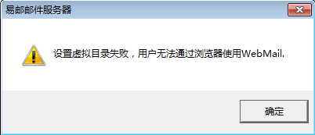

（9）允许通过防火墙

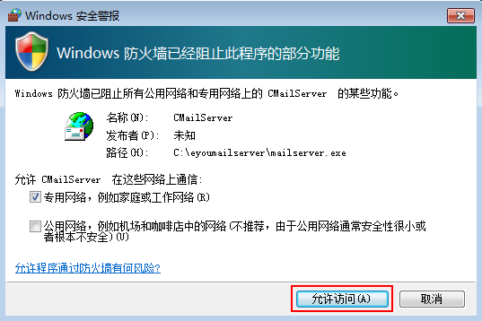

最后，易邮邮件服务器，如下图：

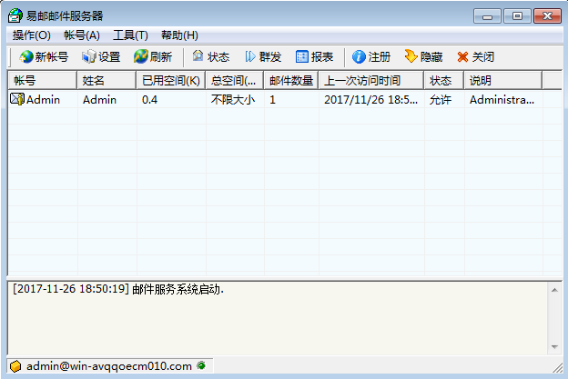

## 2、新建邮箱账号 ##

### 2.1、配置域名 ###

访问路径：工具-->服务器设置

	(1)选中“作为局域网邮件服务器”
	(2)单域名框中输入“lsieun.com”

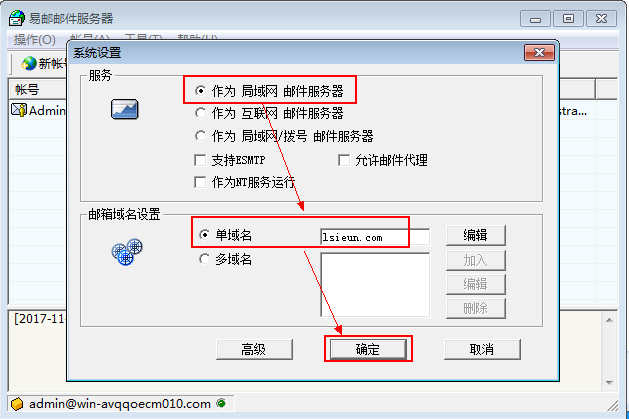

### 2.2、新建邮箱账号 ###

访问路径：帐号-->新建帐号

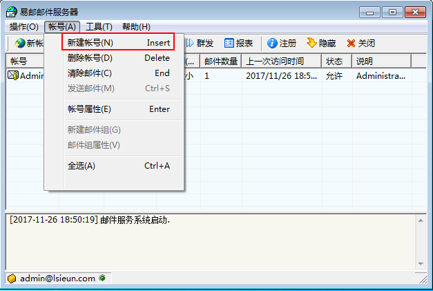

|帐号|密码|姓名|
|----|---|----|
|zhangsan|123456|张三|
|lisi|123456|李四|

添加zhangsan信息完成后，点击“确定”
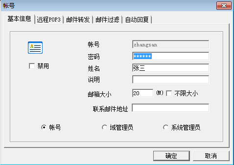

添加lisi信息完成后，点击“确定”
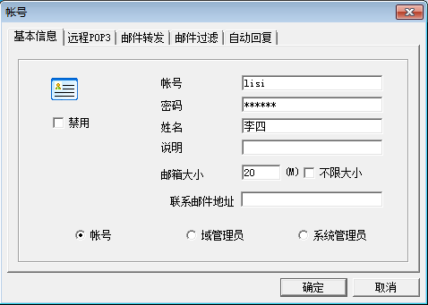

最后，zhangsan和lisi的信息已经显示在列表当中，如下图：

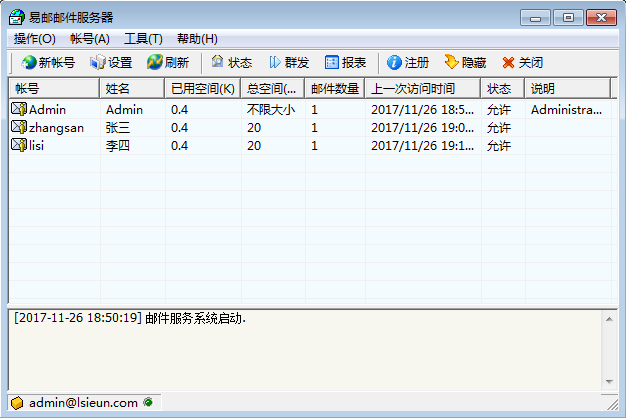

## 3、安装FoxMail ##

（1）双击foxmail的安装文件

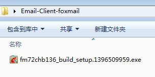

（2）选择“快速安装”

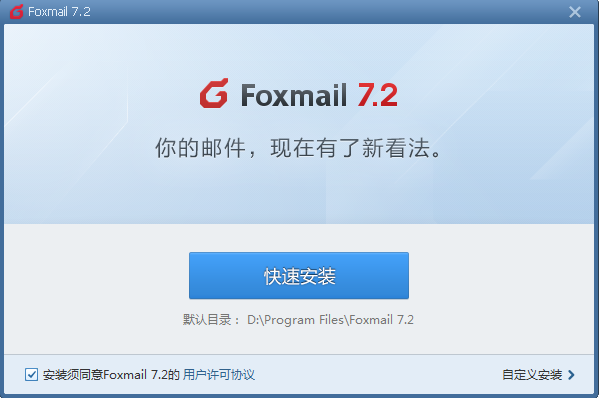

（3）选择“完成”之前，去掉两个勾选项

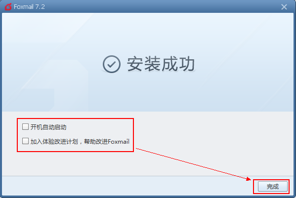

（4）双击“Foxmail”图标启动Foxmail

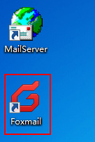

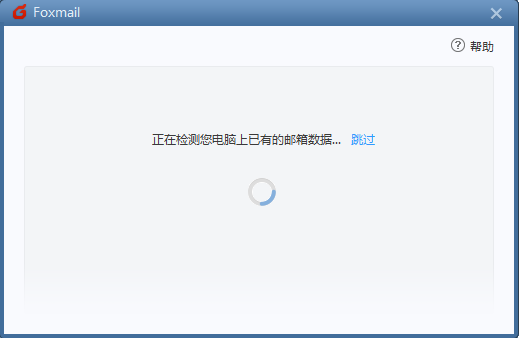

（5）配置POP和SMTP服务器为localhost

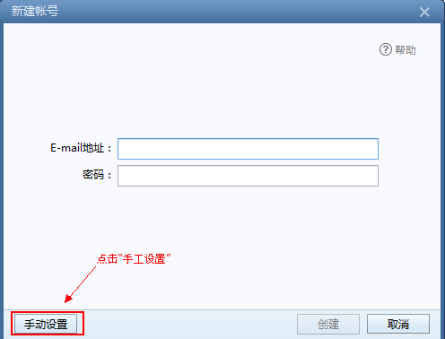

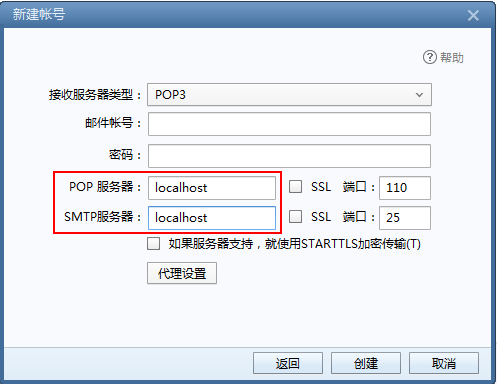

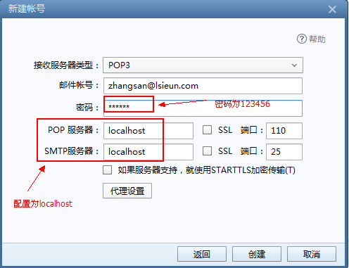

配置完成后，点击“创建”，如下图

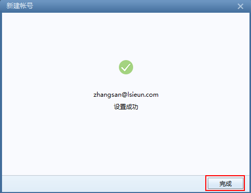

在zhangsan帐号的收件箱里，可以看到一封邮件，如下图：

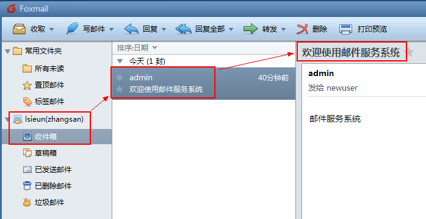

（6）如果想添加lisi的帐号，可以点击右上角的菜单图标后选择“账号管理”

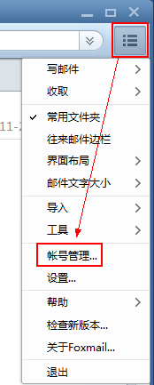

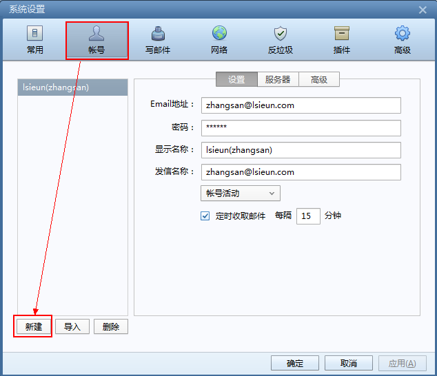

（7）可以使用foxmail客户端进行发送和接收邮件测试

（8）在进行POP和SMTP服务器进行设置时，使用了110和25端口，可以通过命令进行测试：

在cmd命令(以管理员身份运行)中输入：

	netstat -abn

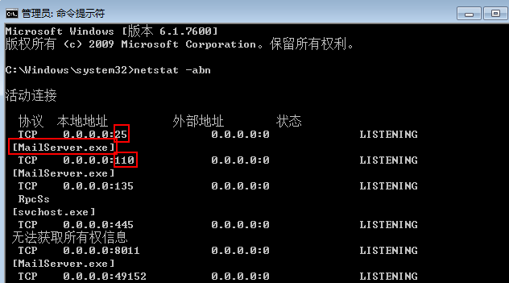