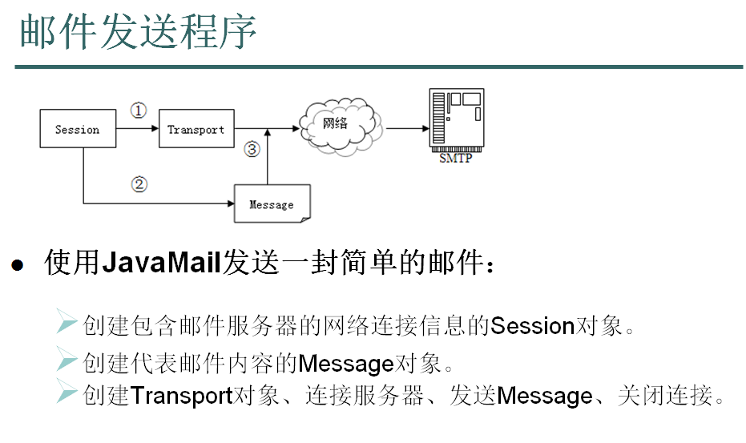
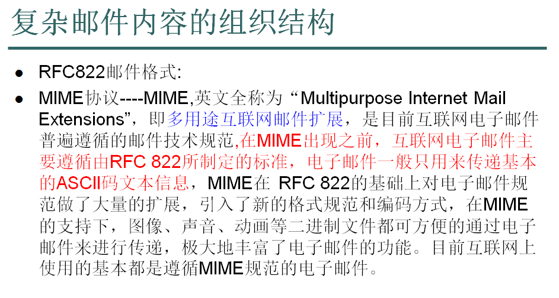
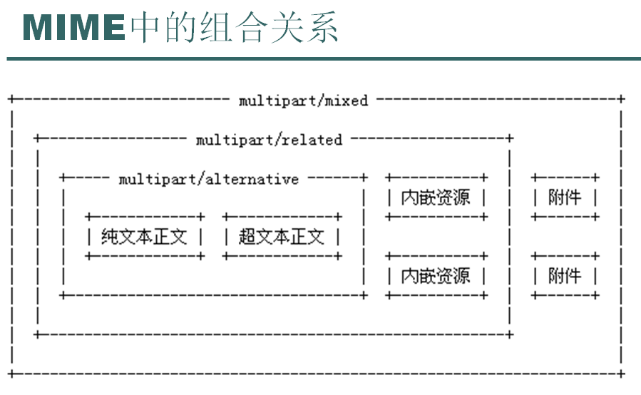
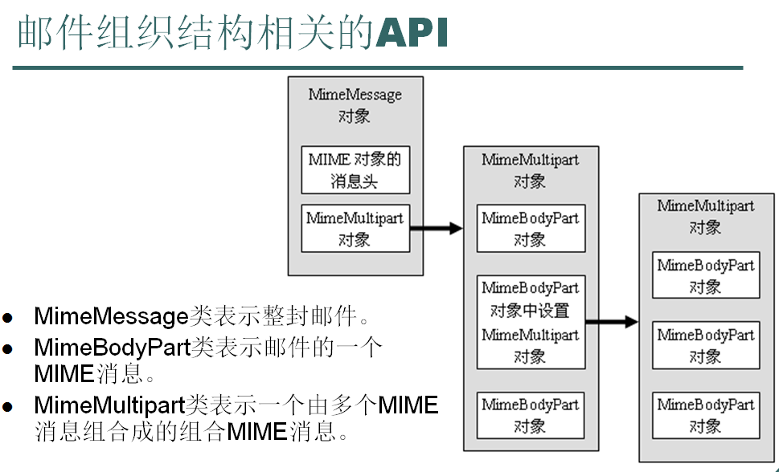

# JavaMail Programming

<!-- TOC -->

- [1. maven dependency](#1-maven-dependency)
- [2. Programming](#2-programming)
  - [2.1. Plain Text](#21-plain-text)
  - [2.2. Image](#22-image)
  - [2.3. Image and Attachment](#23-image-and-attachment)
- [3. Note](#3-note)

<!-- /TOC -->

## 1. maven dependency

```xml
<!-- https://mvnrepository.com/artifact/javax.mail/mail -->
<dependency>
    <groupId>javax.mail</groupId>
    <artifactId>mail</artifactId>
    <version>1.4</version>
</dependency>
```

## 2. Programming

### 2.1. Plain Text

发送普通文本邮件和发送带有超链接的邮件的区别在于调用的方法不同：

- （1）发送普通文本邮件，调用message.setText方法
- （2）发送带有超链接的邮件，调用message.setContent方法

```java
package com.lsieun.javamail;

import org.junit.Test;

import javax.mail.Message;
import javax.mail.Session;
import javax.mail.Transport;
import javax.mail.internet.InternetAddress;
import javax.mail.internet.MimeMessage;
import java.util.Date;
import java.util.Properties;

public class App_A_SendNormalMail {
    @Test
    public void testSend()throws Exception{
        //0. 邮件参数
        Properties prop = new Properties();
        prop.put("mail.transport.protocol", "smtp");	// 指定协议
        //prop.put("mail.smtp.host", "localhost");      // 主机   stmp.qq.com
        prop.put("mail.smtp.host", "192.168.80.128");	// 我把邮件服务器放到了192.168.80.128上
        prop.put("mail.smtp.port", 25);					// 端口
        prop.put("mail.smtp.auth", "true");				// 用户密码认证
        prop.put("mail.debug", "true");					// 调试模式

        //1. 创建一个邮件的会话
        Session session = Session.getDefaultInstance(prop);
        //2. 创建邮件体对象 (整封邮件对象)
        MimeMessage message = new MimeMessage(session);
        //3. 设置邮件体参数:
        //3.1 标题
        message.setSubject("第一个示例：我的第一封邮件");
        //3.2 邮件发送时间
        message.setSentDate(new Date());
        //3.3 发件人
        message.setSender(new InternetAddress("zhangsan@lsieun.com"));
        //3.4 接收人
        message.setRecipient(Message.RecipientType.TO, new InternetAddress("lisi@lsieun.com"));
        //3.5内容
        //message.setText("你好，已经发送成功！  正文....");  // 简单纯文本邮件
        //邮件中含有超链接
        message.setContent("<a href='http://www.baidu.com'>百度</a>","text/html;charset=UTF-8");
        message.saveChanges();   // 保存邮件(可选)

        //4. 发送
        Transport trans = session.getTransport();
        trans.connect("zhangsan", "123456");
        // 发送邮件
        trans.sendMessage(message, message.getAllRecipients());
        trans.close();

    }
}

```



### 2.2. Image

```java
package com.lsieun.javamail;

import org.junit.Test;

import javax.activation.DataHandler;
import javax.activation.DataSource;
import javax.activation.FileDataSource;
import javax.mail.Message;
import javax.mail.Session;
import javax.mail.Transport;
import javax.mail.internet.InternetAddress;
import javax.mail.internet.MimeBodyPart;
import javax.mail.internet.MimeMessage;
import javax.mail.internet.MimeMultipart;
import java.io.File;
import java.util.Date;
import java.util.Properties;

public class App_B_SendImgMail {
    private static Properties prop;
    static {
        prop = new Properties();
        prop.put("mail.transport.protocol", "smtp");     // 指定协议
        //prop.put("mail.smtp.host", "localhost");       // 主机   stmp.qq.com
        prop.put("mail.smtp.host", "192.168.80.128");    // 我把邮件服务器放到了192.168.80.128上
        prop.put("mail.smtp.port", 25);                  // 端口
        prop.put("mail.smtp.auth", "true");              // 用户密码认证
        prop.put("mail.debug", "true");                  // 调试模式
    }

    @Test
    public void testSend() throws Exception {
        //1. 创建一个邮件的会话
        Session session = Session.getDefaultInstance(prop);
        //2. 创建邮件体对象 (整封邮件对象)
        MimeMessage message = new MimeMessage(session);
        //3. 设置邮件体参数:发送人、接收人、发送时间、标题、内容
        message.setSender(new InternetAddress("zhangsan@lsieun.com"));
        message.setRecipient(Message.RecipientType.TO, new InternetAddress("lisi@lsieun.com"));
        message.setSentDate(new Date());
        message.setSubject("第二个示例：带图片邮件");

        /*******************设置邮件内容：多功能用户邮件(related)*********************/
        /*
        related
        |----content
        |----resource
        */
        //(1)构建多功能邮件块内容: resource + content
        MimeBodyPart resource = new MimeBodyPart();
        MimeBodyPart content = new MimeBodyPart();

        //(2)设置邮件资源:resource------
        // filePath --> file
        String filePath = this.getClass().getResource("jerry.jpg").getPath();
        File file = new File(filePath);
        // file --> ds --> handler
        DataSource ds = new FileDataSource(file);
        DataHandler handler = new DataHandler(ds);
        // handler --> resource
        resource.setDataHandler(handler);
        resource.setContentID("myimg.jpg");


        //(3)设置邮件内容:content------
        content.setContent("<br/>这里是文字","text/html;charset=UTF-8");

        //(4)整合：构建一个多功能邮件块related = content + resource
        MimeMultipart related = new MimeMultipart("related");
        related.addBodyPart(content);
        related.addBodyPart(resource);

        //(5)最后：将MimeMultipart设置到message中
        message.setContent(related);

        //4. 发送
        Transport trans = session.getTransport();
        trans.connect("zhangsan", "123456");
        // 发送邮件
        trans.sendMessage(message, message.getAllRecipients());
        trans.close();
    }
}
```







### 2.3. Image and Attachment

```java
package com.lsieun.javamail;

import org.junit.Test;

import javax.activation.DataHandler;
import javax.activation.DataSource;
import javax.activation.FileDataSource;
import javax.mail.Message;
import javax.mail.Session;
import javax.mail.Transport;
import javax.mail.internet.InternetAddress;
import javax.mail.internet.MimeBodyPart;
import javax.mail.internet.MimeMessage;
import javax.mail.internet.MimeMultipart;
import java.io.File;
import java.util.Date;
import java.util.Properties;

public class App_C_SendImgAttachMail {
    private static Properties prop;
    static {
        prop = new Properties();
        prop.put("mail.transport.protocol", "smtp");     // 指定协议
        //prop.put("mail.smtp.host", "localhost");       // 主机   stmp.qq.com
        prop.put("mail.smtp.host", "192.168.80.128");    // 我把邮件服务器放到了192.168.80.128上
        prop.put("mail.smtp.port", 25);                  // 端口
        prop.put("mail.smtp.auth", "true");              // 用户密码认证
        prop.put("mail.debug", "true");                  // 调试模式
    }

    @Test
    public void testSend() throws Exception {
        //1. 创建一个邮件的会话
        Session session = Session.getDefaultInstance(prop);
        //2. 创建邮件体对象 (整封邮件对象)
        MimeMessage message = new MimeMessage(session);
        //3. 设置邮件体参数:发送人、接收人、发送时间、标题、内容
        message.setSender(new InternetAddress("zhangsan@lsieun.com"));
        message.setRecipient(Message.RecipientType.TO, new InternetAddress("lisi@lsieun.com"));
        message.setSentDate(new Date());
        message.setSubject("第三个示例：带图片和附件的邮件");

        /*******************设置邮件内容：多功能用户邮件(related)*********************/
        /*
        related
        |----content
        |----resource
        */
        //(1)构建多功能邮件块内容: resource + content
        MimeBodyPart resource = new MimeBodyPart();
        MimeBodyPart content = new MimeBodyPart();

        //(2)设置邮件资源:resource------
        // filePath --> file
        String filePath = this.getClass().getResource("jerry.jpg").getPath();
        File file = new File(filePath);
        // file --> ds --> handler
        DataSource ds = new FileDataSource(file);
        DataHandler handler = new DataHandler(ds);
        // handler --> resource
        resource.setDataHandler(handler);
        resource.setContentID("myimg.jpg");


        //(3)设置邮件内容:content------
        content.setContent("<br/>这里是文字","text/html;charset=UTF-8");

        //(4)整合：构建一个多功能邮件块related = content + resource
        MimeMultipart related = new MimeMultipart("related");
        related.addBodyPart(content);
        related.addBodyPart(resource);

        /*
        mixed
        |----left
             |----related
        |----right
         */
        //(5)创建left和right
        MimeBodyPart left = new MimeBodyPart();
        MimeBodyPart right = new MimeBodyPart();

        //(6)related --> left
        left.setContent(related);

        //(7)设置 总邮件块的右侧，  即附件
        String path_ = this.getClass().getResource("readme.docx").getPath();
        File file_ = new File(path_);
        DataSource file_ds = new FileDataSource(file_);
        DataHandler file_handler = new DataHandler(file_ds);
        right.setDataHandler(file_handler);
        right.setFileName("myfile.docx");  // 附件中显示的文件名

        //(8)设置 总邮件块的右侧，  即附件
        MimeMultipart mixed = new MimeMultipart();
        mixed.addBodyPart(left);
        mixed.addBodyPart(right);

        //(9)最后：将mixed设置到message中
        message.setContent(mixed);

        //4. 发送
        Transport trans = session.getTransport();
        trans.connect("zhangsan", "123456");
        // 发送邮件
        trans.sendMessage(message, message.getAllRecipients());
        trans.close();
    }
}
```

## 3. Note

对于Java Project，不存在什么问题；

但如果是Web项目，因为在javaee自带的jar包中有邮件功能，可能存在问题，这种情况的处理方法是：

- （1）删除javaee的jar包中mail包
- （2）使用我们自己的jar包

> 至此结束
