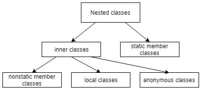

# Nested Classes

<!-- TOC -->

- [1. General Picture](#1-general-picture)
- [2. Reference](#2-reference)

<!-- /TOC -->

## 1. General Picture

Generally, **a nested class is a class that is declared inside another class or interface**:

Looking at the diagram, we see that **anonymous classes** along with **local** and **nonstatic member ones** form the so-called **inner classes**. Together with **static member classes**, they form the **nested classes**.

## 2. Reference

- [Nested Classes in Java](https://www.baeldung.com/java-nested-classes)
- [Anonymous Classes in Java](https://www.baeldung.com/java-anonymous-classes)
- 《Thinking in Java》，Inner Classes
