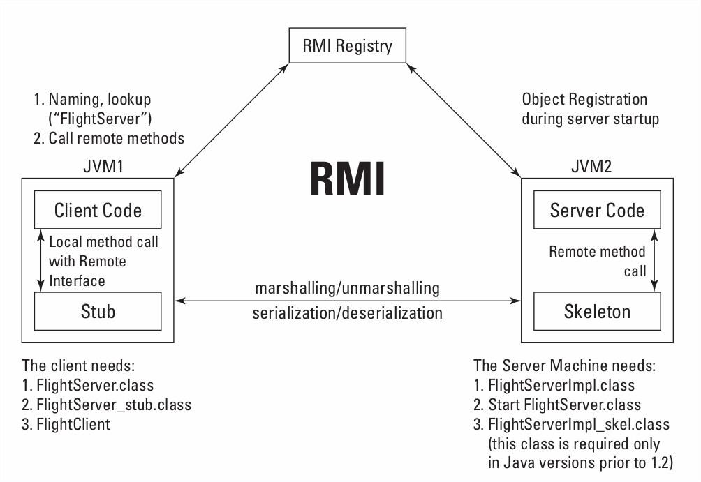

# Flight Information Application

<!-- TOC -->

- [1. Declaring remote interfaces](#1-declaring-remote-interfaces)
- [2. Implementing remote interfaces](#2-implementing-remote-interfaces)
- [3. Stubs and skeletons](#3-stubs-and-skeletons)
- [4. Registering remote objects](#4-registering-remote-objects)
- [5. Writing RMI clients](#5-writing-rmi-clients)

<!-- /TOC -->

## 1. Declaring remote interfaces

The following are the rules for creation of remote interfaces:

- (1) An application’s remote interface must declare methods having `public` access that will enable clients to communicate with the server.
- (2) An application’s remote interface must extend the `java.rmi.Remote` interface. The `Remote` interface does not have any methods -- just declare the required methods there.
- (3) Each method must declare a `java.rmi.RemoteException` or one of its ancestors.
- (4) Method **arguments** and **return data types** must be serializable.

```java
import java.rmi.Remote;
import java.rmi.RemoteException;

public interface FlightService extends Remote {
    public String getArrivalTime(String flightNo) throws RemoteException;
}
```

In RMI applications, all remote methods must declare `java.rmi.RemoteException`. This exception will be thrown by the server application in such cases as communication failures, **marshalling** or **unmarshalling** errors, and so on. Because a `RemoteException` is a **checked** exception, it has to be handled in the client code.

> Marshalling可译作集结、结集、编码、编组、编集、安整、数据打包等，是计算机科学中把一个对象的内存表示变换为适合存储或发送的数据格式的过程。  
> Marshalling类似于序列化，可用于一个对象与一个远程对象通信。逆过程被称作unmarshalling。

Besides the `RemoteException`, a remote application can throw any other exceptions to be handled by the client exactly as if they were thrown locally.

## 2. Implementing remote interfaces

You can make the implementation class visible to remote Java clients declaring that this class is inherited from the `java.rmi.server.UnicastRemoteObject` class. This class will respond to and process the client’s requests.

```java
import java.rmi.RemoteException;
import java.rmi.server.UnicastRemoteObject;
import java.util.HashMap;
import java.util.Map;

public class FlightServiceImpl extends UnicastRemoteObject implements FlightService {
    private Map<String, String> arrivals = new HashMap<String, String>();

    public FlightServiceImpl() throws RemoteException {
        super();
        arrivals.put("AAA", "3:20PM");
        arrivals.put("BBB", "8:00PM");
        arrivals.put("CCC", "6:05PM");
    }

    public String getArrivalTime(String flightNo) throws RemoteException {
        String arrTime = null;
        arrTime = (String) arrivals.get(flightNo);
        if (arrTime == null) {
            throw new RemoteException("Flight number " + flightNo +
                    " does not exist");
        }
        return arrTime;
    }
}

```

If the `FlightServerImpl` class cannot be inherited from the `UnicastRemoteObject` because it’s already derived from some other business class, you can just declare that this class implements the `Remote` interface. You would then make it available to the remote clients by exporting it. Here’s how you would do this:

```java
FlightServerImpl fsi = new FlightServerImpl();
UnicastRemoteObject.exportObject(fsi);
```

## 3. Stubs and skeletons

After the remote interface and its implementation are created, you need to generate **the objects responsible for the network communications** between them. 

The **stub** is a **client-side object** that represents the remote object. When a client calls a remote method, the stub method is invoked and it does the following:

- Initiates a connection with the remote JVM
- Marshals (prepares and transmits) the parameters to the server
- Waits for the result of the method invocation
- Unmarshals (reads) the return value or exception returned
- Returns the value to the client

All the background work (serialization and networking) is hidden from developers — they just need to write local method calls!

An RMI **server** may have a similar object called a **skeleton** to process the client’s network calls. It performs the following operations for each received call:

- Unmarshals (reads) the parameters for the remote method
- Invokes the method on the actual remote-object implementation
- Marshals the result to the caller

The skeleton is responsible for dispatching the client call to the actual object implementation. The **skeletons** are deprecated starting from Java 1.2 onwards. They are not replaced by any other classes and can be just ignored. But if at least one of the
JVMs participating in the RMI application uses Java version 1.1 or older, the skeleton class must exist on the server side.



J2SE comes with the **RMI compiler** called `rmic`, which generates **stubs** and **skeletons** from the existing implementation class. You can start the `rmic` program like this:

```bash
$ rmic FlightServiceImpl
```

Output:

```txt
Warning: generation and use of skeletons and static stubs for JRMP
is deprecated. Skeletons are unnecessary, and static stubs have
been superseded by dynamically generated stubs. Users are
encouraged to migrate away from using rmic to generate skeletons and static
stubs. See the documentation for java.rmi.server.UnicastRemoteObject.
```

由上面这段话，可以看出：不推荐当前这种方式了，而推荐dynamically generated stubs

> 执行上面的命令，并不会生成`FlightServiceImpl_Skel.class`，要使用下面的命令

```bash
rmic -v1.1 FlightServiceImpl
```

This command will create two more classes — one (`FlightServiceImpl_Stub.class`) for the client side and the other (`FlightServiceImpl_Skel.class`) for the server.

If you want to know what’s under the hood, run the `rmic` with the `-keepgenerated` flag to see the source code of the stub and skeleton in the files `FlightServerImpl_stub.java` and `FlightServerImpl_skel.java`.

If the application does not use JVMs older than version 1.2, you can inform the RMI compiler that the stub does not have to be generated by issuing the following command:

```bash
rmic -v1.2 FlightServiceImpl
```

## 4. Registering remote objects

Before a client program can invoke a particular method on the remote object, it has to find this object on the network. A server makes remote objects visible to the clients by registering these objects with a naming service. The `rmiregistry` is a simple naming service that comes with J2SE. The process of registering an object with the RMI registry is called **binding**. **The RMI registry is nothing but a naming service** that knows where to find the server’s objects, and it will enable clients to look
up an object in the network by name. While the class name can be long and include the package name, the registry name is usually short and descriptive.

Two methods in the `java.rmi.Naming` class can bind an object to the registry.

- The `bind()` method binds an object to a name. It throws the `AlreadyBoundException` if the binding already exists under the - specified name.
- The `rebind()` method replaces any preexisting registry entry with the new one.
- The `unbind()` method removes an object from the registry.

The registry must be up and running by the time you bind the objects. To start the registry, open a command window and type the following:

```bash
rmiregistry
```

This command will start the registry on the default RMI port `1099`. If you need to specify another port, provide the port’s number as a command-line parameter. For example, to start the registry on port 6000 use the following command:

```bash
c:\>rmiregistry 6000
```

If the specified port is being used by another program, the `rmiregistry` will throw an exception that may look like the following:

```txt
java.rmi.server.ExportException: Port already in use: 6000;
nested exception is: java.net.BindException: Address already in use: JVM_Bind
```

The `Server` program binds the `FlightServiceImpl` class under the name `FlightService` to the registry that runs on the same machine as the server (localhost) on port `6000`.

```java
import java.net.MalformedURLException;
import java.rmi.Naming;
import java.rmi.RemoteException;

public class Server {
    public static void main(String[] args) {
        try {
            FlightServiceImpl fsi = new FlightServiceImpl();
            Naming.rebind("rmi://localhost:6000/FlightService", fsi);
            System.out.println("FlightService is waiting for the requests on port 6000...");
        } catch (RemoteException e) {
            e.printStackTrace();
        } catch (MalformedURLException e) {
            e.printStackTrace();
        }
    }
}
```

Instead of starting the registry manually, you could have also started it from within the `Server` program itself. Just add the following line at the beginning of the `main()` method:

```java
LocateRegistry.createRegistry(6000);
```

## 5. Writing RMI clients

The client has to perform a lookup in the registry on the server’s machine and obtain a remote reference to the object listed under the specified name. The `lookup()` method of the `java.rmi.Naming` class locates the remote object on the specified host and port:

```java
import java.net.MalformedURLException;
import java.rmi.Naming;
import java.rmi.NotBoundException;
import java.rmi.RemoteException;

public class Client {
    public static void main(String[] args) {
        try {
            FlightService service = (FlightService) Naming.lookup("rmi://localhost:6000/FlightService");
            String arrival = service.getArrivalTime("AAA");
            System.out.println("Arrival time is " + arrival);
        } catch (NotBoundException e) {
            e.printStackTrace();
        } catch (MalformedURLException e) {
            e.printStackTrace();
        } catch (RemoteException e) {
            e.printStackTrace();
        }
    }
}

```
