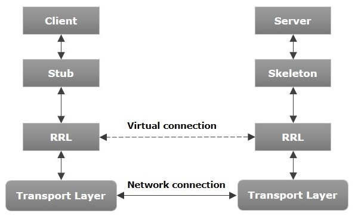
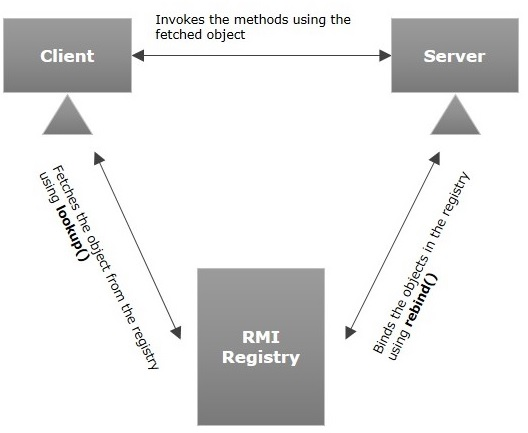

# Java RMI - Introduction

URL: [Java RMI - Introduction](https://www.tutorialspoint.com/java_rmi/java_rmi_introduction.htm)

**RMI** stands for **Remote Method Invocation**. It is a mechanism that allows an object residing in one system (JVM) to access/invoke an object running on another JVM.

RMI is used to build distributed applications; it provides remote communication between Java programs. It is provided in the package `java.rmi`.

<!-- TOC -->

- [1. Architecture of an RMI Application](#1-architecture-of-an-rmi-application)
- [2. Working of an RMI Application](#2-working-of-an-rmi-application)
- [3. Marshalling and Unmarshalling](#3-marshalling-and-unmarshalling)
- [4. RMI Registry](#4-rmi-registry)
- [5. Goals of RMI](#5-goals-of-rmi)

<!-- /TOC -->

## 1. Architecture of an RMI Application

In an RMI application, we write two programs, a **server program** (resides on the server) and a **client program** (resides on the client).

- Inside the **server program**, a remote object is created and reference of that object is made available for the client (using the registry).

- The **client program** requests the remote objects on the server and tries to invoke its methods.

The following diagram shows the architecture of an RMI application.

Let us now discuss the components of this architecture.

- **Transport Layer** − This layer connects the client and the server. It manages the existing connection and also sets up new connections.

- **Stub** − A stub is a representation (proxy) of the remote object at client. It resides in the client system; it acts as a gateway for the client program.

- **Skeleton** − This is the object which resides on the server side. stub communicates with this skeleton to pass request to the remote object.

- **RRL(Remote Reference Layer)** − It is the layer which manages the references made by the client to the remote object.

## 2. Working of an RMI Application

The following points summarize how an RMI application works −

- When the client makes a call to the remote object, it is received by the stub which eventually passes this request to the RRL.

- When the client-side RRL receives the request, it invokes a method called `invoke()` of the object `remoteRef`. It passes the request to the RRL on the server side.

- The RRL on the server side passes the request to the Skeleton (proxy on the server) which finally invokes the required object on the server.

- The result is passed all the way back to the client.

## 3. Marshalling and Unmarshalling

Whenever a client invokes a method that accepts parameters on a remote object, the parameters are bundled into a message before being sent over the network. These parameters may be of primitive type or objects. In case of **primitive type**, the parameters are put together and a header is attached to it. In case the parameters are **objects**, then they are serialized. This process is known as **marshalling**.

At the server side, the packed parameters are unbundled and then the required method is invoked. This process is known as **unmarshalling**.

## 4. RMI Registry

RMI registry is a namespace on which all server objects are placed. Each time the server creates an object, it registers this object with the RMIregistry (using `bind()` or `reBind()` methods). These are registered using a unique name known as **bind name**.

To invoke a remote object, the client needs a reference of that object. At that time, the client fetches the object from the registry using its **bind name** (using `lookup()` method).

The following illustration explains the entire process −

## 5. Goals of RMI

Following are the goals of RMI −

- Minimize the difference between working with local and remote objects. （这个应该是最根本的）
- To minimize the complexity of the application. （这是通过Stub和Skeleton来实现的，方便开发者）
- To preserve type safety. （这是怎么保证的呢？或许是因为两方面：（1）基于interface，它能保证method接收参数的type是一致的；（2）它有marshalling和unmarshalling的过程，能够对object进行序列化和反序列化）
- Distributed garbage collection. （各个JVM进行自己的垃圾回收，这是可以理解的，但它如何就成为了一个goal呢？在这个过程中，并没有将method的具体实现代码进行传输，而只是将输入参数和输出结果进行传输。）
