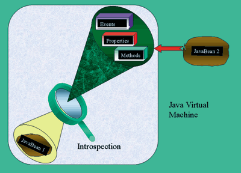

# Reflection VS Introspection

<!-- TOC -->

- [1. Intro](#1-intro)
- [2. Introspection Uses Reflection](#2-introspection-uses-reflection)
- [3. The Costs of Usage](#3-the-costs-of-usage)
- [4. Reference](#4-reference)

<!-- /TOC -->

## 1. Intro

Webster's dictionary defines reflection as "the act of giving back or showing an image of."

Reflection in Java allows the developer to create objects that can:

- Construct new class instances and new arrays
- Access and modify fields of objects and classes
- Invoke methods on objects and classes
- Access and modify the elements of arrays

Webster's dictionary defines introspection as "observation or examination of one's own state."

In Java, introspection is used in the context of **JavaBeans**, which define Java's component model. Introspection is used to allow a Bean to discover the **properties**, **methods** and **events** of another Bean at runtime. This enables developers to design and build their own Beans without knowing about the internals of another Bean.

Introspection is used by visual builder tools to introspect on Beans; i.e., to determine **what properties** are exposed by the Bean, **what public methods** it provides and **what events** it can generate. However, Introspection is a facility that is available to all Java classes, not just JavaBeans.

## 2. Introspection Uses Reflection

Reflection and introspection are very closely related. **Reflection** is **a low-level facility** that allows the code to examine the internals of any class or object at runtime. **Introspection** builds on **this facility** and provides a more convenient interface for examining Beans.

In fact, the relationship between reflection and introspection is very similar to the relationship between JavaBeans and other Java classes. **JavaBeans** are simply normal Java objects with certain design patterns enforced in their nomenclature. **Introspection** assumes these design patterns on the object that it is inspecting and uses low-level reflection to examine the object's internals.

## 3. The Costs of Usage

Reflection and Introspection are powerful tools that contribute to the flexibility provided by the Java language. However, these APIs should be used only as needed and after taking into account the costs associated with their usage:

- Reflection and Introspection method calls have a substantial performance overhead.
- Using reflection makes the code much more complex and harder to understand than using direct method calls.
- Errors in method invocation are discovered at runtime instead of being caught by the compiler.
- The code becomes type-unsafe.

The Reflection and Introspection APIs should be used only when other forms of object-oriented programming are not appropriate.

## 4. Reference

- [Reflection & Introspection: Object Exposed](http://www2.sys-con.com/itsg/virtualcd/java/archives/0305/sagar2/index.html)
