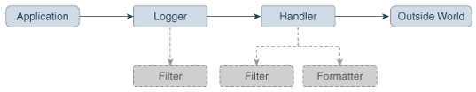

# Java Logging API

<!-- TOC -->

- [1. Java Logging, a high level overview](#1-java-logging-a-high-level-overview)
- [2. Overview of Control Flow](#2-overview-of-control-flow)
- [3. Reference](#3-reference)

<!-- /TOC -->

Java Logging API was introduced in `1.4` and you can use java logging API to log application messages.

## 1. Java Logging, a high level overview

- `Logger`: A named entity to which user application sends messages.
- `Handler`: A specific handler is typically tied to a specific logging destination. A destination is where final formatted messages are sent. A handler can apply any additional logic, e.g. to improve performance. Examples: `ConsoleHandler`, `FileHandler`, `SocketHandler`, user defined ones.
- `Level`: Used by `Logger`/`Handler`. To discard messages if the `Level` of a given message is less than the `Level` associated with the `Logger`/`Handler`.
- `Filter`: Used by `Logger`/`Handler`. It can filter message which cannot be filtered based on Levels. A dynamic/programmatic way to filter messages.
- `Formatter`: To display messages in a specific format. Examples: `SimpleFormatter`, `XMLFormatter` or user defined ones
- `ResourceBundle`: A `Logger` may have a `ResourceBundle` associated with it. It is used to map raw message strings with localized message strings.

## 2. Overview of Control Flow

Applications make logging calls on `Logger` objects. `Logger` objects are organized in a hierarchical namespace and child `Logger` objects may inherit some logging properties from their parents in the namespace.

> 笔记：在`java.util.logging`当中，`Logger`是第一位的研究对象，其它的概念都是在`Logger`基础上延伸出来的。另外，每一个`Logger`都有一个namespace相关联，而这些namespace又处于`LogManager`的管理之下。

Applications make logging calls on `Logger` objects. These `Logger` objects allocate `LogRecord` objects which are passed to `Handler` objects for publication. Both `Logger` and `Handler` objects may use logging `Level` objects and (optionally) `Filter` objects to decide if they are interested in a particular `LogRecord` object. When it is necessary to publish a `LogRecord` object externally, a `Handler` object can (optionally) use a `Formatter` object to localize and format the message before publishing it to an I/O stream.

> 笔记：由`Logger`进行延伸出另外两个概念，有`LogRecord`和`Handler`，这三个概念构成了logging框架的主体。当然了，除了这三个概念之外，还有一些附属概念，例如：`Level`、`Filter`和`Formatter`。

Each `Logger` object keeps track of a set of output `Handler` objects. By default all `Logger` objects also send their output to their parent `Logger`. But `Logger` objects may also be configured to ignore `Handler` objects higher up the tree.

> 笔记：`Logger`和`Handler`之间的关系。

Some `Handler` objects may direct output to other `Handler` objects. For example, the `MemoryHandler` maintains an internal ring buffer of `LogRecord` objects, and on trigger events, it publishes its `LogRecord` object through a target `Handler`. In such cases, any formatting is done by the last `Handler` in the chain.

> 笔记：`Formatter`是在最后一个`Handler`当中确定的。

The APIs are structured so that calls on the `Logger` APIs can be cheap when logging is disabled笔记：完全禁用. If logging is disabled for a given log level, then the `Logger` can make a cheap comparison test and return笔记：禁用某一种级别. If logging is enabled for a given log level笔记：启用某一种级别, the `Logger` is still careful to minimize costs before passing the `LogRecord` into the `Handler`. In particular, localization and formatting (which are relatively expensive) are deferred until the `Handler` requests them. For example, a `MemoryHandler` can maintain a circular buffer of `LogRecord` objects without having to pay formatting costs笔记：不到最后关头，不考虑输出格式.

> 笔记：总的来说，这个API设计的目标就是减少不必要的性能消耗。

## 3. Reference

- [Java 12: Java Logging Overview](https://docs.oracle.com/en/java/javase/12/core/java-logging-overview.html) 这是Oracle的文档
- [Logic Big: Java Logging](https://www.logicbig.com/tutorials/core-java-tutorial/logging.html) 这里面是一系列文章，我读后，从实践的角度上，让我明白了许多知识
- [jenkov: Java Logging](http://tutorials.jenkov.com/java-logging/index.html) 这里面也是一系列文章，对我也非常有帮助
