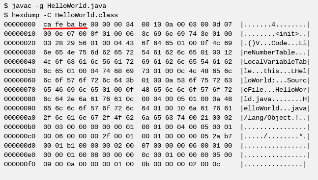
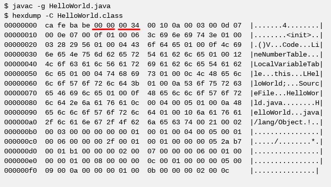
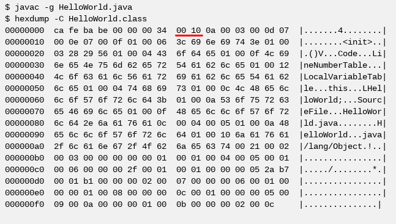

# 理解Class文件的存储结构

`java_class_file_info`


| 数据结构         | 名称                  | 数量                      |
| ---------------- | --------------------- | ------------------------- |
| `u4`             | `magic_number`        | `1`                       |
| `u2`             | `minor_version`       | `1`                       |
| `u2`             | `major_version`       | 1                         |
| `u2`             | `constant_pool_count` | 1                         |
| `cp_info`        | `constant_pool`       | `constant_pool_count - 1` |
| `u2`             | `access_flags`        | `1`                       |
| `u2`             | `this_class`          | `1`                       |
| `u2`             | `super_class`         | `1`                       |
| `u2`             | `interfaces_count`    | `1`                       |
| `u2`             | `interfaces`          | `interfaces_count`        |
| `u2`             | `fields_count`        | `1`                       |
| `field_info`     | `fields`              | `fields_count`            |
| `u2`             | `methods_count`       | `1`                       |
| `method_info`    | `methods`             | `methods_count`           |
| `u2`             | `attributes_count`    | `1`                       |
| `attribute_info` | `attributes`          | `attributes_count`        |

《理解Class结构》，这门“武功”分成4个层次：

- 第一层：炸死TA搜搜（Just so-so）
- 第二层：胆大心细，亦不过如此
- 第三层：炸死TA搜搜again
- 第四层：曾经沧海难为水

第一层：炸死TA搜搜。这里只包括`magic_number`、`minor_version` 和 `major_version`三个，它们是`u2`、`u4`类型的数据，非常简单。

第二层：胆大心细，亦不过如此。这里只包括`constant_pool_count` 和 `constant_pool`，虽然涉及到的结构类型比较多，但本质上是简单的，只是处理复杂的问题时，需要有耐心和细心。

第三层：炸死TA搜搜again。这里包括`access_flags`、`this_class`、`super_class`、`interfaces_count` 和 `interfaces` 五个，它们都是`u2`类型的数据，也是非常简单的。

第四层：曾经沧海难为水。曾经到过沧海，看到别的河流也不足为顾了。见识过第二层的Constant Pool，这里的`fields_count`、`fields`、`methods_count`、`methods`、`attributes_count` 和 `attributes` 也就算不得什么了。

## 第一层：炸死TA搜搜

```java
public class HelloWorld {
    //
}
```

```bash
$ javac -g HelloWorld.java
$ hexdump -C HelloWorld.class
00000000  ca fe ba be 00 00 00 34  00 10 0a 00 03 00 0d 07  |.......4........|
00000010  00 0e 07 00 0f 01 00 06  3c 69 6e 69 74 3e 01 00  |........<init>..|
00000020  03 28 29 56 01 00 04 43  6f 64 65 01 00 0f 4c 69  |.()V...Code...Li|
00000030  6e 65 4e 75 6d 62 65 72  54 61 62 6c 65 01 00 12  |neNumberTable...|
00000040  4c 6f 63 61 6c 56 61 72  69 61 62 6c 65 54 61 62  |LocalVariableTab|
00000050  6c 65 01 00 04 74 68 69  73 01 00 0c 4c 48 65 6c  |le...this...LHel|
00000060  6c 6f 57 6f 72 6c 64 3b  01 00 0a 53 6f 75 72 63  |loWorld;...Sourc|
00000070  65 46 69 6c 65 01 00 0f  48 65 6c 6c 6f 57 6f 72  |eFile...HelloWor|
00000080  6c 64 2e 6a 61 76 61 0c  00 04 00 05 01 00 0a 48  |ld.java........H|
00000090  65 6c 6c 6f 57 6f 72 6c  64 01 00 10 6a 61 76 61  |elloWorld...java|
000000a0  2f 6c 61 6e 67 2f 4f 62  6a 65 63 74 00 21 00 02  |/lang/Object.!..|
000000b0  00 03 00 00 00 00 00 01  00 01 00 04 00 05 00 01  |................|
000000c0  00 06 00 00 00 2f 00 01  00 01 00 00 00 05 2a b7  |...../........*.|
000000d0  00 01 b1 00 00 00 02 00  07 00 00 00 06 00 01 00  |................|
000000e0  00 00 01 00 08 00 00 00  0c 00 01 00 00 00 05 00  |................|
000000f0  09 00 0a 00 00 00 01 00  0b 00 00 00 02 00 0c     |...............|

```

### Magic Number

本节讲解：`magic_number`

| 数据结构         | 名称                  | 数量                      |
| ---------------- | --------------------- | ------------------------- |
| `u4`             | `magic_number`        | `1`                       |
| `u2`             | `minor_version`       | `1`                       |

每个`.class`文件的头4个字节称为魔数(Magic Number)，它唯一的作用是确定这个文件是否为一个能被虚拟机接受的Class文件。

Class文件的魔数很有“玩乐”的意味，值为：`0xCAFEBABE`。据Java开发小组最初的关键成员Patrick Naughton所说：“我们一直在寻找一些好玩的、容易记忆的东西，选择`0xCAFEBABE`是因为它象征着著名咖啡品牌Peet's Coffee中深受欢迎的Baristas咖啡”。

> 搜索一下，这句话（Patrick Naughton）的英文版  
> 搜索一下Baristas咖啡是一个什么样的受欢迎地位



### Class Version

本节讲解：`minor_version` 和 `major_version`

| 数据结构         | 名称                  | 数量                      |
| ---------------- | --------------------- | ------------------------- |
| `u4`             | `magic_number`        | `1`                       |
| `u2`             | `minor_version`       | `1`                       |
| `u2`             | `major_version`       | 1                         |
| `u2`             | `constant_pool_count` | 1                         |

第5和第6个字节是次版本号(Minor Version)，第7和第8个字节是主版本号(Major Version)。

在下图中，Minor Version的值是`0x0000`，换成十进制为`0`；Major Version的值为`0034`，换成十进制为`52`。



Java的主版本(Major Version)是从45开始，JDK 1.1之后的每个JDK大版本发布主版本号向上加1（JDK 1.0~1.1使用了45.0~45.3的版本号）。

Class文件版本号如下：

| 十六进制版本号 | 十进制版本号 | 编译器版本 |
| -------------- | ------------ | ---------- |
| `00 00 00 34`  | `52.0`       | `JDK 1.8`  |
| `00 00 00 33`  | `51.0`       | `JDK 1.7`  |
| `00 00 00 32`  | `50.0`       | `JDK 1.6`  |
| `00 00 00 31`  | `49.0`       | `JDK 1.5`  |
| `00 00 00 30`  | `48.0`       | `JDK 1.4`  |
| `00 00 00 2F`  | `47.0`       | `JDK 1.3`  |
| `00 00 00 2E`  | `46.0`       | `JDK 1.2`  |
| `00 00 00 2D`  | `45.0`       | `JDK 1.1`  |

高版本的JDK能向下兼容以前版本的Class文件，但不能运行以后的Class文件，即使文件格式并未发生任何变化，虚拟机也必须拒绝执行超过其版本号的Class文件。

```java
import lsieun.utils.IOUtils;

public class ModifyClass {
    public static void main(String[] args) {
        String filepath = "HelloWorld.class";
        byte[] bytes = IOUtils.readBytes(filepath);

        bytes[7] = 53;
        IOUtils.writeBytes(filepath, bytes);
    }
}
```

## 第二层：胆大心细，亦不过如此

本节讲解：`constant_pool_count` 和 `constant_pool`

| 数据结构         | 名称                  | 数量                      |
| ---------------- | --------------------- | ------------------------- |
| `u2`             | `major_version`       | 1                         |
| `u2`             | `constant_pool_count` | 1                         |
| `cp_info`        | `constant_pool`       | `constant_pool_count - 1` |
| `u2`             | `access_flags`        | `1`                       |

### constant_pool_count

`constant_pool_count`，代表常量池中常量计数值。

```java
public class HelloWorld {
    //
}
```

```bash
# 编译
$ javac -g HelloWorld.java
# 查看十六进制
$ hexdump -C HelloWorld.class
# 查看常量池的内容
$ javap -v HelloWorld.class
```

在下图中，是使用`javac -g HelloWorld.java`生成的结果，常量池容量为十六进制数`0x0010`，换成十进制为`16`。

> 注意：如果使用`javac HelloWorld.java`，常量池容量为十六进制数`0x000d`，换成十进制为`13`。



使用`javap -v HelloWorld.class`，可以查看到有`15`个常量，索引值范围为`1~15`。在Class文件格式规范制定之时，设计者将第`0`项常量空出来是有特殊考虑的，这样做的目的在于满足后面某些指向常量池的索引值的数据在特定情况下需要表达“不引用任何一个常量池项目”的含义，这种情况就可以把索引位置设置为`0`来表示。`0`和`1~15`一共记为`16`个常量，常量索引`0`是不可见的、不需要存储的，而`1~15`是可见的、需要存储的。

```txt
Constant pool:
   #1 = Methodref          #3.#13         // java/lang/Object."<init>":()V
   #2 = Class              #14            // HelloWorld
   #3 = Class              #15            // java/lang/Object
   #4 = Utf8               <init>
   #5 = Utf8               ()V
   #6 = Utf8               Code
   #7 = Utf8               LineNumberTable
   #8 = Utf8               LocalVariableTable
   #9 = Utf8               this
  #10 = Utf8               LHelloWorld;
  #11 = Utf8               SourceFile
  #12 = Utf8               HelloWorld.java
  #13 = NameAndType        #4:#5          // "<init>":()V
  #14 = Utf8               HelloWorld
  #15 = Utf8               java/lang/Object
```

### Constant Pool

| 数据结构         | 名称                  | 数量                      |
| ---------------- | --------------------- | ------------------------- |
| `u2`             | `constant_pool_count` | 1                         |
| `cp_info`        | `constant_pool`       | `constant_pool_count - 1` |
| `u2`             | `access_flags`        | `1`                       |

`cp_info`并不是一个具体的存储结构，而是多个存储结构的名称集合。当前，`cp_info`包括14种具体的存储结构。这14种表有一个共同特点，就是存储结构开始的第一位是`u1`类型的标志位`tag`，用于区分当前的`cp_info`是属于哪一种具体的存储结构。

| 数据结构   | 名称        | 数量          |
| ---------| -----------| --------------|
| `u1`     | `tag`      | 1             |

常量池`cp_info`使用`tag`区分具体类型的存储结构如下：

| 标志位tag | 存储结构类型                       | 描述                     |
| --------- | ---------------------------------- | ------------------------ |
| `1`       | `CONSTANT_Utf8_info`               | UTF-8编码的字符串        |
| `3`       | `CONSTANT_Integer_info`            | 整型字面量               |
| `4`       | `CONSTANT_Float_info`              | 浮点型字面量             |
| `5`       | `CONSTANT_Long_info`               | 长整型字面量             |
| `6`       | `CONSTANT_Double_info`             | 双精度浮点型字面量       |
| `7`       | `CONSTANT_Class_info`              | 类或接口的符号引用       |
| `8`       | `CONSTANT_String_info`             | 字符串类型符号引用       |
| `9`       | `CONSTNAT_Fieldref_info`           | 类中字段的符号引用       |
| `10`      | `CONSTANT_Methodref_info`          | 类中方法的符号引用       |
| `11`      | `CONSTANT_InterfaceMethodref_info` | 接口中方法的符号引用     |
| `12`      | `CONSTANT_NameAndType_info`        | 字段或方法的部分符号引用 |
| `15`      | `CONSTANT_MethodHandle_info`       | 表示方法句柄             |
| `16`      | `CONSTANT_MethodType_info`         | 表示方法类型             |
| `18`      | `CONSTANT_InvokeDynamic_info`      | 表示一个动态方法调用点   |

常量池中主要存放两大类常量：字面量（Literal）和符号引用（Symbolic References）。

- [ ] 常量
  - [ ] 字面量
    - [ ] 文本字符串
    - [ ] 声明为final的常量值
  - [ ] 符号引用
    - [ ] 类和接口的全限定名（Fully Qualified Name）
    - [ ] 字段的名称和描述（Descriptor）
    - [ ] 方法的名称和描述（Descriptor）

CONSTANT_Utf8_info

| 存储结构 | 名称     | 描述                                |
| -------- | -------- | ----------------------------------- |
| `u1`     | `tag`    | 值为`1`                             |
| `u2`     | `length` | `UTF-8`编码的字符串占用的字节数     |
| `u1`     | `bytes`  | 长度为`length`的`UTF-8`编码的字符串 |

举例如下：

```txt
UTF8: {value='HelloWorld', pattern='tag(2)-length(4)-info', hexCode='01000A48656C6C6F576F726C64'}
UTF8: {value='java/lang/Object', pattern='tag(2)-length(4)-info', hexCode='0100106A6176612F6C616E672F4F626A656374'}
```

CONSTANT_Integer_info

| 存储结构 | 名称    | 描述                    |
| -------- | ------- | ----------------------- |
| `u1`     | `tag`   | 值为`3`                 |
| `u4`     | `bytes` | 按照高位在前存储的int值 |

```java
public class HelloWorld {
    private final int value = 1041;
}
```

```txt
Integer: {intValue=1041, pattern='tag(2)-bytes(8)', hexCode='0300000411'}
```

CONSTANT_Float_info

| 存储结构 | 名称    | 描述                    |
| -------- | ------- | ----------------------- |
| `u1`     | `tag`   | 值为`4`                 |
| `u4`     | `bytes` | 按照高位在前存储的float值 |

```java
public class HelloWorld {
    private final float value = 3.14F;
}
```

```txt
Float: {floatValue=3.14, pattern='tag(2)-bytes(8)', hexCode='044048F5C3'}
```

CONSTANT_Long_info

| 存储结构 | 名称    | 描述                    |
| -------- | ------- | ----------------------- |
| `u1`     | `tag`   | 值为`5`                 |
| `u8`     | `bytes` | 按照高位在前存储的long值 |

注意：`CONSTANT_Long_info` 和 `CONSTANT_Double_info` 的位序是占2个的。

```java
public class HelloWorld {
    private final float value = 3.14F;
}
```

```txt
Long: {longValue=100, pattern='tag(2)-bytes(16)', hexCode='050000000000000064'}
```

CONSTANT_Double_info

| 存储结构 | 名称    | 描述                    |
| -------- | ------- | ----------------------- |
| `u1`     | `tag`   | 值为`6`                 |
| `u8`     | `bytes` | 按照高位在前存储的double值 |

注意：`CONSTANT_Long_info` 和 `CONSTANT_Double_info` 的位序是占2个的。

```java
public class HelloWorld {
    private final double value = 0.72;
}
```

```txt
Double: {doubleValue=0.72, pattern='tag(2)-bytes(16)', hexCode='063FE70A3D70A3D70A'}
```

CONSTANT_Class_info

| 存储结构 | 名称    | 描述                    |
| -------- | ------- | ----------------------- |
| `u1`     | `tag`   | 值为`7`                 |
| `u2`     | `index` | 指向全限定名常量项的索引 |

```txt
|005| CLASS: {index=5, classIndex=18, value='HelloWorld', pattern='tag(2)-nameIndex(4)', hexCode='070012'}
|018| UTF8: {index=18, value='HelloWorld', pattern='tag(2)-length(4)-info', hexCode='01000A48656C6C6F576F726C64'}
```

CONSTANT_String_info

| 存储结构 | 名称    | 描述                    |
| -------- | ------- | ----------------------- |
| `u1`     | `tag`   | 值为`8`                 |
| `u2`     | `index` | 指向字符串字面量的索引 |

```java
public class HelloWorld {
    private final String value = "abc";
}
```

```txt
|002| String: {index=2, stringIndex=16, value='abc', pattern='tag(2)-utf8Index(4)', hexCode='080010'}
|016| UTF8: {index=16, value='abc', pattern='tag(2)-length(4)-info', hexCode='010003616263'}
```

CONSTANT_Fieldref_info

| 存储结构 | 名称    | 描述                    |
| -------- | ------- | ----------------------- |
| `u1`     | `tag`   | 值为`9`                 |
| `u2`     | `index` | 指向声明字段的类或接口描述符CONSTANT_Class_info的索引项 |
| `u2`     | `index` | 指向字段的名称及类型描述符CONSTANT_NameAndType_info的索引项 |

```java
public class HelloWorld {
    private String value;

    public void test() {
        // 或者赋值
        this.value = "abc";
        // 或者取值
        String str = this.value;
    }
}
```

注意：`Field Ref`记录的是字段的使用（取值 或 赋值），而并不是字段的定义(Field Definition)。

```txt
|003| Field Ref: {index=3, classIndex=4, nameAndTypeIndex=17, value='HelloWorld.value: Ljava/lang/String;', pattern='tag(2)-classIndex(4)-nameAndTypeIndex(4)', hexCode='0900040011'}
|004| CLASS: {index=4, classIndex=18, value='HelloWorld', pattern='tag(2)-nameIndex(4)', hexCode='070012'}
|017| Name And Type: {index=17, nameIndex=6, descriptorIndex=7, value='value: Ljava/lang/String;', pattern='tag(2)-nameIndex(4)-descriptorIndex(4)', hexCode='0C00060007'}
```

CONSTANT_Methodref_info

| 存储结构 | 名称    | 描述                    |
| -------- | ------- | ----------------------- |
| `u1`     | `tag`   | 值为`10`                 |
| `u2`     | `index` | 指向声明方法的类或接口描述符CONSTANT_Class_info的索引项 |
| `u2`     | `index` | 指向方法的名称及类型描述符CONSTANT_NameAndType_info的索引项 |

```java
public class HelloWorld {
    public void print() {
        //
    }

    public void test() {
        this.print(); // Method Ref
    }
}
```

注意： `Method Ref`是记录方法的调用(Invoke Method)，而不是方法的定义(Method Definition)。方法的定义(Method Definition)是记录在`methods`那一部分，而当前是`constant_pool`部分。

```txt
|002| Method Ref: {index=2, classIndex=3, nameAndTypeIndex=14, value='HelloWorld.print: ()V', pattern='tag(2)-classIndex(4)-nameAndTypeIndex(4)', hexCode='0A0003000E'}
|003| CLASS: {index=3, classIndex=15, value='HelloWorld', pattern='tag(2)-nameIndex(4)', hexCode='07000F'}
|014| Name And Type: {index=14, nameIndex=9, descriptorIndex=6, value='print: ()V', pattern='tag(2)-nameIndex(4)-descriptorIndex(4)', hexCode='0C00090006'}
```

CONSTANT_InterfaceMethodref_info

| 存储结构 | 名称    | 描述                    |
| -------- | ------- | ----------------------- |
| `u1`     | `tag`   | 值为`11`                 |
| `u2`     | `index` | 指向声明方法接口描述符CONSTANT_Class_info的索引项 |
| `u2`     | `index` | 指向方法的名称及类型描述符CONSTANT_NameAndType_info的索引项 |

CONSTANT_NameAndType_info

| 存储结构 | 名称    | 描述                    |
| -------- | ------- | ----------------------- |
| `u1`     | `tag`   | 值为`12`                 |
| `u2`     | `index` | 指向该字段或方法名称常量项的索引 |
| `u2`     | `index` | 指向该字段或方法描述符常量项的索引项 |

```java
public class HelloWorld {
}
```

```txt
|010| Name And Type: {index=10, nameIndex=4, descriptorIndex=5, value='<init>: ()V', pattern='tag(2)-nameIndex(4)-descriptorIndex(4)', hexCode='0C00040005'}

|004| UTF8: {index=4, value='<init>', pattern='tag(2)-length(4)-info', hexCode='0100063C696E69743E'}
|005| UTF8: {index=5, value='()V', pattern='tag(2)-length(4)-info', hexCode='010003282956'}
```

CONSTANT_MethodHandle_info

| 存储结构 | 名称    | 描述                    |
| -------- | ------- | ----------------------- |
| `u1`     | `tag`   | 值为`15`                 |
| `u1`     | `reference_kind` | 值必须在`1~9`之间（包括1和9），它决定了方法句柄的类型。方法句柄类型的值表示方法句柄的字节码行为。 |
| `u2`     | `reference_index` | 值必须是常量池的有效索引 |

CONSTANT_MethodType_info

| 存储结构 | 名称    | 描述                    |
| -------- | ------- | ----------------------- |
| `u1`     | `tag`   | 值为`16`                 |
| `u2`     | `descriptor_index` | 值必须是常量池的有效索引，常量池在该索引处的项必须是CONSTANT_Utf8_info结构，表示方法的描述符 |
CONSTANT_MethodType_info

| 存储结构 | 名称    | 描述                    |
| -------- | ------- | ----------------------- |
| `u1`     | `tag`   | 值为`18`                 |
| `u2`     | `bootstrap_method_attr_index` | 值必须是对当前Class文件中引导方法表的bootstrap_methods[]数组的有效索引 |
| `u2`     | `descriptor_index` | 值必须是常量池的有效索引，常量池在该索引处的项必须是CONSTANT_NameAndType_info结构，表示方法名和方法描述符 |


常量池，可以理解为Class文件之中的资源仓库，它是Class文件结构中与其他项目关联最多的数据类型，也是占用Class文件空间最大的数据项目之一。

## 第三层：炸死TA搜搜again

### Access Flags

| 数据结构         | 名称                  | 数量                      |
| ---------------- | --------------------- | ------------------------- |
| `cp_info`        | `constant_pool`       | `constant_pool_count - 1` |
| `u2`             | `access_flags`        | `1`                       |
| `u2`             | `this_class`          | `1`                       |

在常量池结束之后，紧接着的两个字节代表访问标志(access_flags)，这个标志用于识别一些类或接口层次的访问信息，包括：这个Class是类还是接口；是否定义为public类型；是否定义为abstract类型；如果是类的话，是否被声明为final等。

具体的标志位及标志的含义如下表。

| 标志值   | 标志名称         | 含义                                                         |
| -------- | ---------------- | ------------------------------------------------------------ |
| `0x0001` | `ACC_PUBLIC`     | 是否为`public`类型                                           |
| `0x0010` | `ACC_FINAL`      | 是否被声明为`final`，只有类可设置                            |
| `0x0020` | `ACC_SUPER`      | 是否允许使用`invokespecial`字节码指定的新语意，`invokespecial`指令的语音是在`JDK 1.0.2`发生过改变，为了区别这条指令使用哪种语音，`JDK 1.0.2`之后编译出来的类的这个标志都必须为真。 |
| `0x0200` | `ACC_INTERFACE`  | 标识这是一个接口                                             |
| `0x0400` | `ACC_ABSTRACT`   | 是否为`abstract`类型，对于接口或者抽象类来说，此标志值为真，其他类值为假。 |
| `0x1000` | `ACC_SYNTHETIC`  | 标识这个类并非由用户代码产生的                               |
| `0x2000` | `ACC_ANNOTATION` | 标识这是一个注解                                             |
| `0x4000` | `ACC_ENUM`       | 标识这是一个枚举                                             |
`access_flags`中一共有16个标志位可以使用，当前只定义了其中8个，没有使用到的标志位要求一律为`0`。

> 此处应该有一张图：一共16个位置，表示16个位置，显示出各个位置上的意思。

<hr/>

类索引(`this_class`)和父类型索引(`parent_class`)都是一个`u2`类型的数据，而接口索引集合(`interfaces`)是一组`u2`类型的数据的集合，Class文件中由这三项数据来确定这个类的继承关系。

- 类索引(`this_class`)用于确定这个类的全限定名(Fully Qualified Class Name)。
- 父类索引(`parent_class`)用于确定这个类的父类的全限定名。由于Java语言不允许多重继承，所以父类索引只有一个，除了`java.lang.Object`之外，所有的Java类都有父类，因此除了`java.lang.Object`外，所有Java类的父类索引都不为`0`。
- 接口索引集合(`interfaces`)就用来描述这个类实现了哪些接口，这些被实现的接口将按`implements`语句（如果这个类本身是一个接口，则应当是`extends`语句）后的接口顺序从左到右排列在接口索引集合中。

### This Class

| 数据结构         | 名称                  | 数量                      |
| ---------------- | --------------------- | ------------------------- |
| `u2`             | `access_flags`        | `1`                       |
| `u2`             | `this_class`          | `1`                       |
| `u2`             | `super_class`         | `1`                       |

### Super Class

| 数据结构         | 名称                  | 数量                      |
| ---------------- | --------------------- | ------------------------- |
| `u2`             | `this_class`          | `1`                       |
| `u2`             | `super_class`         | `1`                       |
| `u2`             | `interfaces_count`    | `1`                       |

类：`java.lang.Object`

```txt
|017| CLASS: {index=17, tagHex=07(7), classIndex=66, value='java.lang.Object', pattern='tag(2)-nameIndex(4)', hexCode='070042'}

This Class: {classIndex=17, hexCode='0011', value='java.lang.Object'}
Super Class: {classIndex=0, hexCode='0000', value='null'}
```

对于`java.lang.Object`类的`Super Class`，要注意两点：

- (1)`java.lang.Object`类的父类的索引值为`0`；其他类的父类的索引值都不为`0`。
- (2)回顾一下：常量池中对于索引为`0`的常量的解释。

### Interfaces

| 数据结构         | 名称                  | 数量                      |
| ---------------- | --------------------- | ------------------------- |
| `u2`             | `super_class`         | `1`                       |
| `u2`             | `interfaces_count`    | `1`                       |
| `u2`             | `interfaces`          | `interfaces_count`        |
| `u2`             | `fields_count`        | `1`                       |

对于接口索引集合，入口的第一项是`u2`类型的数据为接口计数器(`interfaces_count`)，表示索引表的容量。如果该类没有实现任何接口，则该计数器值为`0`,后面接口索引表(`interfaces`)不再占用任何字节。

思路：

- (1)实现0个接口的类
- (2)实现1个（或2个）接口的类

## 第四层：曾经沧海难为水

### Fields

字段表(`field_info`)用于描述接口或类中声明的变量。字段包括类级变量以及实例变量，但不包括方法内部声明的局部变量。

我们可以想一想在Java中描述一个字段可以包含什么信息？可以包括的字段有：字段的作用域（public、private、protected修饰符）、是实例变量还是类变量（static修饰符）、可见性（final）、并发可见性（volatile修饰符，是否强制从主内存读写）、可否被序列化（transient修饰符）、字段类型（基本类型、对象、数组）、字段名称。

在上述信息中，

- 各个修饰符都是布尔值，要么有某个修饰符，要么没有，很适合使用标志位来表示。
- 而字段叫什么名字、字段被定义为什么数据类型，这些都是无法固定的，只能引用常量池中的常量来描述。

字段表(`field_info`)结构

| 数据结构         | 名称               | 数量               |
| ---------------- | ------------------ | ------------------ |
| `u2`             | `access_flags`     | `1`                |
| `u2`             | `name_index`       | `1`                |
| `u2`             | `descriptor_index` | `1`                |
| `u2`             | `attributes_count` | `1`                |
| `attribute_info` | `attributes`       | `attributes_count` |

字段修饰符放在`access_flags`项目中，它与类中的`access_flags`项目是非常类似的，都是一个`u2`的数据类型。


字段访问标志如下：

| 标志值   | 标志名称        | 含义                     |
| -------- | --------------- | ------------------------ |
| `0x0001` | `ACC_PUBLIC`    | 字段是否为`public`       |
| `0x0002` | `ACC_PRIVATE`   | 字段是否为`private`      |
| `0x0004` | `ACC_PROTECTED` | 字段是否为`protected`    |
| `0x0008` | `ACC_STATIC`    | 字段是否为`static`       |
| `0x0010` | `ACC_FINAL`     | 字段是否为`final`        |
| `0x0040` | `ACC_VOLATILE`  | 字段是否为`volatile`     |
| `0x0080` | `ACC_TRANSIENT` | 字段是否为`transient`    |
| `0x0100` | `ACC_SYNTHETIC` | 字段是否由编译器自动产生 |
| `0x4000` | `ACC_ENUM`      | 字段是否为`enum`         |

很明显，在实际情况中，`ACC_PUBLIC`、`ACC_PRIVATE`、`ACC_PROTECTED`三个标志最多只能选择其中一个，`ACC_FINAL`、`ACC_VOLATILE`不能同时选择。接口之中的字段必须有`ACC_PUBLIC`、`ACC_STATIC`、`ACC_FINAL`标志，这些都是由Java本身的语言规则所决定的。


### Methods

### Attributes

| 数据结构         | 名称                  | 数量                      |
| ---------------- | --------------------- | ------------------------- |
| `u4`             | `magic_number`        | `1`                       |
| `u2`             | `minor_version`       | `1`                       |
| `u2`             | `major_version`       | `1`                       |
| `u2`             | `constant_pool_count` | `1`                       |
| `cp_info`        | `constant_pool`       | `constant_pool_count - 1` |
| `u2`             | `access_flags`        | `1`                       |
| `u2`             | `this_class`          | `1`                       |
| `u2`             | `super_class`         | `1`                       |
| `u2`             | `interfaces_count`    | `1`                       |
| `u2`             | `interfaces`          | `interfaces_count`        |
| `u2`             | `fields_count`        | `1`                       |
| `field_info`     | `fields`              | `fields_count`            |
| `u2`             | `methods_count`       | `1`                       |
| `method_info`    | `methods`             | `methods_count`           |
| `u2`             | `attributes_count`    | `1`                       |
| `attribute_info` | `attributes`          | `attributes_count`        |

## 不足之处

对于attribute中的Code没有讲到。

学到这里的读者，我想对你说一句：

```txt
你这个人，好讨厌，居然这么聪明，居然能学到这里；不过，恭喜你，通关了！！！
```

作者有话说：我在写此文的时候，正好在听这首歌，觉得好听，不妨你也听听。《Last Soul on Earth》
