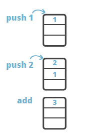
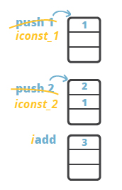

# Mastering Java Bytecode at the Core of the JVM

URL: https://zeroturnaround.com/rebellabs/rebel-labs-report-mastering-java-bytecode-at-the-core-of-the-jvm/

## 1. A Gentle Introduction to Java Bytecode

**Put simply**, **Java bytecode** is the **intermediate representation** of **Java code** (i.e. class files) and it is executed inside the **JVM**.

**From a technical POV**, **Java bytecode** is the code set used by the **Java Virtual Machine** that is JIT-compiled into **native code** at runtime.

> POV是Point of View的简写。

**Java bytecode is the form of instructions that the JVM executes.** A Java programmer, normally, does not need to be aware of how Java bytecode works. However, understanding the low-level details of the platform is what makes you a better programmer after all (and we all want that, right?)

Understanding the bytecode, however, is essential to **the areas of tooling and program analysis**(应用领域), where the applications can modify the bytecode to adjust the behavior according to the application’s domain. Profilers, mocking frameworks, AOP – to create these tools, developers must understand Java bytecode thoroughly.

## 1.1 Down to the Basics

Lets start with a very basic example in order to understand **how Java bytecode is executed**. 

Consider a trivial expression, `1 + 2`, which can be written down in **reverse Polish notation** as `1 2 +`. **Why is the reverse Polish notation any good here?** It is easy to evaluate such expression by using a stack:



The result, `3`, is on the top of the stack after the `add` instruction executes.

**The model** of **computation of Java bytecode** is that of **a stack-oriented programming language**. The example above is expressed with **Java bytecode instructions** is identical, and **the only difference** is that **the opcodes** have some specific semantics attached:

> 下面的`iconst_1`、`iconst_2`和`iadd`属于**Java bytecode instructions**。



The opcodes `iconst_1` and `iconst_2` put constants `1` and `2` to the stack. The instruction `iadd` performs addition operation on the two integers and leaves the result on the top of the stack.

## 1.2 General Facts About Java Bytecode

As the name implies, **Java bytecode** consists of **one-byte instructions**, hence there are **256 possible opcodes**. There are a little less real instructions than the set permits – approximately 200 opcodes are utilized, where some of the opcodes are reserved for debugger operation.

**Instructions** are composed from **a type prefix** and **the operation name**. For instance, `i` prefix stands for `integer` and therefore the `iadd` instruction indicates that the addition operation is performed for integers.

Depending on the nature of the instructions, we can group these into several broader groups:

- **Stack manipulation instructions**, including interaction with local variables.
- **Control flow instructions**
- **Object manipulation**, incl. methods invocation
- Arithmetics and type conversion

There are also a number of instructions of more specialized tasks such as **synchronization** and **exception throwing**.

### 1.2.1 `javap`

To obtain the instruction listings of a compiled class file, we can apply the `javap` utility, **the standard Java class file disassembler** distributed with the **JDK**.

We will start with a class that will serve as an entry point for our example application, the moving average calculator.

```java
package lsieun;

public class MovingAverage {
}
```

```java
package lsieun;

public class Main {
    public static void main(String[] args) {
        MovingAverage app = new MovingAverage();
    }
}
```

After the class file is compiled, to obtain the bytecode listing for the example above one needs to execute the following command: `javap -c Main`

```bash
$ javap -c lsieun.Main
# or
$ javap -c lsieun/Main.class
```

The result is as follows:

```txt
Compiled from "Main.java"
public class lsieun.Main {
  public lsieun.Main();
    Code:
       0: aload_0
       1: invokespecial #8                  // Method java/lang/Object."<init>":()V
       4: return

  public static void main(java.lang.String[]);
    Code:
       0: new           #16                 // class lsieun/MovingAverage
       3: dup
       4: invokespecial #18                 // Method lsieun/MovingAverage."<init>":()V
       7: astore_1
       8: return
}
```

As you can see there is **a default constructor** and a `main` method. You probably always knew that if you don’t specify any constructor for a class there’s still **a default one**, but maybe you didn’t realize where it actually is. Well, here it is! We just proved that **the default constructor** actually exists in **the compiled class**, so it is **java compiler** who generates it.

**The body of the constructor** should be empty but there are a few instructions generated still. Why is that? **Every constructor makes a call to `super()`**, right? It doesn’t happen automagically, and this is why some bytecode instructions are generated into the default constructor. Basically, this is the `super()` call;

The `main` method creates an instance of `MovingAverage` class and returns. (后续会详细介绍)

You might have noticed that some of the instructions are referring to some numbered parameters with `#1, #2, #3`. This are the references to **the pool of constants**. **How can we find out what the constants are** and **how can we see the constant pool in the listing?** We can apply the `-verbose` argument to `javap` when disassembling the class:

```bash
$ javap -c -verbose lsieun.Main
```

Here’s some interesting parts that it prints:

```txt
Classfile jar:file:/home/liusen/workdir/git-repo/learn-java/advanced/bytecode/code/learn-bytecode/target/lsieun.jar!/lsieun/Main.class
  Last modified Nov 5, 2018; size 453 bytes
  MD5 checksum 66192738533aa2540d01247361817934
  Compiled from "Main.java"
public class lsieun.Main
  minor version: 0
  major version: 49
  flags: ACC_PUBLIC, ACC_SUPER
Constant pool:
   #1 = Methodref          #5.#21         // java/lang/Object."<init>":()V
   #2 = Class              #22            // lsieun/MovingAverage
   #3 = Methodref          #2.#21         // lsieun/MovingAverage."<init>":()V
   #4 = Class              #23            // lsieun/Main
   #5 = Class              #24            // java/lang/Object
   #6 = Utf8               <init>
   #7 = Utf8               ()V
   #8 = Utf8               Code
```

Theres a bunch of **technical information** about **the class file**: **when it was compiled**(时间), **the MD5 checksum**(校验), **which `*.java` file it was compiled from**(源文件的名字), **which Java version it conforms to**(遵从的Java版本), etc.

We can also see **the accessor flags** there: `ACC_PUBLIC` and `ACC_SUPER`. The `ACC_PUBLIC` flag is kind of intuitive to understand: our class is `public` hence there is the accessor flag saying that it is `public`. But was is `ACC_SUPER` for? `ACC_SUPER` was introduced to correct a problem with the invocation of `super` methods with the `invokespecial` instruction. You can think of it as **a bugfix** to the Java 1.0 so that it could discover `super` class methods correctly. Starting from Java 1.1 the compiler always generates `ACC_SUPER` accessor flag to bytecode.

You can also find the denoted constant definitions in the constant pool:

```txt
#1 = Methodref          #5.#21         // java/lang/Object."<init>":()V
```

**The constant definitions** are **composable**, meaning **the constant** might be composed from **other constants** referenced from the same table.

There are a few other things that reveal itself when using `-verbose` argument with `javap`. For instance there’s more information printed about the methods:

```txt
  public static void main(java.lang.String[]);
    descriptor: ([Ljava/lang/String;)V
    flags: ACC_PUBLIC, ACC_STATIC
    Code:
      stack=2, locals=2, args_size=1
         0: new           #2                  // class lsieun/MovingAverage
         3: dup
         4: invokespecial #3                  // Method lsieun/MovingAverage."<init>":()V
         7: astore_1
         8: return
      LineNumberTable:
        line 5: 0
        line 6: 8
      LocalVariableTable:
        Start  Length  Slot  Name   Signature
            0       9     0  args   [Ljava/lang/String;
            8       1     1   app   Llsieun/MovingAverage;
```

**The accessor flags** are also generated for **methods**, but we can also see **how deep a stack is required for execution of the method**(`stack=2`), **how many parameters it takes in**(`args_size=1`), and **how many local variable slots need to be reserved in the local variables table**(`locals=2`).


