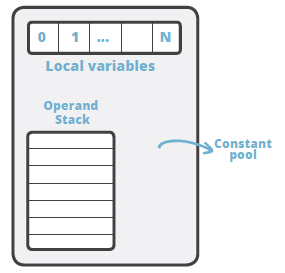
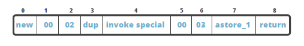
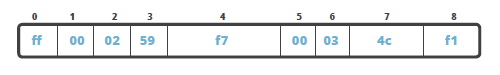
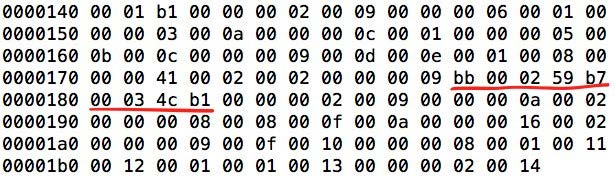
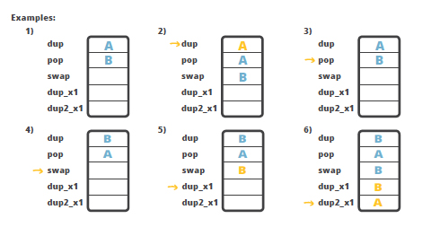
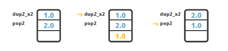
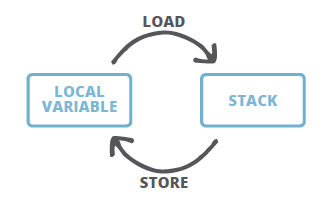

### 1.2.2 The JVM as a stack machine

To understand the details of the bytecode, we need to have an idea of **the model of execution of the bytecode**(新概念：bytecode的执行模型). **A JVM is a stack-based machine**. **Each thread** has **a JVM stack** which stores **frames**. Every time **a method** is invoked **a frame** is created. 

**A frame** consists of 

- **an operand stack**(操作数；运算对象), 
- **an array of local variables**, and 
- **a reference to the runtime constant pool of the class of the current method**.  

We have seen all this in our initial example, the disassembled `Main` class.



**The array of local variables**, also called **the local variable table**, contains **the parameters of the method**(方法接受的参数) and is also used to hold **the values of the local variables**(方法内定义的变量，即局部变量). **The size of the array of local variables** is determined at **compile time** and is dependent on **the number and size** of **local variables** and **formal method parameters**.

**The operand stack** is a LIFO stack used to push and pop values. Its **size** is also determined at **compile time**. Certain **opcode instructions** push values onto the operand stack; others take operands from the stack, manipulate them, and push the result. **The operand stack** is also used to **receive return values from methods**.

### 1.2.3 What’s in the method body?

When looking at the bytecode listing from the HelloWorld example you might start to wonder, what are **those numbers** in front of **every instruction?** And **why are the intervals between the numbers not equal?**

```txt
  public static void main(java.lang.String[]);
    descriptor: ([Ljava/lang/String;)V
    flags: ACC_PUBLIC, ACC_STATIC
    Code:
      stack=2, locals=2, args_size=1
         0: new           #2                  // class lsieun/MovingAverage
         3: dup
         4: invokespecial #3                  // Method lsieun/MovingAverage."<init>":()V
         7: astore_1
         8: return
      LineNumberTable:
        line 5: 0
        line 6: 8
      LocalVariableTable:
        Start  Length  Slot  Name   Signature
            0       9     0  args   [Ljava/lang/String;
            8       1     1   app   Llsieun/MovingAverage;
```

The reason: **Some of the opcodes** have **parameters** that take up space in the bytecode array. For instance, `new` occupies *three slots* in the array to operate: *one* for itself and *two* for the input parameters. Therefore, the next instruction – `dup` – is located at the index `3`.

Here’s what it looks like if we visualize the method body as an array:



**Every instruction** has its own **HEX representation** and if we use that we’ll get the **HEX string** that represents the method body:

> 注意：下图中的全部`f`字符，原本应该为`b`字符。我通过`hexdump -C Main.class`命令验证过了。



```bash
$ hexdump -C Main.class
```

By opening the class file in **HEX editor** we can find this string:



It is even possible to change the bytecode via **HEX editor** even though it is a bit fragile to do so. Besides there are some better ways of doing this, like using **bytecode manipulation** tools such as `ASM` or `Javassist`.

Not much to do with this knowledge at the moment, but now you know where these numbers come from.

### 1.2.4 Crunching the local stack

> crunch v.嘎扎嘎扎地咀嚼(饼干等)

There are **a number of instructions** that **manipulate the stack** in one way or another. We have already mentioned some basic instructions that work with the stack: **push values to the stack** or **take values from the stack**. But there’s more; the `swap` instruction can **swap two values on the top of the stack**.

Here are **some example instructions** that juggle(耍把戏；耍弄) the values around the stack. Some basic instructions first: `dup` and `pop`. The `dup` instruction **duplicates the value on top of the stack**. The `pop` instruction **removes the top value from the stack**.

There are **some more complex instructions**: `swap`, `dup_x1` and `dup2_x1`, for instance. The `swap` instruction, as the name implies, swaps two values on the top of the stack, e.g. A and B exchange positions (see example 4); `dup_x1` inserts a copy of the top value into the stack two values from the top (see example 5); `dup2_x1` duplicates two top values and inserts beneath the third (example 6).



The `dup_x1` and `dup2_x1` instructions seem to be a bit esoteric(只有内行才懂的；难领略的) – why would anyone need to apply such behavior – duplicating top values under the existing values in the stack? Here’s a more practical example: how to swap 2 values of double type? **The caveat** is that double takes two slots in the stack, which means that if we have two double values on the stack they occupy four slots. To swap the two double values we would like to use the `swap` instruction but the problem is that it works only with one-word instructions, meaning it will not work with doubles, and `swap2` instruction does not exist. The workaround is then to use `dup2_x2` instruction to duplicate the top double value below the bottom one, and then we can pop the top value using the `pop2` instruction. As a result, the two doubles will be swapped.



### 1.2.5 Local variables

While **the stack** is used for **execution**, **local variables** are used to **save the intermediate results** and are in direct interaction with **the stack**.

Let’s now add some more code into our initial example:

```java
package lsieun;

import java.util.List;
import java.util.ArrayList;

public class MovingAverage {
    private List<Double> list = new ArrayList<Double>();

    public void submit(double value) {
        this.list.add(value);
    }

    public double getAvg() {
        if (this.list.size() < 1) return 0;
        double sum = 0.0;
        int size = this.list.size();
        for (int i=0; i<size; i++) {
            sum += this.list.get(i);
        }

        return sum / size;
    }
}
```

```java
package lsieun;

public class Main {
    public static void main(String[] args) {
        MovingAverage app = new MovingAverage();

        int num1 = 1;
        int num2 = 2;

        app.submit(num1);
        app.submit(num2);

        double avg = app.getAvg();
        System.out.println(avg);
    }
}

```

We submit two numbers to the `MovingAverage` class and ask it to calculate the average of the current values. The bytecode obtained from this code is as follows:

```bash
$ javap -c -verbose Main.class
```

```txt
  public static void main(java.lang.String[]);
    descriptor: ([Ljava/lang/String;)V
    flags: ACC_PUBLIC, ACC_STATIC
    Code:
      stack=3, locals=6, args_size=1
         0: new           #16                 // class lsieun/MovingAverage
         3: dup
         4: invokespecial #18                 // Method lsieun/MovingAverage."<init>":()V
         7: astore_1
         8: iconst_1
         9: istore_2
        10: iconst_2
        11: istore_3
        12: aload_1
        13: iload_2
        14: i2d
        15: invokevirtual #19                 // Method lsieun/MovingAverage.submit:(D)V
        18: aload_1
        19: iload_3
        20: i2d
        21: invokevirtual #19                 // Method lsieun/MovingAverage.submit:(D)V
        24: aload_1
        25: invokevirtual #23                 // Method lsieun/MovingAverage.getAvg:()D
        28: dstore        4
        30: getstatic     #27                 // Field java/lang/System.out:Ljava/io/PrintStream;
        33: dload         4
        35: invokevirtual #33                 // Method java/io/PrintStream.println:(D)V
        38: return
      LineNumberTable:
        line 5: 0
        line 7: 8
        line 8: 10
        line 10: 12
        line 11: 18
        line 13: 24
        line 14: 30
        line 15: 38
      LocalVariableTable:
        Start  Length  Slot  Name   Signature
            0      39     0  args   [Ljava/lang/String;
            8      31     1   app   Llsieun/MovingAverage;
           10      29     2  num1   I
           12      27     3  num2   I
           30       9     4   avg   D

```

After creating **the local variable** of type `MovingAverage` the code stores the value in a local variable `app`, with the `astore_1` instruction: `1` is **the slot number** of `app` in the LocalVariableTable.

Next, instructions `iconst_1` and `iconst_2` are used to load constants `1` and `2` to **the stack** and store them in LocalVariableTable slots `2` and `3` respectively by the instructions `istore_2` and `istore_3`.

Note that the invocation of `store-like` instruction actually **removes the value from the top of the stack**. This is why in order to use **the variable value** again we have to **load it back to the stack**. For instance, in the listing above, before calling the `submit` method, we have to load the value of the parameter to the stack again:

```java
app.submit(num1);
```

```txt
12: aload_1
13: iload_2
14: i2d
15: invokevirtual #19                 // Method lsieun/MovingAverage.submit:(D)V
```

After calling the `getAvg()` method the result of the execution locates on the top of the stack and to store it to the local variable again the `dstore` instruction is used since the target variable is of type `double`.

```java
double avg = app.getAvg();
```

```txt
24: aload_1
25: invokevirtual #23                 // Method lsieun/MovingAverage.getAvg:()D
28: dstore        4
```

One more interesting thing to notice about **the LocalVariableTable** is that **the first slot** is occupied with **the parameter(s) of the method**. In our current example it is the `static` method and there’s no this reference assigned to the slot `0` in the table. However, for the non-static methods `this` will be assigned to slot `0`.

The takeaway from this part is that whenever you want to **assign something** to **a local variable**, it means you want to **store** it by using a respective instruction, e.g. `astore_1`. The **store** instruction will always **remove the value from the top of the stack**. The corresponding **load** instruction will **push the value from the local variables table to the stack**, however **the value** is **not removed** from **the local variable**.




