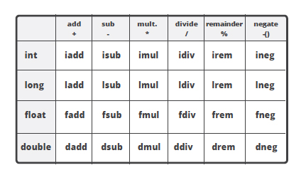
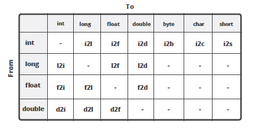

### 1.2.6 Flow control

The **flow control instructions** are used to organize **the flow of the execution** depending on **the conditions**. `If-Then-Else`, `ternary operator`(三目运算符), **various kinds of loops** and even **exception handling** opcodes belong to **the control flow group** of **Java bytecode**. This is all about **jumps** and **gotos** now :)

We will now change our example so that it will handle an arbitrary number of numbers that can be submitted to the `MovingAverage` class:

```java
package lsieun;

public class Main {
    private static int[] numbers = new int[3] ;

    static {
        numbers[0] = 1;
        numbers[1] = 2;
        numbers[2] = 3;
    }

    public static void main(String[] args) {
        MovingAverage app = new MovingAverage();

        for (int number : numbers) {
            app.submit(number);
        }

        double avg = app.getAvg();
        System.out.println(avg);
    }
}
```

```java
    public static void main(String[] args) {
        MovingAverage app = new MovingAverage();

        for (int number : numbers) {
            app.submit(number);
        }

        double avg = app.getAvg();
        System.out.println(avg);
    }
```

Assume that the `numbers` variable is a `static` field in the same class. The bytecode that corresponds to the loop that iterates over the `numbers` is as follows

```bash
$ javap -c -verbose Main.class
```

```txt
  public static void main(java.lang.String[]);
    descriptor: ([Ljava/lang/String;)V
    flags: ACC_PUBLIC, ACC_STATIC
    Code:
      stack=3, locals=6, args_size=1
         0: new           #2                  // class lsieun/MovingAverage
         3: dup
         4: invokespecial #3                  // Method lsieun/MovingAverage."<init>":()V
         7: astore_1
         8: getstatic     #4                  // Field numbers:[I
        11: astore_2
        12: aload_2
        13: arraylength
        14: istore_3
        15: iconst_0
        16: istore        4
        18: iload         4
        20: iload_3
        21: if_icmpge     43
        24: aload_2
        25: iload         4
        27: iaload
        28: istore        5
        30: aload_1
        31: iload         5
        33: i2d
        34: invokevirtual #5                  // Method lsieun/MovingAverage.submit:(D)V
        37: iinc          4, 1
        40: goto          18
        43: aload_1
        44: invokevirtual #6                  // Method lsieun/MovingAverage.getAvg:()D
        47: dstore_2
        48: getstatic     #7                  // Field java/lang/System.out:Ljava/io/PrintStream;
        51: dload_2
        52: invokevirtual #8                  // Method java/io/PrintStream.println:(D)V
        55: return
      LineNumberTable:
        line 13: 0
        line 15: 8
        line 16: 30
        line 15: 37
        line 19: 43
        line 20: 48
        line 21: 55
      LocalVariableTable:
        Start  Length  Slot  Name   Signature
           30       7     5 number   I
           12      31 	  2  arr$   [I
           15      28 	  3  len$   I
           18      25 	  4  i$     I           
            0      56     0  args   [Ljava/lang/String;
            8      48     1   app   Llsieun/MovingAverage;
           48       8     2   avg   D
```

The instructions at positions `8` through `16` are used to organize **the loop control**. You can see that there are **three variables** in the `LocalVariableTable` that aren’t really mentioned in the source code: `arr$`, `len$`, `i$` – those are the loop variables. The variable `arr$` stores the reference value of the `numbers` field from which the length of the loop, `len$`, is derived using the `arraylength` instruction. Loop counter, `i$` is incremented after each iteration using `iinc` instruction.

The first instructions of the loop body are used to perform the comparison of the loop counter to the array length:

```txt
18: iload         4
20: iload_3
21: if_icmpge     43
```

We load the values of `i$` and `len$` to the stack and call the `if_icmpge` to compare the values. The `if_icmpge` instruction meaning is that if the one value is **greater or equal** than the other value, in our case if `i$` is greater or equal than `len$`, then the execution should proceed from the statement that is marked with `43`. If the condition does not hold, then the loop proceeds with the next iteration.

At the end of the loop it loop counter is incremented by `1` and the loop jumps back to the beginning to validate the loop condition again:

```txt
37: iinc          4, 1       // increment i$
40: goto          18         // jump back to the beginning of the loop
```

### 1.2.7 Arithmetics & Conversion

As you have seen already, there’s a number of instructions that perform all kind of arithmetics in **Java bytecode**. In fact, a large portion of the instruction set is denoted to the arithmetic. There are instructions of **addition**, **subtraction**, **multiplication**, **division**, **negation** for all kind of types – `integers`, `longs`, `doubles`, `floats`. Plus there’s a lot of instructions that are used to convert between the types.

**Arithmetical opcodes and types**



**Type conversion opcodes**

**Type conversion** happens for instance when we want to assign an `integer` value to a variable which type is `long`.



In our example where an integer value is passed as a parameter to `submit()` method which actually takes `double`, we can see that before actually calling the method the type conversion opcode is applied:

```java
app.submit(number);
```

```txt
31: iload         5
33: i2d
34: invokevirtual #5                  // Method lsieun/MovingAverage.submit:(D)V
```

It means we load **a value of a local variable** to **the stack** as an `integer`, and then apply `i2d` instruction to convert it into `double` in order to be able to pass it as a parameter.

The only instruction that doesn’t require the value on the stack is the increment instruction, `iinc`, which operates on the value sitting in `LocalVariableTable` directly. All other operations are performed using the stack.

