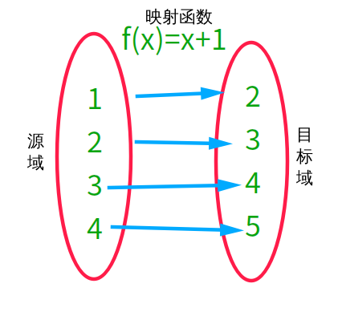
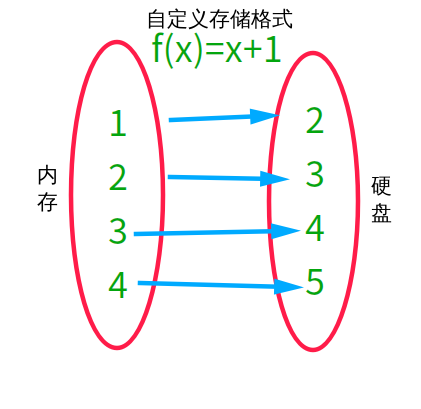

# chat

认知的过程：由简单->复杂。一生二，二生三，三生万物。

人的认知，也是有梯度的，

始于模仿，终于创造。

## 造轮子也有点作用（从观念上改变认知）

通过自己来构造一个小的轮子来理解别人的大轮子的运行原理，可谓“以小知大”、“以简单知复杂”。

## 造轮子（动手操作）


最终的目标是，理解class文件的存储格式。

中间的目标是，构造一种自定义的存储格式。这种自定义的存储格式，将有助于我们理解class文件的存储格式。中间的目标就是当前要实现的目标，也就是“造轮子”的过程。

既然是自定义的文件存储格式，总是要存一些内容的。如果没有什么内容要存储，那也就不存在“存储格式”的问题了。

下面的这段对话，就需要作为“存储内容”。

```txt
唐太宗:人主何为而明，何为而暗?
魏征:兼听则明，偏听则暗。
唐太宗:作为皇帝怎样才能做到明察秋毫，而不被臣下所蒙蔽？
魏征:多听取各方面的意见就会明察秋毫，偏听偏信就会被人蒙蔽。
```

有了存储内容，下面就是一步步进行存储的过程：

```txt
存储内容->存储格式->文件
```

接下来，就是“存储格式”的问题。由于是自定义的文件存储格式，就有很大的自由性，不同的人定义出的存储格式可能是各种各样的。

为了模仿class文件的存储格式，我们采取下面的思路：

```txt
存储内容->存储格式->文件
存储格式：文本->定义Java类和字段（用字段存储文本信息）->确定字段存储的空间大小
```

文本，涉及到两个概念：“说话的人（Talker）” 和 “说话内容（Say）”。

```txt
唐太宗:人主何为而明，何为而暗?
魏征:兼听则明，偏听则暗。
唐太宗:作为皇帝怎样才能做到明察秋毫，而不被臣下所蒙蔽？
魏征:多听取各方面的意见就会明察秋毫，偏听偏信就会被人蒙蔽。

说话的人：唐太宗、魏征
说话内容：人主何为而明，何为而暗?、兼听则明，偏听则暗。……
```

Java类，由“说话的人（Talker）”和“说话内容（Say）”这两个概念得出：

```java
public class Talker {
    private final int index;
    private final String name;
}

public class Say {
    private final int talkerIndex;
    private final String words;
}
```

因此，完整的文本对话

```txt
唐太宗:人主何为而明，何为而暗?
魏征:兼听则明，偏听则暗。
唐太宗:作为皇帝怎样才能做到明察秋毫，而不被臣下所蒙蔽？
魏征:多听取各方面的意见就会明察秋毫，偏听偏信就会被人蒙蔽。
```

可以表示成如下Java代码:

```java
List<Talker> talkerList = new ArrayList();
talkerList.add(new Talker(1, "唐太宗"));
talkerList.add(new Talker(2, "魏征"));

List<Say> sayList = new ArrayList();
sayList.add(new Say(1, "人主何为而明，何为而暗?"));
sayList.add(new Say(2, "兼听则明，偏听则暗。"));
sayList.add(new Say(1, "作为皇帝怎样才能做到明察秋毫，而不被臣下所蒙蔽？"));
sayList.add(new Say(2, "多听取各方面的意见就会明察秋毫，偏听偏信就会被人蒙蔽。"));
```

将对话内容（两个List：talkerList和sayList）进行保存的代码，可以如下写：

```java
OutputStream out = null;
try {
    out = new FileOutputStream(filepath);
    out = new BufferedOutputStream(out);

    for(Talker item : talkerList) {
        writeTalker(out, item);
    }

    for(Say item : sayList) {
        writeSay(out, item);
    }

} catch (FileNotFoundException e) {
    e.printStackTrace();
} finally {
    IOUtils.closeQuietly(out);
}

public static void writeTalker(OutputStream out, Talker talker) {
    //
}

public static void writeSay(OutputStream out, Say say) {
    //
}
```

此处问题的关键就是，如何实现`writeTalker`和`writeSay`方法。

确定字段存储空间的大小

序列化(Serialization)，就是将内存(Memory)中的数据向硬盘(HardDisk)中的数据转换的过程。

```txt
序列化：Java对象（内存）->文件（硬盘）
```


序列化(Serialization)的本质是映射(Mapping)。映射(Mapping)，是源域(Source Domain)中的样本向目标域(Target Domain)中的样本的对应关系，如下图所示。




之所以说“序列化(Serialization)的本质是映射(Mapping)”，是因为我们可以将内存(Memory)理解成源域(Source Domain)，将硬盘(HardDisk)理解成目标域(Target Domain)；序列化的过程，就是将内存中的数据向硬盘中的数据进行映射的过程。

```txt
序列化的本质上是映射。（序列化==>映射）
```



```txt
文本->Java类->序列化。
序列化：Java对象（内存）->文件（硬盘）
序列化 == 映射
```

是根据`Talker`类和`Say`类的字段来进行自己定义的。

```java
public class Talker {
    private final int index;
    private final String name;
}

public class Say {
    private final int talkerIndex;
    private final String words;
}
```

在内存中，以`Talker`类为例：

- index，类型为int，在内存当中，占用4个字节
- name，类型为String，占用的字节数不确定

| 数据类型（字节大小）   | 字段    | 数量 |
| ---------------------- | ------- | ---- |
| `int(4)`               | `index` | `1`  |
| `String（随内容变化）` | `name`  | `1`  |

在文件中，为了实现`Talker`类的存储，自定义存储格式如下：

- index，占用1个字节，与`Talker`类中的`index`字段。
- length，占用2个字节，用于存储`Talker`类中`name`字段UTF8编码后的字节长度
- bytes，占用length个字节，用于存储`Talker`类中`name`字段UTF8编码后的字节内容。

因为存储的是`Talker`类，暂且就将这种存储结构称为`talker_info`，以表格形式表示如下：

| 存储结构 | 字段     | 数量     |
| -------- | -------- | -------- |
| `u1`     | `index`  | `1`      |
| `u2`     | `length` | `1`      |
| `u1`     | `bytes`  | `length` |


```txt
日期：2019-02-10 （文件存储日期）

```

### 写什么内容到文件中去

日期：


自定义文件格式


类型、名称、数量。

chat_info

magic
year
month
day
talker_count
taler_info
say_count
say_info

talker_info

index
