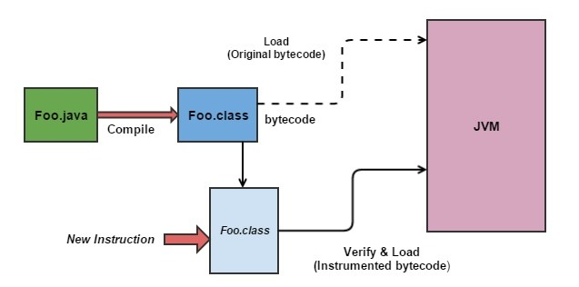

# Getting to know javaagents

URL: https://udaniweeraratne.wordpress.com/2015/10/25/getting-to-know-javaagents/

**Java agent** is **a powerful tool** introduced with **Java 5**在哪个版本添加的功能. It has been highly useful in **profiling activities**(性能分析) where developers and application users can monitor tasks carried out within servers and applications. **The ability to inject code segments**(嵌入代码片段) by modifying classes and their method bodies during the run time has become useful in many ways. **Intercepting parameter values passed between methods**(拦截方法的参数值), **calculation of execution time of methods**(计算方法的执行时间) can be considered as some examples. As long as you know the class name and the structure of class along with their method bodies, injecting a piece of code would take less than a minute一分钟？有这么快吗？.

> 性能分析（Profiling）

Well, **the true power of these java agents** lie on **their ability to do the bytecode instrumentation**(java agent，之所以有很大的用处，就在于它能够修改bytecode). Now, you may wonder **what is this bytecode**(提出问题：什么是bytecode). Although we humans can understand the program files written using programming languages known to us (java, python, php), computer processors do not understand them. Processors have their own language, with set of terms known as **opcodes**. They represent the instruction needed to carryout operations. Collection of these opcodes, instructions are referred to as **bytecode**, which is included in `.class` files we obtain after compiling our `.java` files. **Instrumentation** is **the process of modifying these bytecode**(对于instrumentation进行解释).

Given below are **three most famous libraries**(三个java agent类库) used in **bytecode instrumentation**.

- **ASM** – **low level library**. Need to have better understanding about bytcode instructions
- **Javassist** – **middle level library**. Operates on top of ASM. Knowledge about bytecode is not a must.
- **AspectJ** – **high level framework**. Much more easy to work with.

Out of these three libraries, **Javassist**(三者当中的关注点) will be the library used in the future examples. But, before we start writing a simple agent, let’s get an overall idea on **how an agent works**（接下来，讲的是“原理”）.

Mainly, there are **two ways**(两种方式) that an agent can be invoked. Type of the agent is decided based on the main method type selected by the developer.

- `premain()` – Agent is loaded before `main` class and other respective classes are loaded onto memory. This `premain` method, as its name described, will be **invoked before** the `main` method.
- `agentmain()` – Using this method, we can invoke an agent at **an arbitrary point in time**, after all the classes are load onto JVM加载进JVM之后，还能修改class文件吗？有时间我得试一试.

Since we are new to the process, let’s start with **the simple `premain()` method**(两者当中，较为简单的那个). **JVM** will be informed about **our agent** by passing **the path to our agent jar** as a parameter. It can be done by including the `-javaagent` parameter in the command line. (JVM和agent之间的联系通过`-javaagent`参数来进行连接)

The above figure describes the basic concept of this instrumentation process. Once we provide **the details of the class we want to modify** along with **method names** and **content we need to inject**, **agent** will obtain **the bytecode of the respective class** before it load onto **JVM**. It will **make a copy of those byte code as a byte array** and **do requested changes on the instruction set** by pushing and popping instruction on the stack. Finally, once the instrumentation is completed, it’ll **recompile the new bytecode** to verify whether there are any compilation errors. If it cause no compilation errors, it will load the new bytecode to the JVM, which can then be used in the tasks it was assigned to do.

> 上面这段，需要好好读一下，它大概的讲述了“bytecode修改的过程”

So, above is **a brief introduction to java agents**.

Next topic would be on ‘**Requirements of a Java Agent**’. Have a great time.
