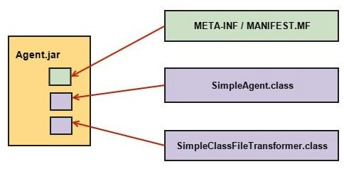

# Requirements of a Javaagent

URL: https://udaniweeraratne.wordpress.com/2015/11/01/requirements-of-a-java-agent/

上一篇，是讲了java agent的原理，这一篇，主要是讲将java agent进行分解，了解它的结构。

Second post is to introduce **main parts of a java agent**. Before we jump in an write a java agent, lets see **what are the main files needed by an java agent**. First of all, you should notice that **all the files required by the agent** need to be bundled up in **a JAR file**<sub>所有文件，都将被打成JAR包</sub>. There are many ways to prepare our `agent.jar`. But let’s keep the bundling part aside, till we finish writing a simple agent, and move to files needed.



Unlike normal program with just a main class and bunch of other classes, **agent** require **three main files** as described below.

## SimpleAgent.class

This is the class file which contain our agent. It’ll include a `premain` method or `agentmain` method according to the requirement of the writer. There may be **either one method type** or **both** in a single class file(可以有一个，也可以有两个). But **the selection of method** used to invoke the agent will be **decided based on the time user want to invoke the agent**（两个方法的选择，取决于用户调用的时机）. As it is mentioned in earlier post,

- `premain()` – invoke agent before VM start
- `agentmain()` – invoke agent after VM has stated

This class will be used to pass **the `instrumentation` object**(`Instrumentation instrumentation`) along with **any parameters needed by the agent**(`String agentArgs`) and **add a `transformer`**(`SimpleClassFileTransformer transformer`) to classes which we need to instrument.

```java
public class SimpleAgent {
    public static void premain(String agentArgs, Instrumentation instrumentation) {
        SimpleClassFileTransformer transformer = new SimpleClassFileTransformer();
        instrumentation.addTransformer(transformer);
    }
}
```

## SimpleClassFileTransformer.class

**This is where provide the instructions** on all the operations we need to do on our classes. This class is written by implementing the `ClassFileTransformer` interface. The `transform` method will carryout **redefinition / re-transformation** of classes as specified by the user. But the layout of the instruction given here would depend based on the bytecode instrumentation framework used. As mentioned earlier, we’ll be using **Javassist** through out the tutorial.

```java
public class SimpleClassFileTransformer implements ClassFileTransformer {
    public byte[] transform(ClassLoader loader,
                            String className,
                            Class<?> classBeingRedefined,
                            ProtectionDomain protectionDomain,
                            byte[] classfileBuffer) throws IllegalClassFormatException {
        byte[] byteCode = classfileBuffer;
        // do something...
        return byteCode;
    }
}
```

## MANIFEST.MF

Another most important file is **the `manifest` file**, which provide **all the parameters needed to initialize the agent**<sub>这个文件中，提供了java agent运行时需要的参数</sub>. This is a special type of file, which provide information on files packaged in a JAR. When we create a jar, it will add **a default manifest file**, with set of **default values** as follows including environment details as follows.

```txt
Manifest-Version: 1.0
Created-By: 1.7.0_06 (Oracle Corporation)
```

But, in a java agent, we need to include a few more attributes as given below. Except for those mentioned as optional<sub>有些参数是optional的</sub>, we will not be able to start the agent, because it will throw some kind of an error and abort the agent<sub>有些参数必不可少，否则运行不起来</sub>.

> 下面是讲解MANIFEST.MF文件中可以配置的几个属性信息

- `Premain-class` – Used when agent is invoked at JVM launch time. It need to include **the fully qualified name of the agent class**. In our case also, we’ll be defining this attribute, because we are working with `premain` method. This will provide an entry point to our agent by specifying where to look for `Agent.class` which need to be invoked before the `main.class`
- `Agent-class` – Used when we are invoking the agent **after** VM has started. This is used when we are using `agentmain` method in our `Agent.class`.
- `Can-Retransform-Classes` – (optional) Specify as `true` or `false`, where **default value** is `false`. If it is not specified as `true`, it won’t allow to carryout **re-transformation** of classes.
- `Can-Redefine-Classes` – (optional) Specify as `true` or `false`. It won’t allow to **redefine** classes during the instrumentation process, if it is not specified as true.
- `Class-Path` – We need to add paths of all the jars needed by the agent during run time. (Eg; `javassist-xyz.jar`) Importing all the relevant jars while working on the IDE will make us think everything is fine. But those files will not be available during run time. Hence it will abort the agent throwing `ClassNotFoundException` and `NoClassDefFoundError`.

Therefore, we need to make sure that we add **all these parameters** and **necessary files** to our agent before we start our agent. At first I started to **manually write this manifest files**, which turned out to be **a real pain** when **the number of libraries used in the program increased**. （后面会讲解，使用pom.xml进行配置）

## 引用第三方的JAR文件

Apart from above **three main files**, it may include class files of any other Java classes needed by the agent as well. For an example, if you want to have a set of methods which you want to call from the instrumented class methods, it would be less complex if you add them in a separate class and call those methods, than adding them in the `SimpleClassFileTransformer`.

Well, this is the end of **Requirements of a Java Agent**. Let’s start writing our simple agent in our next lesson, ‘**How to write a simple Agent**’. See you all in next lesson.


