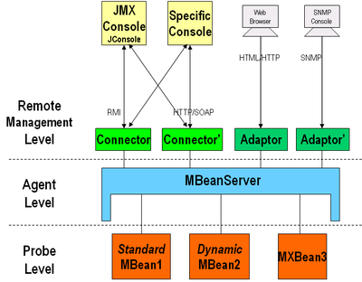

# Java Management Extensions

**Java Management Extensions** (**JMX**) is a Java technology that supplies tools for **managing and monitoring** applications, system objects, devices (such as printers) and service-oriented networks. **Those resources** are represented by objects called **MBeans** (for **Managed Bean**). In the API, classes can be dynamically loaded and instantiated<sub>为什么要讲这样一句话呢？类可以动态加载、初始化，那又怎么样呢？</sub>. Managing and monitoring applications can be designed and developed using the **Java Dynamic Management Kit**.

这段理解：

- （1） JMX是Java Management Extensions的缩写
- （2） JMX是用于managing and monitoring，但是managing和monitoring究竟是什么意思呢？我的理解，monitor是“监测”，就是“只是看，但不采取行动”，而manage是“管理”，就是“采取某种行动”。
- （3） 那些资源被称之为MBeans（Managed Bean）

## Architecture

JMX uses a three-level architecture:

- (1) **The Probe level** - also called **the Instrumentation level** - contains the **probes** (called **MBeans**) instrumenting the resources

> 这里有个单词是probe，它有多个解释，其中的一个解释是这样的：a spacecraft without people on board which obtains information and sends it back to earth，也就是“（不载人）空间探测器”。我们可以做一个形象的类比：我们将运行程序的JVM想像成“火星”，而MBean就是我们放到火星上的一个探测器，MBean探测到信息之后，会把信息发送到火星和地球之间的一个“空间中转站”上，再由“空间中转站”把信息传回给地球。空间探测器是受我们（从地球传来的信号）的控制的，这也解释了MBean中的M（Managed）的含义。

- (2) **The Agent level**, or **MBeanServer** - the core of JMX. It acts as an intermediary between **the MBean** and **the applications**.

> 这个MBeanServer，就是我们上面提到的“空间中转站”。

- (3) **The Remote Management level** enables remote applications to access the MBeanServer through **connectors** and **adaptors**. **A connector** provides full remote access to the MBeanServer API using various communication (RMI, IIOP, JMS, WS-* …), while **an adaptor** adapts the API to another protocol (SNMP, …) or to Web-based GUI (HTML/HTTP, WML/HTTP, …).

> 这里就相当于我们上面提到“地球”，它与MBeanServer的沟通方式主要有两种：connector和adapter，具体实现上可能有多种产品。

从程序开发的角度来讲，我的理解是这样的：

- （1） MBean是由我们编写代码开发的
- （2） MBeanServer是由Java Platform来提供的，不需要我们写
- （3） remote application，主要是使用现成的工具，可以是Java Platform提供的工具，也可以是第三方提供的工具。



Applications can be **generic consoles** (such as `JConsole` and `MC4J`) or **domain-specific (monitoring) applications**. External applications can interact with the MBeans through the use of **JMX connectors and protocol adapters**. **Connectors** serve to connect an agent with a remote JMX-enabled management application. This form of communication involves a connector in the JMX agent and a connector client in the management application.

**Protocol adapters** provide a management view of the JMX agent through a given protocol. Management applications that connect to a protocol adapter are usually specific to the given protocol.

## Managed beans

A **managed bean** - sometimes simply referred to as an **MBean** - is a type of JavaBean, created with dependency injection. **Managed Beans** are particularly used in the **Java Management Extensions technology**<sub>这里只是简单的说，MBean主要是用在JMX中</sub> - but with Java EE 6 the specification provides for a more detailed meaning of a managed bean<sub>Java EE 6的文档对于MBean进行更详细的描述，更详细的描述究竟是什么呢？</sub>.

**The MBean** represents **a resource** running in the Java virtual machine<sub>注：MBean代表了运行在JVM中的一种resource，那这种resource又究竟代表什么呢？</sub>, such as an application or a Java EE technical service (transactional monitor, JDBC driver, etc.). They can be used for (1)collecting statistics on concerns like performance, resources usage, or problems (pull)<sub>注：第一方面，收集信息，就是pull，形象的“拉取”信息</sub>; for (2)getting and setting application configurations or properties (push/pull)<sub>注：第二方面，获取和设置程序的配置信息，是一个pull和push的过程</sub>; and (3)notifying events like faults or state changes (push)<sub>注：第三个方面，事件通知，是一个push的过程</sub>.


Java Management Extensions (JMX) is a standard component of the Java Platform. It was first added to the J2SE 5.0 release<sub>注：Java添加JMX的版本</sub>.

## JMX URL

For client application to get the MBean proxy, first we need to create `JMXServiceURL` by passing the RMI host and port.

```java
JMXServiceURL url = new JMXServiceURL("service:jmx:rmi:///jndi/rmi://" + HOST + ":" + PORT + "/jmxrmi");
```

After that we have to get the `JMXConnector` instance using it’s factory class.

```java
JMXConnector jmxConnector = JMXConnectorFactory.connect(url);
```

After that we get `MBeanServerConnection` from the JMXConnector instance.

```java
MBeanServerConnection mbeanServerConnection = jmxConnector.getMBeanServerConnection();
```

After that we get MBean proxy instance using `MBeanServerInvocationHandler`.

```java
//ObjectName should be same as your MBean name
ObjectName mbeanName = new ObjectName("com.journaldev.jmx:type=SystemConfig");

//Get MBean proxy instance that will be used to make calls to registered MBean
SystemConfigMBean mbeanProxy = (SystemConfigMBean) MBeanServerInvocationHandler.newProxyInstance(
        mbeanServerConnection, mbeanName, SystemConfigMBean.class, true);
```

Once we get the proxy instance, we can invoke any operation exposed by the MBean.


## Monitor your app’s status at runtime

Java Management Extensions (JMX) is a standard way for you to embed code within your own app to report at runtime the state of your app’s operations.

This embedding of a reporting agent (a “probe”) within a larger piece of software is known as “instrumenting” your code. JMX enables you a framework to surface those pieces of static information at runtime, so you need not invent that reporting-system plumbing yourself. At runtime you, or your system administrator, can use any of a number of standard monitoring apps sometimes known as “consoles” or “dashboards”.

In the context of computer programming, **instrumentation** refers to an ability to monitor or measure the level of a product's performance, to diagnose errors, and to write trace information. Programmers implement instrumentation in the form of code instructions that monitor specific components in a system (for example, instructions may output logging information to appear on the screen). When an application contains instrumentation code, it can be managed by using a management tool. Instrumentation is necessary to review the performance of the application. Instrumentation approaches can be of two types: source instrumentation and binary instrumentation.


