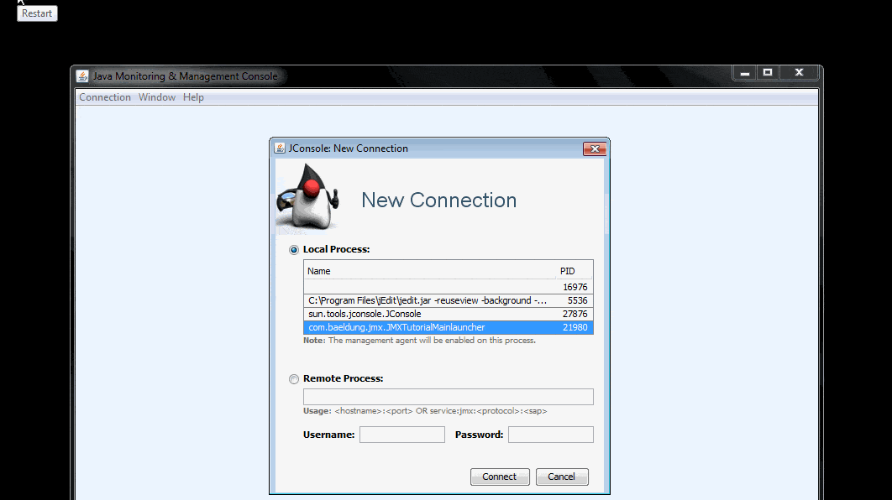

# Java Management Extension (JMX)

URL:

- [Basic Introduction to JMX](https://www.baeldung.com/java-management-extensions)
- [Deep Dive into Java Management Extensions](https://stackify.com/jmx/)
- [What is JMX? 10 mins Quick Start JMX Tutorial](https://www.journaldev.com/1352/what-is-jmx-mbean-jconsole-tutorial)

## What Is Java Management Extension Technology

The **Java Management Extensions (JMX) framework** was introduced in Java 1.5 and has found widespread acceptance in the Java developers community since its inception. JMX is used mostly in enterprise applications to make the system configurable or to get the state of application at any point of time.

> 起源于1.5，受到了很大欢迎

It is a standard component of the Java Standard Edition, providing a simple API to monitor and manage your resources at runtime.

> JMX属于Java Standard Edition

Trough the API, you can monitor your resources in real-time, which is why most production-grade Java tools out there expose metrics data over JMX.

> 通过JMX API，可以实时监控JVM中的资源。

## Architecture Of The JMX Technology

Before we dive deep into code, let’s start understanding how the core of JMX works and what its architecture looks like.

Simply put, there are **three** main levels of JMX:

- **Instrumentation**: MBeans registered with the JMX agent through which resources are managed
- **The JMX Agent**: the core component (**MbeanServer**) which maintains registry of managed MBeans and provides an interface to access them
- **Remote Management**: usually client side tool like JConsole

### Instrumentation

To start managing resources, the application needs to implement and expose **MBeans** – which can be managed with the help of a **JMX Agent**.

> MBeans是真正提供功能的部分，而JMX Agent是对MBeans进行管理的角色。

What’s worth noting here is that the **MBean** – which is, at the core, **an interface** – is entirely decoupled and doesn’t require knowledge of the **JMX agent**.

> MBean本质上是接口(interface)

Also, you’ll notice **how simple, yet powerful and extensible MBeans are**. You can get insight into your application with very little effort, which is an important aspect of the tool.

> 为了说明MBeans的强大，我自己想出一句话：MBeans的功能强大，恐怕只会受到你的想像力的限制。

While creating MBeans, there is a particular design pattern which we must conform to. The model MBean class MUST implement an interface with the following name: “**model class name**” plus **MBean**.

### The JMX Agent

The **JMX Agent** is the standard management agent that directly controls resources and makes them available for remote management applications. The **core** of the **JMX Agent** is the **MBean server** – where **MBeans** are registered.

> 这段理解三个意思：  
> （1）JMX Agent作为一个整体，能够直接对resources进行控制，并将功能暴露给外部的管理程序  
> （2）位于JMX Agent的中心的是MBean Server  
> （3）MBean正是注册到MBean Server上

Since the agent is used for connection to remote management applications, it includes at least one communication adapter or connector.

### Remote Managment

After you created the MBean and registered it, you can access it in a number of different ways. Access is, of course, similar if you’re connecting to a third-party application that exposes its internal data over JMX as well.

Simply put, you can get access through **JConsole**(**Java Monitoring and Managment Console**) or through the communication adaptor or connectors available by default.

To enable remote management, you need to use the following options when starting the application:

```txt
-Dcom.sun.management.jmxremote
-Dcom.sun.management.jmxremote.port=8008
-Dcom.sun.management.jmxremote.authenticate=false
-Dcom.sun.management.jmxremote.ssl=false
```

## Creating an MBean Class

Simply put, a MBean can represent any resource that needs to be managed; it exposes a simple interface – which lists a set of invokable operations and a set of readable and/or writable attributes.

The **MBean** interface lists the methods for all exposed attributes and operations. **By convention, implementations of the interface are named with the `MBean` suffix**.

So let’s define our MBean interface and the class implementing it:

```java
package lsieun.jmx.game;

public interface GameMBean {
    void playFootball(String clubName);

    String getPlayerName();

    void setPlayerName(String playerName);
}
```

```java
package lsieun.jmx.game;

public class Game implements GameMBean {
    private String playerName;

    @Override
    public void playFootball(String clubName) {
        System.out.println(this.playerName + " playing football for " + clubName);
    }

    @Override
    public String getPlayerName() {
        System.out.println("Return playerName " + this.playerName);
        return playerName;
    }

    @Override
    public void setPlayerName(String playerName) {
        System.out.println("Set playerName to value " + playerName);
        this.playerName = playerName;
    }
}
```

## Instrumenting with the JMX Agent

**JMX agents** are the entities running either locally or remotely which provide the management access to the **MBeans** registered with them.

Let’s use `MbeanServer` – the core component of **JMX agent** and register the **Game MBean** with it. We’ll get the `MBeanServer` from the factory class `java.lang.management.ManagementFactory`.

We’ll use another entity – `ObjectName` – to register the `Game` class instance with the `MbeanServer`; this is a String consisting of two parts:

- **domain**: can be an arbitrary String, but according to MBean naming conventions, it should have Java package name (avoids naming conflicts)
- **key**: a list of “key=value” pairs separated by a comma

```java
package lsieun.jmx.game;

import java.lang.management.ManagementFactory;

import javax.management.InstanceAlreadyExistsException;
import javax.management.MBeanRegistrationException;
import javax.management.MBeanServer;
import javax.management.MalformedObjectNameException;
import javax.management.NotCompliantMBeanException;
import javax.management.ObjectName;

public class JMXMainLauncher {
    public static void main(String[] args) {
        try {
            MBeanServer server = ManagementFactory.getPlatformMBeanServer();
            Game gameObj = new Game();
            
            ObjectName objectName = new ObjectName("lsieun.jmx.config:type=basic,name=game");
            server.registerMBean(gameObj, objectName);
        } catch (MalformedObjectNameException e) {
            e.printStackTrace();
        } catch (NotCompliantMBeanException e) {
            e.printStackTrace();
        } catch (InstanceAlreadyExistsException e) {
            e.printStackTrace();
        } catch (MBeanRegistrationException e) {
            e.printStackTrace();
        }

        System.out.println("Registration for Game mbean with the platform server is successfull");
        System.out.println("Please open jconsole to access Game mbean");

        while (true) {
            try {
                Thread.sleep(1000);
            } catch (InterruptedException e) {
                e.printStackTrace();
            }
        }
    }
}

```

### Accessing the MBean




## Enabling JMX In Our Application(Tomcat)

Let’s now focus on how you get information from your MBean into JConsole.

Remember that, before we start JConsole, we need to enable JMX in our application, similarly to what we did in the previous Tomtcat example:

```txt
-Dcom.sun.management.jmxremote
-Dcom.sun.management.jmxremote.port=8008
-Dcom.sun.management.jmxremote.authenticate=false
-Dcom.sun.management.jmxremote.ssl=false
```

After you start the application with enabled JMX, you can now start up JConsole.
