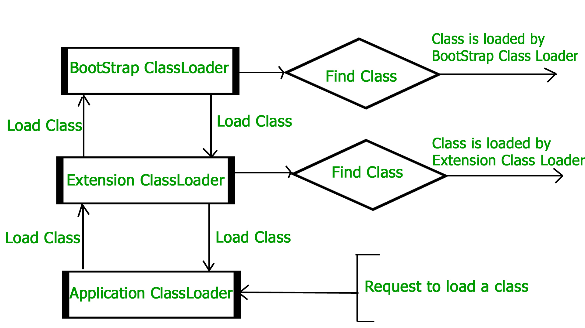

# How JVM Works – JVM Architecture?

URL: https://www.geeksforgeeks.org/jvm-works-jvm-architecture/

**JVM(Java Virtual Machine)** acts as a **run-time engine** to run Java applications. **JVM** is the one that actually calls the `main` method present in a java code. **JVM** is a part of **JRE(Java Runtime Environment)**.

> 这段理解2个意思：  
> （1）JVM是JRE的一部分；  
> （2）JVM是bytecode的run-time engine

When we compile a `.java` file, a `.class` file(contains byte-code) with the same filename is generated by the Java compiler. This `.class` file goes into various steps when we run it. These steps together describe the whole JVM.


## 1. Class Loader Subsystem

It is mainly responsible for three activities.

- Loading
- Linking
- Initialization

### 1.1 Loading

The Class loader reads the `.class` file, generate the corresponding binary data and save it in **method area**. For each `.class` file, JVM stores following information in **method area**.

- Fully qualified name of the loaded class and its immediate parent class.
- Whether `.class` file is related to `Class` or `Interface` or `Enum`
- Modifier, Variables and Method information etc.

After loading `.class` file, JVM creates an object of type `Class` to represent this file in the **heap memory**. Please note that this object is of type `Class` predefined in `java.lang` package. This `Class` object can be used by the programmer for getting **class level information** like **name of class**, **parent name**, **methods** and **variable** information etc. To get this object reference we can use `getClass()` method of `Object` class.

```java
// A Java program to demonstrate working of a Class type 
// object created by JVM to represent .class file in 
// memory. 
import java.lang.reflect.Field; 
import java.lang.reflect.Method; 
  
// Java code to demonstrate use of Class object 
// created by JVM 
public class Test 
{ 
    public static void main(String[] args) 
    { 
        Student s1 = new Student(); 
  
        // Getting hold of Class object created 
        // by JVM. 
        Class c1 = s1.getClass(); 
  
        // Printing type of object using c1. 
        System.out.println(c1.getName()); 
  
        // getting all methods in an array 
        Method m[] = c1.getDeclaredMethods(); 
        for (Method method : m) 
            System.out.println(method.getName()); 
  
        // getting all fields in an array 
        Field f[] = c1.getDeclaredFields(); 
        for (Field field : f) 
            System.out.println(field.getName()); 
    } 
} 

// A sample class whose information is fetched above using 
// its Class object. 
class Student 
{ 
    private String name; 
    private int roll_No; 
  
    public String getName()  {  return name;   } 
    public void setName(String name) { this.name = name; } 
    public int getRoll_no()  { return roll_No;  } 
    public void setRoll_no(int roll_no) { 
        this.roll_No = roll_no; 
    } 
}
```

Output:

```txt
Student
getName
setName
getRoll_no
setRoll_no
name
roll_No
```

**Note** : For every loaded `.class` file, only **one** object of `Class` is created.

```java
Student s2 = new Student();
// c2 will point to same object where 
// c1 is pointing
Class c2 = s2.getClass();
System.out.println(c1==c2); // true
```

### 1.2 Linking

Performs **verification**, **preparation**, and (optionally) **resolution**.

- **Verification** : It ensures the correctness of `.class` file i.e. it check whether this file is properly formatted and generated by valid compiler or not. If verification fails, we get run-time exception `java.lang.VerifyError`.
- **Preparation** : JVM allocates **memory** for **class variables** and initializing the **memory** to **default values**.
- **Resolution** : It is the process of replacing **symbolic references** from **the type** with **direct references**. It is done by searching into **method area** to locate **the referenced entity**.


### 1.3 Initialization

In this phase, **all static variables** are assigned with their values defined in the code and **static block**(if any). This is executed from **top** to **bottom** in a class and from **parent** to **child** in class hierarchy.

In general, there are **three class loaders** :

- **Bootstrap class loader** : Every JVM implementation must have **a bootstrap class loader**, capable of loading trusted classes. It loads **core java API classes** present in `JAVA_HOME/jre/lib` directory. This path is popularly known as **bootstrap path**. It is implemented in native languages like C, C++.
- **Extension class loader** : It is child of **bootstrap class loader**. It loads the classes present in the extensions directories `JAVA_HOME/jre/lib/ext`(Extension path) or any other directory specified by the `java.ext.dirs` system property. It is implemented in java by the sun.misc.Launcher$ExtClassLoader class.
- **System/Application class loader** : It is child of **extension class loader**. It is responsible to load **classes** from **application class path**. It internally uses Environment Variable which mapped to `java.class.path`. It is also implemented in Java by the `sun.misc.Launcher$AppClassLoader` class.

```java
// Java code to demonstrate Class Loader subsystem 
public class Test 
{ 
    public static void main(String[] args) 
    { 
        // String class is loaded by bootstrap loader, and 
        // bootstrap loader is not Java object, hence null 
        System.out.println(String.class.getClassLoader()); 
  
        // Test class is loaded by Application loader 
        System.out.println(Test.class.getClassLoader()); 
    } 
} 
```

Output:

```txt
null
sun.misc.Launcher$AppClassLoader@73d16e93
```

**Note** : JVM follow **Delegation-Hierarchy principle** to load classes. **System class loader** delegate load request to **extension class loader** and **extension class loader** delegate request to **boot-strap class loader**. If class found in boot-strap path, class is loaded; otherwise request again transfers to extension class loader and then to system class loader. At last if system class loader fails to load class, then we get run-time exception `java.lang.ClassNotFoundException`.




## 2. JVM Memory

### 2.1 Method area

In **method area**, all class level information like **class name**, **immediate parent class name**, **methods** and **variables** information etc. are stored, including static variables. There is **only one method area per JVM**, and it is **a shared resource**.

### 2.2 Heap area

Information of all objects is stored in heap area. There is also **one Heap Area per JVM**. It is also **a shared resource**.

### 2.3 Stack area

For **every thread**, JVM create **one run-time stack** which is stored here. Every block of this stack is called `activation record`/`stack frame` which store methods calls. **All local variables** of **that method** are stored in **their corresponding frame**. After a thread terminate, it’s run-time stack will be destroyed by JVM. It is **not a shared resource**.

### 2.4 PC Registers

Store **address** of **current execution instruction** of **a thread**. Obviously **each thread** has **separate PC Registers**.

### 2.5 Native method stacks

For **every thread**, **separate native stack** is created. It stores **native method information**.


## 3. Execution Engine

**Execution engine** execute the `.class` (bytecode). It reads the byte-code line by line, use data and information present in various memory area and execute instructions. It can be classified in three parts :

- **Interpreter** : It interprets the bytecode line by line and then executes. The disadvantage here is that when one method is called multiple times, every time interpretation is required.
- **Just-In-Time Compiler(JIT)** : It is used to increase efficiency of interpreter.It compiles the entire bytecode and changes it to native code so whenever interpreter see repeated method calls,JIT provide direct native code for that part so re-interpretation is not required,thus efficiency is improved.
- **Garbage Collector** : It destroy un-referenced objects.

## 4. Java Native Interface (JNI) 

It is **a interface** which interacts with the **Native Method Libraries** and provides **the native libraries**(C, C++) required for the execution. It enables JVM to call C/C++ libraries and to be called by C/C++ libraries which may be specific to hardware.

## 5. Native Method Libraries

It is a collection of **the Native Libraries**(C, C++) which are **required by the Execution Engine**.

