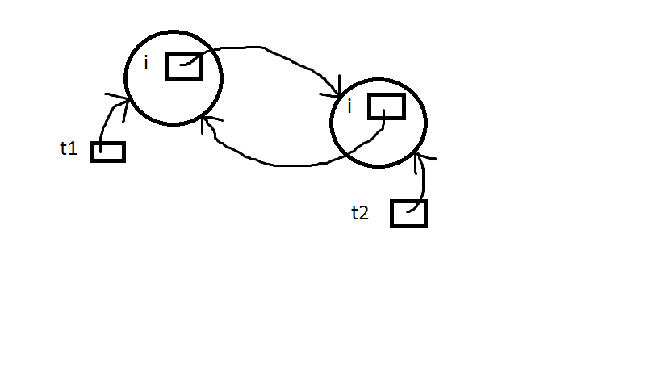
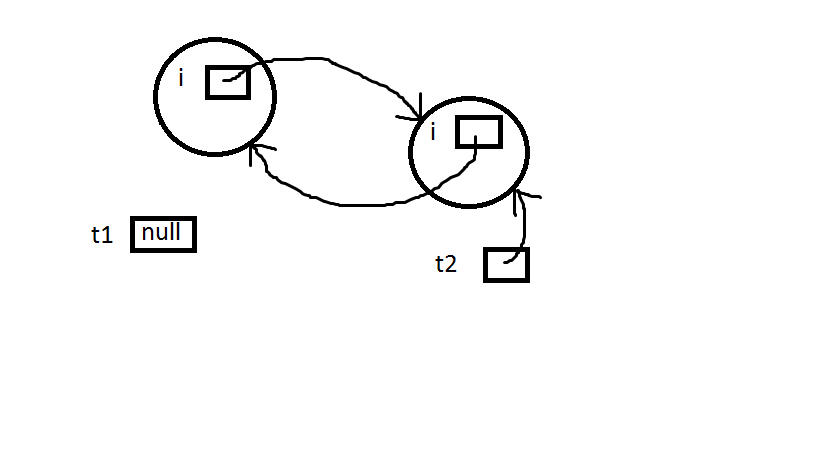
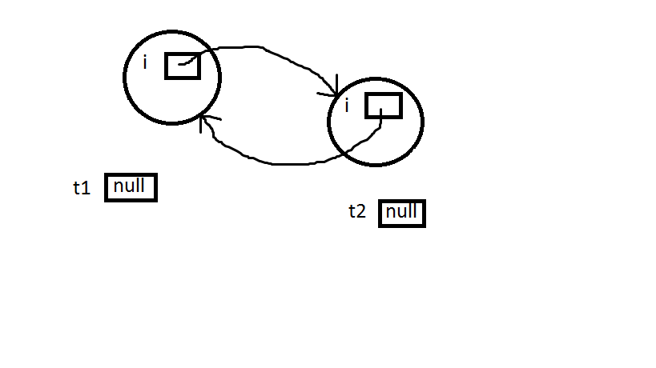

# Island of Isolation in Java

URL: https://www.geeksforgeeks.org/island-of-isolation-in-java/

In java, **object destruction** is taken care by the **Garbage Collector** module and the objects which do not have any references to them are eligible for garbage collection. Garbage Collector is capable to identify this type of objects.

## Island of Isolation:

`Object 1` references `Object 2` and `Object 2` references `Object 1`. Neither `Object 1` nor `Object 2` is referenced by any other object. That’s an **island of isolation**.

Basically, an **island of isolation** is **a group of objects that reference each other but they are not referenced by any active object** in the application. Strictly speaking, even **a single unreferenced object** is **an island of isolation** too.

```java
public class Test 
{ 
    Test i; 
    public static void main(String[] args)   
    { 
        Test t1 = new Test(); 
        Test t2 = new Test(); 
           
        // Object of t1 gets a copy of t2 
        t1.i = t2; 
       
        // Object of t2 gets a copy of t1 
        t2.i = t1; 
           
        // Till now no object eligible 
        // for garbage collection  
        t1 = null; 
          
        //now two objects are eligible for 
        // garbage collection  
        t2 = null; 
          
        // calling garbage collector 
        System.gc(); 
         
    } 
  
    @Override
    protected void finalize() throws Throwable  
    {  
        System.out.println("Finalize method called");  
    } 
}
```

Output:

```txt
Finalize method called
Finalize method called
```

**Explanation** :

Before **destructing an object**, **Garbage Collector** calls `finalize` method at most **one time** on that object.

The reason `finalize` method called two times in above example because two objects are eligible for garbage collection.This is because we don’t have any external references to `t1` and `t2` objects after executing `t2=null`.

All we have is **only internal references**(which is in instance variable `i` of class `Test`) to them of each other. There is no way we can call instance variable of both objects. So, none of the objects can be called again.

Till `t2.i = t1` : Both the objects have external references `t1` and `t2`.




`t1 = null` : Both the objects can be reached via `t2.i` and `t2` respectively.



`t2 = null`: No way to reach any of the objects.



Now, both the objects are eligible for garbage collection as **there is no way we can call them**. This is popularly known as **Island of Isolation**.

