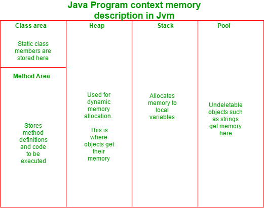

# How to prevent objects of a class from Garbage Collection in Java

URL: https://www.geeksforgeeks.org/how-to-prevent-objects-of-a-class-from-garbage-collection-in-java/

The **garbage collector** in Java is **automatic**, i.e the user doesn’t have to manually free an occupied memory which was dynamically allocated. 

And how does a garbage collector decide **which object is to be deleted**? It’s simple: **the object which loses it’s reference**, is **marked for deletion** from the **heap memory**.

```java
// Java code to demonstrate when an object would 
// be deleted by the garbage collector 
  
class A { 
    static void f() 
    { 
        A x = new A(); /*object created locally 
              It's scope remains valid till the 
              termination of this function*/
    } 
    public static void main(String a[]) 
    { 
        f(); 
  
        /* function f() terminates,  
           and hence the object 'x'  
           too gets collected  
           by the garbage collector*/
    } 
}
```

The above code shows that the reference variable ‘`x`’ had a scope limited to the function ‘`f()`’. Therefore, after the termination of the mentioned function, the variable has no recognition. Therefore, the object created loses it’s reference, and hence, is collected by the garbage collector.

The objects that are collected by the garbage collector, are collected so as to free the heap memory, where dynamic memory is allocated. 

The following diagram explains the **different memory segments** in a Java program, and their uses:



However, sometimes the question often arises: **Is there a way by which we can prevent an object from being collected by the garbage collector?**

There are several ways which can make objects undeletable in Java. They are discussed below:

- By Increasing Heap Memory
- By using Singleton Class
- Using `public void finalize()`

## 1. By Increasing Heap Memory

Java allocates memory to it’s object in a partition called ‘**heap**’ (except for String and some other special objects which are allocated memory in **pool**). Since **the heap memory is limited**, some memory is always needed to be freed to accommodate space for new objects. However, we can, to some limit make objects undeletable by increasing the heap size. The following jvm command line parameters can get the job done:

- Xms
- Xmx

**Xmx** specifies the maximum memory allocation pool for a Java virtual machine (JVM), while **Xms** specifies the initial memory allocation pool. The following is an example:

```bash
java -Xms256m -Xmx2048m classfile
```

Here, in the above example, you start with 256 MB of initially allocated heap memory, which could be expanded to a maximum of 2048MB of heap size.

**This approach** leads to the **garbage collector** running **infrequently**, however when it runs, will take **longer** than before to complete the garbage collection task.

## 2. By using Singleton Class

In case of a **singleton** class, the reference of the only object created can be stored in **a static reference**. Since **static members** are stored in **class area** (a memory segment), their lifetime spans the lifetime of the program. The following program explains how to do it:

```java
public class Singleton { 
  
    /* static class member which  
       will store the object reference*/
    private static Singleton uniqueInstance; 
  
    private Singleton() 
    { 
    } 
  
    public static synchronized Singleton getInstance() 
    { 
        if (uniqueInstance == null) { 
            uniqueInstance = new Singleton(); 
        } 
        return uniqInstance; 
    } 
} 
```

The above example shows that since the object’s reference has been passed into a `static` variable, it will never be lost. Therefore, the object won’t be deleted until the end of the program. However, **the only issue** remains that **only one object** can be created here.

## 3. Using `public void finalize()`

Finalize is a call-back method (a method called by the **JVM**, and **not** by the user), that is last method executed on an object. A subclass may override the finalize method to dispose of system resources or to perform other cleanup.

**How to prevent garbage collection using finalize?**

The finalize method of a class can be overridden to preserve the reference of the object that is about to be deleted. The following program demonstrates, how:

```java
// Java code to demonstrate how to prevent garbage collection 
// of an object using finalize method 
class A { 
    static A y; 
    void f() 
    { 
        A x = new A(); 
    } 
    pubic void finalize() 
    { 
        y = this; // Putting the reference id 
        // of the current object 
        // into the static variable y 
  
        System.out.println("Object reference saved. The object 
              won't be collected by the garbage collector"); 
    } 
    public static void main(String a[]) 
    { 
        f(); // function called 
    } 
```

Output:

```txt
Object reference saved. The object won't be collected by the garbage collector
```

As explained previously, `finalize` is the last method that is executed on an object. In the above program, the function ‘`f()`’ creates a local object of class `A`. When the call of the function terminates, the scope of the variable ‘`x`’ terminates as well, and hence, is marked for collection by the garbage collector. However, before the garbage collector could delete the object, `finalize` runs.

Inside the body of the method ‘`finalize`’, one can see that the static member of class `A`, ‘`y`’, is assigned the reference id of the current object. As a result, the reference id of the object to be deleted is preserved, and hence, the object is not deleted.

However, it is really important to know that **making an object undeletable** is **risky**, and increases the chances of memory leaks. Therefore, it is not advisable to do so.
