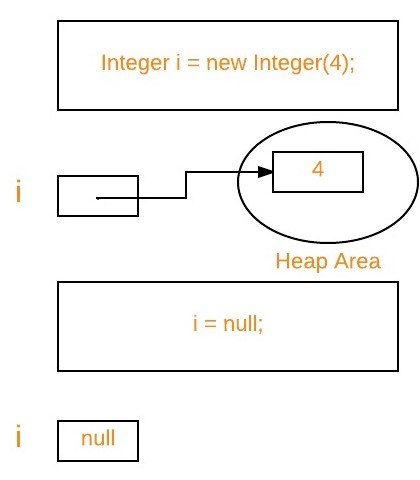

# Garbage Collection in Java

URL: 

- https://www.geeksforgeeks.org/garbage-collection-java/

## 1. Introduction

- In C/C++, programmer is responsible for both creation and destruction of objects. Usually programmer neglects destruction of useless objects. Due to this negligence, at certain point, for creation of new objects, sufficient memory may not be available and entire program will terminate abnormally causing **OutOfMemoryErrors**.
- But in Java, the programmer need not to care for all those objects which are no longer in use. **Garbage collector** destroys these objects.
- **Garbage collector** is best example of **Daemon thread** as it is always running in background.
- Main objective of Garbage Collector is to free heap memory by destroying **unreachable objects**.

## 2. Important terms

### 2.1 Unreachable objects

An object is said to be unreachable if it doesn’t contain any reference to it. Also note that objects which are part of **island of isolation** are also unreachable.

```java
Integer i = new Integer(4);
// the new Integer object is reachable  via the reference in 'i' 
i = null;
// the Integer object is no longer reachable. 
```



### 2.2 Eligibility for garbage collection

An object is said to be eligible for GC(garbage collection) if it is unreachable. In above image, after `i = null`; integer object 4 in heap area is eligible for garbage collection.

## 3. Ways to make an object eligible for GC

Even though programmer is not responsible to destroy useless objects but it is **highly recommended** to **make an object unreachable**(thus eligible for GC) if it is no longer required.

There are generally **four different ways** to make an object eligible for garbage collection.

- (1) Nullifying the reference variable
- (2) Re-assigning the reference variable
- (3) Object created inside method
- (4) Island of Isolation


## 4. Ways for requesting JVM to run Garbage Collector

Once we made object eligible for garbage collection, it may not destroy immediately by garbage collector. Whenever JVM runs Garbage Collector program, only then object will be destroyed. But when JVM runs Garbage Collector, we can not expect.

We can also request JVM to run Garbage Collector. There are **two ways** to do it :

- (1) Using `System.gc()` method : `System` class contain static method `gc()` for requesting JVM to run Garbage Collector. 本质是调用`Runtime.getRuntime().gc()`
- (2) Using `Runtime.getRuntime().gc()` method : `Runtime` class allows the application to interface with the JVM in which the application is running. Hence by using its `gc()` method, we can request JVM to run Garbage Collector.

```java
// Java program to demonstrate requesting  
// JVM to run Garbage Collector 
public class Test 
{ 
    public static void main(String[] args) throws InterruptedException 
    { 
        Test t1 = new Test(); 
        Test t2 = new Test(); 
          
        // Nullifying the reference variable 
        t1 = null; 
          
        // requesting JVM for running Garbage Collector 
        System.gc(); 
          
        // Nullifying the reference variable 
        t2 = null; 
          
        // requesting JVM for running Garbage Collector 
        Runtime.getRuntime().gc(); 
      
    } 
      
    @Override
    // finalize method is called on object once  
    // before garbage collecting it 
    protected void finalize() throws Throwable 
    { 
        System.out.println("Garbage collector called"); 
        System.out.println("Object garbage collected : " + this); 
    } 
} 
```

Output:

```txt
Garbage collector called
Object garbage collected : Test@46d08f12
Garbage collector called
Object garbage collected : Test@481779b8
```

**Note** :

- (1) There is no guarantee that any one of above two methods will definitely run Garbage Collector.
- (2) The call `System.gc()` is effectively equivalent to the call : `Runtime.getRuntime().gc()`

## 5. Finalization

Just before **destroying** an object, **Garbage Collector** calls `finalize()` method on the object to perform cleanup activities. Once `finalize()` method completes, Garbage Collector **destroys** that object.

`finalize()` method is present in `Object` class with following prototype.

```java
protected void finalize() throws Throwable
```

Based on our requirement, we can override `finalize()` method for perform our cleanup activities like closing connection from database.

**Note** :

- (1) The `finalize()` method called by Garbage Collector **not** JVM. Although Garbage Collector is one of the module of JVM.
- (2) `Object` class `finalize()` method has empty implementation, thus it is recommended to override `finalize()` method to dispose of system resources or to perform other cleanup.
- (3) The `finalize()` method is never invoked more than once for any given object.
- (4) If an uncaught exception is thrown by the `finalize()` method, the exception is ignored and finalization of that object terminates.


