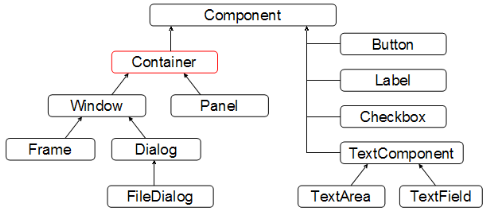

# JFrame框架

<!-- TOC -->

- [1. 创建一个框架](#1-%E5%88%9B%E5%BB%BA%E4%B8%80%E4%B8%AA%E6%A1%86%E6%9E%B6)
  - [1.1. 设置JFrame的可见性](#11-%E8%AE%BE%E7%BD%AEJFrame%E7%9A%84%E5%8F%AF%E8%A7%81%E6%80%A7)
  - [1.2. 设置JFrame的宽度和高度](#12-%E8%AE%BE%E7%BD%AEJFrame%E7%9A%84%E5%AE%BD%E5%BA%A6%E5%92%8C%E9%AB%98%E5%BA%A6)
  - [1.3. JFrame显示在屏幕中间](#13-JFrame%E6%98%BE%E7%A4%BA%E5%9C%A8%E5%B1%8F%E5%B9%95%E4%B8%AD%E9%97%B4)
  - [1.4. 关闭JFrame程序停止](#14-%E5%85%B3%E9%97%ADJFrame%E7%A8%8B%E5%BA%8F%E5%81%9C%E6%AD%A2)
  - [1.5. 设置Icon:](#15-%E8%AE%BE%E7%BD%AEIcon)
  - [1.6. 同时设置位置和大小](#16-%E5%90%8C%E6%97%B6%E8%AE%BE%E7%BD%AE%E4%BD%8D%E7%BD%AE%E5%92%8C%E5%A4%A7%E5%B0%8F)
  - [1.7. 编写一个FrameUtil工具类](#17-%E7%BC%96%E5%86%99%E4%B8%80%E4%B8%AAFrameUtil%E5%B7%A5%E5%85%B7%E7%B1%BB)
- [2. 框架中添加组件](#2-%E6%A1%86%E6%9E%B6%E4%B8%AD%E6%B7%BB%E5%8A%A0%E7%BB%84%E4%BB%B6)
- [3. Source Code](#3-Source-Code)
  - [3.1. JFrame](#31-JFrame)
  - [3.2. Window](#32-Window)

<!-- /TOC -->

JFrame(框架)是一个容器。
创建一个用户界面需要创建一个JFrame来存放用户界面组件，例如：按钮，文本框。


- `java.lang.Object`
  - `java.awt.Component`
    - `java.awt.Container`
      - `java.awt.Window`
        - `java.awt.Frame`
          - `javax.swing.JFrame`

继承关系图(AWT)



## 1. 创建一个框架

### 1.1. 设置JFrame的可见性

Code: [Link](code/simple/JFrame_00_OnlyVisible.java)

```java
import javax.swing.JFrame;

public class JFrame_00_OnlyVisible {
    public static void main(String[] args) {
        // 创建JFrame
        JFrame frame = new JFrame("我的Frame");
        // 显示JFrame
        frame.setVisible(true);
    }
}

```

> 注意:需要调用`setVisible(true)`方法后才会显示框架。也可以通过`frame.setVisible(false);` 来隐藏窗体；通过`frame.dispose();`关闭窗口

运行程序会在窗口的左上角显示一个窗口,但是只能显示标题栏,而且关闭JFrame时,程序程序没有停止.

所以需要完成如下需求:

- 1: 设置Jframe的宽度和高度
- 2: 让Jframe显示在屏幕中间
- 3: 关闭Jframe时,程序会停止

### 1.2. 设置JFrame的宽度和高度

```java
java.awt.Window.setSize(int width, int height)
```

查找API文档,查看 setSize方法,可以指定框架的宽度和高度.参数类型是`int`,注意是以像素为单位,普通的笔记本的屏幕分辨率为1280x800或者1366x768.注意:分辨率表示每平方英寸的像素数.屏幕分辨率越高,屏幕的像素越多.所以分辨率越高看到的细节就越多.

`setSize`方法被定义在`java.awt.Component`类中,被Component  的子类`java.awt.Window`重写.而`Jframe`继承自Windiws类，所以也具备该方法.

```java
import javax.swing.JFrame;

public class JFrame_01_Size {
    public static void main(String[] args) {
        // 创建JFrame
        JFrame frame = new JFrame("我的Frame");
        // 设置尺寸
        frame.setSize(300, 400);
        // 显示JFrame
        frame.setVisible(true);
    }
}

```

### 1.3. JFrame显示在屏幕中间

如果不想要设置在中间,可以使用`setLocation(200, 100);`

```java
import javax.swing.JFrame;

public class JFrame_01_Location {
    public static void main(String[] args) {
        // 创建JFrame
        JFrame frame = new JFrame("我的Frame");
        // 设置尺寸
        frame.setSize(300, 400);
        // 设置位置
        frame.setLocation(200, 100);
        // 显示JFrame
        frame.setVisible(true);
    }
}

```

设置**窗口**相对于指定**组件**的位置。

```java
java.awt.Window.setLocationRelativeTo(Component c)
```

如果 `c` 为 `null`，则此窗口将置于屏幕的中央。
`setLocationRelativeTo(null)`方法可以在屏幕上居中显示框架.

```java
import javax.swing.JFrame;

public class JFrame_01_LocationRelative {
    public static void main(String[] args) {
        // 创建JFrame
        JFrame frame = new JFrame("我的Frame");
        // 设置尺寸
        frame.setSize(300, 400);
        // 设置位置
        frame.setLocationRelativeTo(null);
        // 显示JFrame
        frame.setVisible(true);
    }
}
```


### 1.4. 关闭JFrame程序停止

`setDefaultCloseOperation(int operation)`方法

```java
javax.swing.JFrame.setDefaultCloseOperation(int operation)
```

该方法告诉程序,当框架关闭时结束程序.方法的参数是`JFrame`的常量`EXIT_ON_CLOSE`。


Code: [Link](code/simple/JFrame_01_QuickDemo.java)

```java
import javax.swing.JFrame;

public class JFrame_01_QuickDemo {
    public static void main(String[] args) {
        // 创建JFrame
        JFrame frame = new JFrame("Hello World");
        // 设置尺寸
        frame.setSize(200, 100);
        // JFrame在屏幕中
        frame.setLocationRelativeTo(null);
        // JFrame关闭时的操作
        frame.setDefaultCloseOperation(JFrame.EXIT_ON_CLOSE);
        // 显示JFrame
        frame.setVisible(true);
    }
}

```

### 1.5. 设置Icon:

```java
setIconImage(Toolkit.getDefaultToolkit().createImage("png-0015.png"));
```


```java
import java.awt.Toolkit;
import javax.swing.JFrame;

public class JFrame_01_Icon {
    public static void main(String[] args) {
        // 创建JFrame
        JFrame frame = new JFrame("我的Frame");
        // 设置尺寸
        frame.setSize(300, 400);
        // 设置位置
        frame.setLocationRelativeTo(null);
        // JFrame关闭时的操作
        frame.setDefaultCloseOperation(JFrame.EXIT_ON_CLOSE);
        // 设置ICON
        frame.setIconImage(Toolkit.getDefaultToolkit().createImage("circle.png"));
        // 显示JFrame
        frame.setVisible(true);
    }
}

````

### 1.6. 同时设置位置和大小

```java
java.awt.Window#setBounds(int x, int y, int width, int height)
```

第一个参数是左上角的x轴坐标， 第二参数是左上角y的坐标。 第三个参数表示窗体的宽， 第四个参数表示窗体的高。

```java
import java.awt.Toolkit;
import javax.swing.JFrame;

public class JFrame_01_Bounds {
    public static void main(String[] args) {
        // 创建JFrame
        JFrame frame = new JFrame("我的Frame");
        // 设置尺寸
        // frame.setSize(300, 400);
        // 设置位置
        // frame.setLocationRelativeTo(null);
        // 设置位置和大小
        frame.setBounds(200, 100, 300, 400);
        // JFrame关闭时的操作
        frame.setDefaultCloseOperation(JFrame.EXIT_ON_CLOSE);
        // 显示JFrame
        frame.setVisible(true);
    }
}
```

让窗体居中显示：

```java
import java.awt.Dimension;
import java.awt.Toolkit;
import javax.swing.JFrame;

public class JFrame_01_BoundsCenter {
    public static void main(String[] args) {
        // 创建JFrame
        JFrame frame = new JFrame("我的Frame");
        // 设置窗体大小并居中显示
        initFrame(frame, 300, 400);
        // JFrame关闭时的操作
        frame.setDefaultCloseOperation(JFrame.EXIT_ON_CLOSE);
        // 显示JFrame
        frame.setVisible(true);
    }

    // 获取屏幕的分辨率 设置窗体在屏幕的居中位置
    public static void initFrame(JFrame frame, int width, int height) {
        Toolkit toolkit = Toolkit.getDefaultToolkit();
        // 获取屏幕的分辨率
        Dimension d = toolkit.getScreenSize();

        int screenX = (int) d.getWidth();
        int screenY = (int) d.getHeight();

        int leftTopX = (screenX - width) / 2;
        int leftTopY = (screenY - height) / 2;

        frame.setBounds(leftTopX, leftTopY, width, height);
    }
}

```

### 1.7. 编写一个FrameUtil工具类

```java
import java.awt.Dimension;
import java.awt.Toolkit;

import javax.swing.JFrame;

// 初始化窗体的工具类
public class FrameUtil {

    public static void initFrame(JFrame frame, int width, int height) {
        // 获取一个与系统相关工具类对象
        Toolkit toolkit = Toolkit.getDefaultToolkit();
        // 获取屏幕的分辨率
        Dimension d = toolkit.getScreenSize();

        int screenX = (int) d.getWidth();
        int screenY = (int) d.getHeight();

        int leftTopX = (screenX - width) / 2;
        int leftTopY = (screenY - height) / 2;

        frame.setBounds(leftTopX, leftTopY, width, height);
        frame.setDefaultCloseOperation(JFrame.EXIT_ON_CLOSE);
        frame.setVisible(true);
    }

    public static void quit(JFrame frame) {
        frame.setVisible(false);
        frame.dispose();
    }
}
```


## 2. 框架中添加组件

上述案例中的框架是空的.可以通过`add`方法在框架中添加组件

```java
java.awt.Container.add(Component comp)
```

代码:

```java
import javax.swing.JFrame;
import javax.swing.JButton;

public class JFrame_02_AddComponent {
    public static void main(String[] args) {
        // 创建JFrame
        JFrame frame = new JFrame("Hello World");

        // 创建Button
        JButton btn = new JButton("OK");
        frame.add(btn);

        // 设置尺寸
        frame.setSize(200, 100);
        // JFrame在屏幕中
        frame.setLocationRelativeTo(null);
        // JFrame关闭时的操作
        frame.setDefaultCloseOperation(JFrame.EXIT_ON_CLOSE);
        // 显示JFrame
        frame.setVisible(true);
    }
}

```

运行程序,调整窗口的大小,按钮都是显示在窗口的中央,并且占满整个框架.这是因为组件(本例就是按钮)是被布局管理器放到框架中的.默认布局管理器就是将按钮放到中央.


## 3. Source Code

继承关系图(AWT)


### 3.1. JFrame

```java
package javax.swing;

public class JFrame  extends Frame 
implements WindowConstants, Accessible, RootPaneContainer,
           TransferHandler.HasGetTransferHandler
{
    public static final int EXIT_ON_CLOSE = 3;

    public JFrame() throws HeadlessException {
        super();
        frameInit();
    }

    public JFrame(String title) throws HeadlessException {
        super(title);
        frameInit();
    }
}
```

### 3.2. Window

```java
package java.awt;

public class Window extends Container implements Accessible {
    public void setVisible(boolean b) {
        super.setVisible(b);
    }

    public void setSize(int width, int height) {
        super.setSize(width, height);
    }

    public void setLocationRelativeTo(Component c) {
        // target location
        int dx = 0, dy = 0;
        // target GC
        GraphicsConfiguration gc = getGraphicsConfiguration_NoClientCode();
        Rectangle gcBounds = gc.getBounds();

        Dimension windowSize = getSize();

        // search a top-level of c
        Window componentWindow = SunToolkit.getContainingWindow(c);
        if ((c == null) || (componentWindow == null)) {
            GraphicsEnvironment ge = GraphicsEnvironment.getLocalGraphicsEnvironment();
            gc = ge.getDefaultScreenDevice().getDefaultConfiguration();
            gcBounds = gc.getBounds();
            Point centerPoint = ge.getCenterPoint();
            dx = centerPoint.x - windowSize.width / 2;
            dy = centerPoint.y - windowSize.height / 2;
        } else if (!c.isShowing()) {
            gc = componentWindow.getGraphicsConfiguration();
            gcBounds = gc.getBounds();
            dx = gcBounds.x + (gcBounds.width - windowSize.width) / 2;
            dy = gcBounds.y + (gcBounds.height - windowSize.height) / 2;
        } else {
            gc = componentWindow.getGraphicsConfiguration();
            gcBounds = gc.getBounds();
            Dimension compSize = c.getSize();
            Point compLocation = c.getLocationOnScreen();
            dx = compLocation.x + ((compSize.width - windowSize.width) / 2);
            dy = compLocation.y + ((compSize.height - windowSize.height) / 2);

            // Adjust for bottom edge being offscreen
            if (dy + windowSize.height > gcBounds.y + gcBounds.height) {
                dy = gcBounds.y + gcBounds.height - windowSize.height;
                if (compLocation.x - gcBounds.x + compSize.width / 2 < gcBounds.width / 2) {
                    dx = compLocation.x + compSize.width;
                } else {
                    dx = compLocation.x - windowSize.width;
                }
            }
        }

        // Avoid being placed off the edge of the screen:
        // bottom
        if (dy + windowSize.height > gcBounds.y + gcBounds.height) {
            dy = gcBounds.y + gcBounds.height - windowSize.height;
        }
        // top
        if (dy < gcBounds.y) {
            dy = gcBounds.y;
        }
        // right
        if (dx + windowSize.width > gcBounds.x + gcBounds.width) {
            dx = gcBounds.x + gcBounds.width - windowSize.width;
        }
        // left
        if (dx < gcBounds.x) {
            dx = gcBounds.x;
        }

        setLocation(dx, dy);
    }

    @Override
    public void setLocation(int x, int y) {
        super.setLocation(x, y);
    }

    @Override
    public void setLocation(Point p) {
        super.setLocation(p);
    }
}
```


