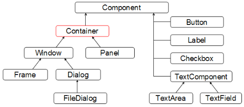

# Panel

继承关系图(AWT)



A generic **Abstract Window Toolkit(AWT)** `Container` object is a component that can contain other AWT components.

A `Window` object is a top-level window with no borders and no menubar. The default layout for a window is `BorderLayout`.

A `Frame` is a top-level window with a title and a border.

`Panel` is the simplest container class. A panel provides space in which an application can attach any other component, including other panels.  The default layout manager for a panel is the `FlowLayout` layout manager.

```java
import java.awt.Color;

import javax.swing.JFrame;
import javax.swing.JPanel;

public class Panel_01_Demo {
    public static void main(String[] args) {
        JFrame frame = new JFrame("Hello");

        JPanel panel = new JPanel();
        panel.setBackground(Color.RED);

        frame.add(panel);
        FrameUtil.initFrame(frame, 300, 400);
    }
}

```