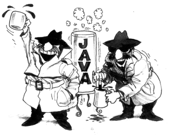

# Java Cryptography

URL: http://tutorials.jenkov.com/java-cryptography/index.html

## 1. Java Cryptography Extension

The Java cryptography API is provided by what is officially called the **Java Cryptography Extension**. The Java Cryptography Extension is also sometimes referred to vi the abbreviation **JCE**.

The **Java Cryptography Extension** has been part of the **Java platform** for a long time now. The JCE was initially kept separate from Java because the **US had some export restrictions on encryption technology**. Therefore **the strongest encryption algorithms were not included in the standard Java platform**. You could obtain these stronger encryption algorithms for Java JCE if you were a company inside the US, but the rest of the world had to make due with the weaker algorithms (or implement their own crypto algorithms and plug into JCE).

> 这一段，是说美国对于加密技术有限制

Today (2017) the US encryption export rules have been eased a lot. Therefore most of the world can benefit from the international encryption standards via Java **JCE**.

> 这里虽然放松了限制，但是究竟有哪些算法是被允许的，那些算法还是被禁止的，我还是不太清楚。

## 2. Java Cryptography Architecture

The **Java Cryptography Architecture (JCA)** is the name for the internal design of the Java cryptography API.

**JCA** is structured around **some central general purpose classes and interfaces**. **The real functionality** behind these interfaces are provided by **providers**. Thus, you may use a `Cipher` class to encrypt and decrypt some data, but the concrete cipher implementation (encryption algorithm) depends on the concrete provider used.

> JCA只是一个框架，而真正的算法来自于Provider。

**You can implement and plugin your own providers** too, but you should be careful with that. Implementing encryption correctly without security holes is hard! Unless you know what you are doing, you are probably better off using **the builtin Java provider**, or use **a well established provider** like **Bouncy Castle**.

> 关于Provider的算法，有三种来源：  
> （1）自己实现（不推荐）  
> （2）使用the builtin Java provider  
> （3）使用第三方提供的**a well established provider** like **Bouncy Castle**  

### 2.1 Bouncy Castle

URL: 

- http://bouncycastle.org/
- http://bouncycastle.org/java.html

> bouncy adj.弹性好的；有反弹力的；生气勃勃的；精神饱满的  
> castle  n.城堡；堡垒；车  


Bouncy Castle是一种用于 Java 平台的开放源码的轻量级密码术包；它支持大量的密码术算法，并提供JCE 1.2.1的实现。

The **Bouncy Castle Crypto APIs** are looked after by an **Australian Charity**, the **Legion of the Bouncy Castle Inc.** which looks after the care and feeding of the **Bouncy Castle APIs**.

> Legion （尤指古罗马的）军团

The **Bouncy Castle Crypto APIs** for **[Java](http://bouncycastle.org/java.html)** consist of the following:

- A lightweight cryptography API.
- **A provider** for the **Java Cryptography Extension (JCE)** and the **Java Cryptography Architecture (JCA)**.
- **A provider** for the **Java Secure Socket Extension (JSSE)**.
- A clean room implementation of the JCE 1.2.1.
- ... ...



## 3. Core Classes and Interfaces

The **Java cryptography API** is divided between the following **Java packages**:

- `java.security`
- `java.security.cert`
- `java.security.spec`
- `java.security.interfaces`
- `javax.crypto`
- `javax.crypto.spec`
- `javax.crypto.interfaces`

The **core classes and interfaces** of these packages are:

- Provider
- SecureRandom
- Cipher
- MessageDigest
- Signature
- Mac
- AlgorithmParameters
- AlgorithmParameterGenerator
- KeyFactory
- SecretKeyFactory
- KeyPairGenerator
- KeyGenerator
- KeyAgreement
- KeyStore
- CertificateFactory
- CertPathBuilder
- CertPathValidator
- CertStore

The most commonly used of these classes are covered throughout the rest of this Java Cryptography tutorial.

我的理解：

- Provider  （算法的提供者）
- Cipher  （加密算法）
    - Symmetric 
    - Asymmetric 
- Message Digest （摘要算法）
    - MAC （Message Digest的升级版）
- Signature （签名： raw data -> Message Digest -> Cipher）

### 3.1 Provider

The `Provider` (`java.security.Provider`) class is a central class in the Java cryptography API. In order to use the Java crypto API you need a Provider set. The Java SDK comes with its own cryptography provider. **If you don't set an explicit cryptography provider, the Java SDK default provider is used**. However, this provider may not support the encryption algorithms you want to use. Therefore **you might have to set your own cryptography provider**.

One of the most popular cryptography providers for the Java cryptography API is called **Bouncy Castle**. Here is an example that sets a `BouncyCastleProvider`:

```xml
<dependency>
    <groupId>org.bouncycastle</groupId>
    <artifactId>bcprov-jdk15on</artifactId>
    <version>1.60</version>
</dependency>
```

> 上述的`artifactId`为`bcprov-jdk15on`；其中`bcprov`应该是`Bouncy Castle Provider`的缩写；`jdk15on`表示`JDK 1.5`以上，即**JDK 1.5** to **JDK 1.8**。

The **Bouncy Castle Crypto** package is a Java implementation of cryptographic algorithms. This jar contains **JCE provider** and lightweight API for the Bouncy Castle Cryptography APIs for **JDK 1.5** to **JDK 1.8**.

```java
import org.bouncycastle.jce.provider.BouncyCastleProvider;

import java.security.Security;

public class ProviderExample {
    public static void main(String[] args) {

        Security.addProvider(new BouncyCastleProvider());

    }
}
```

### 3.2 Cipher

The `Cipher` (`javax.crypto.Cipher`) class represents **a cryptographic algorithm**(加密算法). A cipher can be used to both **encrypt** and **decrypt** data.

#### 3.2.1 create a Java `Cipher` instance

Here is how to create a Java `Cipher` instance:

```java
Cipher cipher = Cipher.getInstance("AES/CBC/PKCS5Padding");
```

This example creates a `Cipher` instance which uses the `AES` encryption algorithm internally.

The `Cipher.getInstance(...)` method take **a String** identifying **which encryption algorithm to use**, as well as a few other configurations of the algorithm. In the example above, the `CBC` part is **a mode** the `AES` algorithm can work in. The `PKCS5Padding` part is how the `AES` algorithm should **handle the last bytes of the data to encrypt, if the data does not align with a 64 bit or 128 bit block size boundary**. What exactly that means belongs in a tutorial about **cryptography in general**, not a tutorial about the **Java cryptography API**.

#### 3.2.2 Initializing the Cipher

Before the `Cipher` instance can be **used** it must be **initialized**. You initialize the `Cipher` instance by calling its `init()` method. The `init()` method takes two parameters:

- Encryption / Decryption cipher mode
- Key

**The first parameter** specifies **whether the Cipher instance should encrypt or decrypt data**. **The second parameter** specifies **the key** to use to encrypt or decrypt data with.

Here is a Java `Cipher.init()` example:

```java
byte[] keyBytes   = new byte[]{0,1,2,3,4,5,6,7,8,9,10,11,12,13,14,15};
String algorithm  = "RawBytes";
SecretKeySpec key = new SecretKeySpec(keyBytes, algorithm);

cipher.init(Cipher.ENCRYPT_MODE, key);
```

Please note that the way **the key** is created in this example is not secure, and should not be used in practice. This Java cryptography tutorial will describe **how to create keys more securely** in sections later.

To initialize a `Cipher` instance to **decrypt data** you have to use the `Cipher.DECRYPT_MODE`, like this:

```java
cipher.init(Cipher.DECRYPT_MODE, key);
```

#### 3.2.3 Encrypting or Decrypting Data

Once the `Cipher` is properly initialized you can start encrypting or decrypting data. You do so by calling the Cipher `update()` or `doFinal()` methods.

The `update()` method is used if you are encrypting or decrypting part of a bigger chunk of data. The `doFinal()` method is called when you are encrypting the last part of the big chunk of data, or if the block you pass to `doFinal()` represents **the complete data block** to encrypt.

Here is an example of **encrypting some data** with the `doFinal()` method

```java
byte[] plainText  = "abcdefghijklmnopqrstuvwxyz".getBytes("UTF-8");
byte[] cipherText = cipher.doFinal(plainText);
```

To **decrypt data** you would have passed **cipher text (encrypted data)** into the `doFinal()` or `doUpdate()` method instead.

### 3.3 Keys

To **encrypt or decrypt data** you need **a key**. There are **two types of keys** - depending on which type of encryption algorithm you use:

- Symmetric keys
- Asymmetric keys

**Symmetric keys** are used for **symmetric encryption algorithms**. **Symmetric encryption algorithms** use **the same key** for encryption and decryption.

**Asymmetric keys** are used for **asymmetric encryption algorithms**. **Asymmetric encryption algorithms** use **one key for encryption**, and **another for decryption**. **The public key - private key encryption algorithms** are examples of asymmetric encryption algorithms.

Somehow the party that needs to decrypt data needs to know the key needed to decrypt the data. If the party decrypting the data is not the same as the party encrypting it, somehow these two parties need to agree on a key, or exchange the key. This is referred to as **key exchange**.


#### 3.3.1 Key Security

Keys should be hard to guess so an attacker cannot easily guess the encryption key. The example in the previous section about the `Cipher` class used a very simple, hardcoded key. This is not a good idea in practice. If they key is easy to guess, it is easy for an attacker to decrypt the encrypted data and possibly create fake messages herself.

It is important to **make a key hard to guess**. Thus, **a key** should consist of **random bytes**. **The more random, the better**, and **the more bytes, the harder to guess** because there are more possible combinations.

#### 3.3.2 Generating a Key

You can use the Java `KeyGenerator` class to generate more random encryption keys. The KeyGenerator is covered in a bit more detail in the text about the Java KeyGenerator, but I will show you an example of how to use it here.

Here is a Java `KeyGenerator` example:

```java
KeyGenerator keyGenerator = KeyGenerator.getInstance("AES");

SecureRandom secureRandom = new SecureRandom();
int keyBitSize = 256;
keyGenerator.init(keyBitSize, secureRandom);

SecretKey secretKey = keyGenerator.generateKey();
```

The resulting `SecretKey` instance can be passed to the `Cipher.init()` method, like this:

```java
cipher.init(Cipher.ENCRYPT_MODE, secretKey);
```

#### 3.3.3 Generating a Key Pair

**Asymmetric encryption algorithms** use a key pair consisting of a **public key** and a **private key** to encrypt and decrypt data. To generate an asymmetric key pair you can use the `KeyPairGenerator` (`java.security.KeyPairGenerator`). The KeyPairGenerator is covered in a bit more detail in Java KeyPairGenerator tutorial, but here is a simple Java KeyPairGenerator example:

```java
SecureRandom secureRandom = new SecureRandom();

KeyPairGenerator keyPairGenerator = KeyPairGenerator.getInstance("DSA");

KeyPair keyPair = keyPairGenerator.generateKeyPair();
```

### 3.4 KeyStore

The Java **KeyStore** is a database that can contain keys. A Java KeyStore is represented by the `KeyStore` (`java.security.KeyStore`) class. A KeyStore can hold the following types of keys:

- Private keys
- Public keys + certificates
- Secret keys

**Private and public keys** are used in **asymmetric encryption**. A **public key** can have **an associated certificate**. **A certificate** is **a document** that verifies the identity of the person, organization or device claiming to own the public key. A certificate is typically digitally signed by the verifying party as proof.

**Secret keys** are used in **symmetric encryption**.

The `KeyStore` class is quite advanced so it is described in more detail in its own Java KeyStore Tutorial.


### 3.5 Keytool

The Java **Keytool** is a command line tool that can work with **Java KeyStore files**. The **Keytool** can generate **key pairs** into **a KeyStore file**, **export certificates** from, and **import certificates** into **a KeyStore** and several other functions.

The Keytool comes with the Java installation. The Keytool is described in more detail in the tutorial about the Java Keytool.


### 3.6 MessageDigest

When you receive some encrypted data from someone else, **how do you know that no one has modified the encrypted data on the way to you?**

A common solution is to **calculate a message digest** from the data before it is encrypted, and then encrypt both the data and the message digest and send that across the wire. **A message digest** is **a hash value** calculated from the message data. If a byte is changed in the encrypted data, the message digest calculated from the data will change too.

When receiving encrypted data, you decrypt it and calculate the message digest from it, and compare the calculated message digest to the message digest that was sent along with the encrypted data. If the two message digests are the same there is a high probability (but not a 100% guarantee) that the data was not modified.

You can use the Java `MessageDigest` (`java.security.MessageDigest`) to calculate message digests. You call the `MessageDigest.getInstance()` method to create a `MessageDigest` instance. There are several different message digest algorithms available. You need to tell which algorithm you want to use when creating a `MessageDigest` instance. This is covered in more detail in the Java MessageDigest tutorial. Here is a short introduction to the MessageDigest class.

Here is an example of creating a MessageDigest example:

```java
MessageDigest messageDigest = MessageDigest.getInstance("SHA-256");
```

This example creates MessageDigest instance which uses the SHA-256 cryptographic hash algorithm internally to calculate message digests.

In order to calculate a message digest of some data you call the `update()` or `digest()` method.

The `update()` method can be called multiple times, and the message digest is updated internally. When you have passed all the data you want to include in the message digest, you call `digest()` and get the resulting message digest data out. Here is an example of calling `update()` several times followed by a `digest()` call:

```java
MessageDigest messageDigest = MessageDigest.getInstance("SHA-256");

byte[] data1 = "0123456789".getBytes("UTF-8");
byte[] data2 = "abcdefghijklmnopqrstuvxyz".getBytes("UTF-8");

messageDigest.update(data1);
messageDigest.update(data2);

byte[] digest = messageDigest.digest();
```

You can also call `digest()` a single time passing all the data to calculate the message digest from. Here is how that looks:

```java
MessageDigest messageDigest = MessageDigest.getInstance("SHA-256");

byte[] data1 = "0123456789".getBytes("UTF-8");

byte[] digest = messageDigest.digest(data1);
```

### 3.7 Mac

The Java `Mac` class is used to create a **MAC** from **a message**. The term **MAC** is short for **Message Authentication Code**. **A MAC is similar to a message digest**, but uses **an additional key** to encrypt the message digest. Only by having both the original data and the key can you verify the MAC. Thus, a **MAC** is a **more secure** way to guard a block of data from modification than **a message digest**. The Mac class is described in more detail in the Java Mac tutorial, but below is a short introduction.

You create a Java `Mac` instance by calling the `Mac.getInstance()` method, passing as parameter **the name of the algorithm** to use. Here is how that looks:

```java
Mac mac = Mac.getInstance("HmacSHA256");
```

Before you can **create** a MAC from data you must **initialize** the Mac instance with **a key**. Here is an example of initializing the Mac instance with a key:

```java
byte[] keyBytes   = new byte[]{0,1,2,3,4,5,6,7,8 ,9,10,11,12,13,14,15};
String algorithm  = "RawBytes";
SecretKeySpec key = new SecretKeySpec(keyBytes, algorithm);

mac.init(key);
```

Once the Mac instance is **initialized** you can **calculate** a MAC from data by calling the `update()` and `doFinal()` method. If you have all the data to calculate the MAC for, you can call the `doFinal()` method immediately. Here is how that looks:

```java
byte[] data = "abcdefghijklmnopqrstuvxyz".getBytes("UTF-8");

byte[] macBytes = mac.doFinal(data);
```

If you only have the access to the data in separate blocks, call `update()` multiple times with the data, and finish off with a call to `doFinal()`. Here is how that looks:

```java
byte[] data  = "abcdefghijklmnopqrstuvxyz".getBytes("UTF-8");
byte[] data2 = "0123456789".getBytes("UTF-8");

mac.update(data);
mac.update(data2);

byte[] macBytes = mac.doFinal();
```

### 3.8 Signature

The `Signature` (`java.security.Signature`) class is used to digital sign data. When data is signed a digital signature is created from that data. The signature is thus separate from the data.

**A digital signature** is created by creating **a message digest (hash)** from the data, and encrypting that **message digest** with **the private key** of the device, person or organization that is to sign the data. **The encrypted message digest** is called **a digital signature**.

#### 3.8.1 create a Signature instance

To create a `Signature` instance you call the `Signature.getInstance(...)` method. Here is an example that creates a `Signature` instance:

```java
Signature signature = Signature.getInstance("SHA256WithDSA");
```

#### 3.8.2 Signing Data

To **sign** data you must **initialize** the `Signature` instance in **signature mode**. You do so by calling the `initSign(...)` method passing **the private key** to use to sign the data. Here is how initializing a `Signature` instance in **signature mode** is done:

```java
signature.initSign(keyPair.getPrivate(), secureRandom);
```

Once the `Signature` instance is initialized it can be used to **sign data**. You do so by calling `update()` passing the data to sign as parameter. You can call the `update()` method several times with more data to include when creating the signature. When all the data has been passed to the `update()` method you call the `sign()` method to obtain the digital signature. Here is how that looks:

```java
byte[] data = "abcdefghijklmnopqrstuvxyz".getBytes("UTF-8");
signature.update(data);

byte[] digitalSignature = signature.sign();
```

#### 3.8.3 Verifying a Signature

To **verify** a signature you must **initialize** a `Signature` instance into **verification mode**. This is done by calling the `initVerify(...)` method passing as parameter **the public key** to use to **verify the signature**. 

Here is now **initializing** a `Signature` instance into **verification mode** looks:

```java
Signature signature = Signature.getInstance("SHA256WithDSA");

signature.initVerify(keyPair.getPublic());
```

Once **initialized** into **verification mode**, you call the `update()` method with **the data** the signature is signing, and finish with a call to `verify()` which returns `true` or `false` depending on whether the signature could be verified or not. Here is how verifying a signature looks:

```java
byte[] data2 = "abcdefghijklmnopqrstuvxyz".getBytes("UTF-8");
signature2.update(data2);

boolean verified = signature2.verify(digitalSignature);
```

#### 3.8.4 Full Signature and Verification Example

Here is a full example of both **creating and verifying** a **digital signature** with the `Signature` class:

```java
// (1) KeyPair: private key + public key
SecureRandom secureRandom = new SecureRandom();
KeyPairGenerator keyPairGenerator = KeyPairGenerator.getInstance("DSA");
KeyPair keyPair = keyPairGenerator.generateKeyPair();

// (2) Sign Data: private data
Signature signature = Signature.getInstance("SHA256WithDSA");

signature.initSign(keyPair.getPrivate(), secureRandom);

byte[] data = "abcdefghijklmnopqrstuvxyz".getBytes("UTF-8");
signature.update(data);

byte[] digitalSignature = signature.sign();

// (3) Verify Data: public key
Signature signature2 = Signature.getInstance("SHA256WithDSA");
signature2.initVerify(keyPair.getPublic());

signature2.update(data);

boolean verified = signature2.verify(digitalSignature);

System.out.println("verified = " + verified);
```


