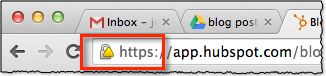
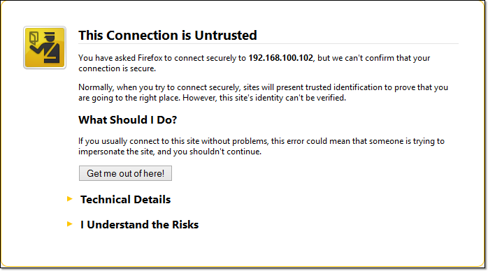

# What Is A Digital Certificate?

URL: https://www.jscape.com/blog/what-is-a-digital-certificate

## 1. What a digital certificate is in a nutshell

**A digital certificate** primarily **acts like an identification card**; something like a driver's license, a passport, a company ID, or a school ID. **It basically tells other people who you are**. So that, for example, when a user arrives at your site looking for yourdomain.com, your site's digital certificate (a.k.a. cert) will help that user confirm whether he actually landed at yourdomain.com. 

> digital certificate的作用就是告诉别人：你是谁（别人不能伪装）。

In addition, **a cert** also holds a copy of your site's **public key**, which is used in encrypting data transmitted between **your site** and **the user's web client** (in most cases, a web browser). 

> certificate中包含了public key。

You won't actually see **the entire digital certificate** as you connect to a site. However, you'll easily know it's there. **Websites protected by certs** usually display **a lock icon** followed by "`https`" on the leftmost part of that site's URL when viewed on your browser's URL bar. To view **the contents of the cert**, just click on **the lock icon**.

> 这段理解出3个意思：  
> （1） 并不能直接看到digital certificate  
> （2） 在浏览器上，digital certificate体现为一个lock icon  
> （3） 查看digital certificate的内容，可以点击lock icon进行查看  



Most **digital certificates** in use today follow what is known as **the X.509 standard**. **X.509** is used in **SSL (Secure Sockets Layer)** and **TLS (Transport Layer Security)**, so yes, it's what's being used in HTTPS, FTPS, WebDAVS and other secure data transfer protocols. Let's now take a look at the kind of information you'll find in this kind of certificate.

> 大部分的digital certificates遵从X.509的格式。


## 2. Contents of a X.509 certificate

The **contents** of **a digital certificate** typically include the following:

- **Information about the subject** a.k.a. **Subject Name** - "subject" refers to the site represented by the cert.

```txt
CN = *.google.com
O = Google LLC
L = Mountain View
ST = California
C = US
```

- **Information about the certificate issuer/certificate authority (CA)** - The **CA** is the body that issued and signed the certificate. 

```txt
CN = Google Internet Authority G3
O = Google Trust Services
C = US
```

- **Serial number** - this is the serial number assigned by the issuer to this certificate. Each issuer must make sure each certificate it issues has a unique serial number. 

```txt
4B:C7:BC:FA:00:5C:49:F0
```

- **Version** - the X.509 version used by a given certificate. These days, you'll usually find version `3`.

```txt
Version 3
```

- **Validity period** - certs aren't meant to last forever. The validity period defines the period over which the cert can still be deemed trustworthy. 

```txt
Not Before: 10/30/18, 9:14:00 PM GMT+8
Not After : 1/22/19, 9:14:00 PM GMT+8
```

- **Signature** -  This is the digital signature of the entire digital certificate, generated using the certificate issuer's private key

```txt
0F 28 46 87 AC 2D 7F 32 77 2B BF 54 DA D8 9E A2
A8 7B 63 A5 45 57 72 DE 62 2F 7B 3A C0 AB 78 95
04 BE A7 18 83 13 C9 5A 2C D5 17 B7 80 41 E8 1C
46 CF 1B 50 AB 86 33 98 1D 77 01 BB D3 A6 CB 1F
EC A8 0C 76 0D 47 0A A0 F7 41 87 64 04 18 ED 48
1D E3 67 80 29 7E 30 EF 80 2D A3 AD CF C3 D5 B6
CE 6B 9A D1 0E 68 73 1C 45 03 AF 90 3D FC F0 9A
96 AE 7D AA 0F 9C B7 06 D8 93 AA 4C F1 BE 33 B6
9C 1B 49 83 A8 82 06 84 6E F7 76 01 CB BE 10 74
A5 81 4C 05 59 B0 1E 1E 8E 74 FB C5 61 D0 7B A0
50 08 F0 53 B9 63 72 3F FC A5 89 3C 72 7F 0B D6
4B 4E FE EC 09 E5 30 7F B4 40 CC 2D 4D DE 7F D9
C4 17 29 B4 25 BA 19 9A E5 89 5D B6 56 30 34 7F
82 B7 11 E7 CF 14 50 04 F2 5D 03 DC B7 17 1B F3
0D F3 9D 71 AD 80 5F F1 BF 2E FB B4 B0 A3 63 F1
8F 95 48 29 15 DE EC BA C0 F5 F0 95 48 14 BC 32
```

- **Signature algorithm** - The cryptographic signature algorithm used to generate the digital signature (e.g. SHA-1 with RSA Encryption)

```txt
PKCS #1 SHA-256 With RSA Encryption
```

- **Public key information** - Information about the subject's public key. This includes:
    - the algorithm (e.g. Elliptic Curve Public Key), 
    - the key size (e.g. 256 bits),
    - the key usage (e.g. can encrypt, verify, derive), and
    - the public key itself


## 3. Certificate Key

While most of **the contents** of a **digital certificate** are there for providing information regarding **the subject**, **the issuer**, or **the certificate itself**, **the certificate key or public key** has a special purpose. It's a vital component in the **encryption of data** exchanged between the **server** and the **client**.

> 这里理解2个意思：  
> （1）此处的关注点是digital certificate中的public key。  
> （2）public key是server和client进行加密数据交换的关键因素。

## 4. Certificate Authorities 

Another element of a **digital certificate** that does more than provide information is the certificate's **digital signature**. As mentioned earlier, **the certificate's digital signature** is generated using **the certificate issuer's private key**.

> 这里理解2个意思：  
> （1）digital certificate中包含digital signature  
> （2）digital signature是借助于CA的private key生成的

you know that **a cert's digital signature** can be used in **authentication**. But in order for a **web client** to **verify/authenticate** a **digital signature**, it will need a copy of the **issuer's public key**.

> 这段理解2个意思：  
> （1）digital signature的作用是进行authentication  
> （2）要验证digital signature，需要借助于CA的public key

If **the issuer** happens to be a widely recognized **certificate authority (CA)**, that won't be a problem. A copy of that CA's public key will likely be pre-installed in the user's web browser. **Popular Web browsers** like Chrome, Firefox, Safari, and Internet Explorer all **come with the certificates of recognized CAs**. That means, they already contain copies of those certificate authorities' public keys and can therefore be used for verifying certificates issued/signed by them. 

Certificates signed by widely recognized CAs are called **signed certificates**. There are also certificates that are simply signed by issuers who aren't widely recognized certificate authorities. For example, when you create your own digital certificate using JSCAPE MFT Server but don't bother processing a Certificate Signing Request (CSR), you will end up with what is known as a **self-signed certificate**. 


## 5. Signed vs Self-signed certificates

In theory, certificate authorities are supposed to exercise **due diligence**(审慎调查) before signing digital certificates submitted to them through CSRs. They need to verify first whether the information placed on the digital certificates are in fact true. This is important because their attestation(鉴证；认证) would later on serve as the sole basis that certain websites who are able to present certs signed by them can really be trusted. 

> due diligence 尽职调查；尽职审查；审慎调查

So, assuming **due diligence** is really exercised, it would be safe to assume that signed certificates are more reliable and trustworthy than self-signed certificates. In fact, when a user attempts to connect to your site and your site only has a **self-signed certificate**, the user's browser will display something like this:




