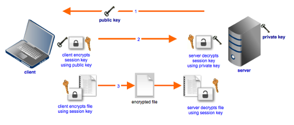

# Symmetric vs Asymmetric Encryption

URL: https://www.jscape.com/blog/bid/84422/Symmetric-vs-Asymmetric-Encryption

## 1. Overview

**Secure file transfer protocols** generally employ a combination of **symmetric** and **asymmetric** encryption to preserve the confidentiality of data while in transit. So why the need for two kinds of encryption? 

In this post, we take a closer look at the main functions of symmetric and asymmetric encryption, their strengths, their weaknesses, and why we'd prefer having both.

## 2. Symmetric key encryption

**Symmetric key encryption** is a type of encryption that makes use of **a single key** for both the encryption and decryption process. 

> 所谓Symmetric key encryption就是加密和解密使用同一个key。

Some of the encryption algorithms that use symmetric keys include: **AES (Advanced Encryption Standard)**, Blowfish, **DES (Data Encryption Standard)**, Triple DES, Serpent, and Twofish. 

> 算法举例。

If you want to apply **symmetric key encryption** to a file transfer environment, both the sender and receiver should have a copy of **the same key**. The sender will use his copy of the key for encrypting the file, while the receiver will use his copy for decrypting it. 

> 从sender和receiver的角度来谈

So if you manage **a secure file transfer server** that only supports **symmetric encryption** and one of your users wants to encrypt a file first before uploading it, one of you (either the user or you, the server admin) should first generate a key and then send the other person a copy of that key. 

> 如果你有一台服务器，那么。。。

## 3. Asymmetric key encryption

**Asymmetric key encryption**, on the other hand, makes use of **two keys**: **A private key** and **a public key**. **The public key** is used for encrypting, while **the private key** is used for decrypting. 

> Asymmetric key encryption需要两个key。

Two of the most widely used asymmetric key algorithms are: **RSA** and **DSA**.

> 算法举例。

If you're going to use asymmetric key encryption in a file transfer environment, **the sender** would need to hold **the public key**, while **the receiver** would need to hold the corresponding **private key**. 

> 从sender和receiver的角度来谈

So if you manage **a file transfer server** and one of your users wants to encrypt a file first before uploading it, it would typically be your duty to generate the key pair. You should then send the public key to your user and leave the private key on the server.

> 如果你有一台服务器，那么。。。

## 4. Which is stronger?

Actually, it's **difficult** to compare the cryptographic strengths of **symmetric** and **asymmetric** key encryptions. Even though asymmetric key lengths are generally much longer (e.g. 1024 and 2048) than symmetric key lengths (e.g. 128 and 256), it doesn't, for example, necessarily follow that a file encrypted with a 2048-bit RSA key (an asymmetric key) is already tougher to crack than a file encrypted with a 256-bit AES key (a symmetric key). 

Instead, it would be more appropriate to compare **asymmetric** and **symmetric** encryptions on the basis of **two properties**:

- Their **computational requirements**, and
- Their **ease of distribution**

Symmetric key encryption doesn't require as many CPU cycles as asymmetric key encryption, so you can say it's generally faster. Thus, when it comes to speed, symmetric trumps asymmetric. 

> 在速度方面，Symmetric更快一些。

However, symmetric keys have a major disadvantage especially if you're going to use them for **securing file transfers**. Because the same key has to be used for encryption and decryption, you will need to find a way to get the key to your recipient if he doesn't have it yet. Otherwise, your recipient won't be able to decrypt the files you send him. However way you do it, it has to be done in a secure manner or else anyone who gets a hold of that key can simply intercept your encrypted file and decrypt it with the key.

> 在分发key方面，Symmetric有很大不足之处。

**The issue of key distribution** becomes even more pronounced in a file transfer environment, which can involve a large number of users and likely distributed over a vast geographical area. Some users, most of whom you may never have met, might even be located halfway around the world. Distributing a symmetric key in a secure manner to each of these users would be nearly impossible.

> 进一步说明，在分发key方面，Symmetric有很大不足之处。

Asymmetric key encryption doesn't have this problem. For as long as you keep your private key secret, no one would be able to decrypt your encrypted file. So you can easily distribute the corresponding public key without worrying about who gets a hold of it (well, actually, there are spoofing attacks on public keys but that's for another story). Anyone who holds a copy of that public key can encrypt a file prior to uploading to your server. Then once the file gets uploaded, you can decrypt it with your private key.  

> 在分发key方面，Asymmetric并不存在类似的问题。

## 5. Getting the best of both worlds with hybrid cryptosystems

Because both symmetric and asymmetric key cryptography have their own advantages, modern file transfer systems typically employ **a hybrid of the two**. 

> 两种方法综合使用

Hybrid cryptosystems employed in an SFTP or FTPS server use **asymmetric keys** to initially encrypt **symmetric keys** known as **session keys**. The session keys are then the ones used to encrypt **the actual data**. As its name implies, a session key is only used in one session. After the session, the key is simply discarded. That's a good thing because even if a session key is compromised, only data sent within that particular session will be at risk. 

> 这段理解分成两个阶段：  
> （1） asymmetric key -> symmetric key
> （2） symmetric key -> actual data

Here's a simplified outline of the steps taken by a typical hybrid cryptosystem used in secure file transfer protocols like SFTP and FTPS. 

- (1) **File transfer server** sends its **public key** to an end user's **file transfer client**.

- (2) **Client** generates **a session key**, encrypts a copy of the session key using the **public key**, and sends that copy to the **server**.

- (3) **Server** receives its copy of **the session key** and both of them use that **session key** to encrypt/decrypt files exchanged within that session.

## 6. Summary

**File transfer systems** normally use **hybrid cryptosystems**, i.e. **a combination of symmetric and asymmetric key encryption**, to provide secure file transfers. **Symmetric keys** facilitate **faster file encryptions**, while **asymmetric keys** simplify **the key distribution process**. 

