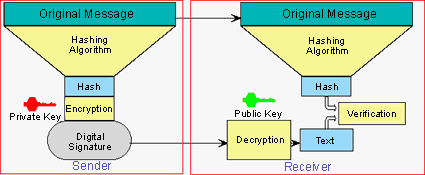
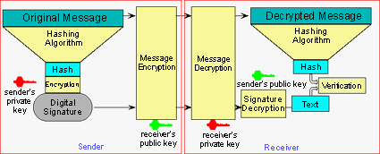

# Java security evolution and concepts, Part 1: Security nuts and bolts

URL: https://www.javaworld.com/article/2076087/java-security/java-security-evolution-and-concepts--part-1--security-nuts-and-bolts.html

This security series does not intend to provide a comprehensive guide to computer security. **Computer security is a multifaceted issue** touching several disciplines, departments, and cultures. 

## 1. What is computer security?

To understand **what computer security means** in general, what security means in everyday life is worth considering. Some of the general rules for security in day-to-day life also apply to computer security, as we'll see.

> 引出问题：computer security到底意味着什么

### 1.1 The limits of computer security

Is there such a thing as **absolute computer security? In a word, no.** The term `secure systems` is a misnomer(误称；误用词) since it implies that systems are either secure or not. **Security, in truth, is a trade-off**. Given unlimited resources, any form of security can be broken. While more and more resources are becoming available to the attacker, in the real world those resources remain finite. With that in mind, we should design systems in such a way that **the cost of breaking them** would far outweigh **the rewards**.

> 绝对的计算机安全（absolute computer security）是不存在的。如果有充足的资源，任何形式的Security都可以被击破。我们要设计的系统安全的目标是：破坏系统的安全性所付出的代价，要远远超过，带来的收益。  
> trade off 权衡；取舍

### 1.2 End-to-end security

**What is end-to-end security?** In a multitier system, each tier should have its own security and work in tandem(串联) with the other tiers. **Designing security** where different systems and middleware come together **is quite a challenge**. Simply put, **system security is only as strong as the weakest link** and, unless you consider security from an end-to-end(端到端；端对端；首尾相连) viewpoint, it is subject to being broken.

### 1.3 Simplicity

Will a complex security design work? It might seem that the best way to stop an unauthorized user might be to design a very complex security scheme, but that's not true. Not only will **the cost of designing a complex security system** be prohibitive(高昂得令人难以承受的；贵得买不起的；), it might be so complex that **legitimate users will try to find a way around it**. Simple systems, on the other hand, are easier understood and better analyzed.

### 1.4 Good system design requires security

Is it possible to retrofit(改进；翻新改造) security? The answer is **rarely**. Quite often it may be impossible to retrofit security without having to redesign substantial parts of the system. In almost all cases, retrofitting will be very expensive. Therefore, security should never be an afterthought(事后产生的想法；事后的想法；事后的思考) -- it must be **an integral part of the system design from the start**.

## 2. Computer security basics

It's useful to understand **what computer security protects against**, **the respective defense mechanisms**, and **the different terminologies** associated with it.

### 2.1 Threats

Threats -- attacks against computer security -- can be broadly categorized as:

- **Secrecy attacks**: Attempts to steal confidential(机密的；保密的) information either by exploiting weaknesses in cryptographic(密码的；用密码写的) algorithms or by other means.
- **Integrity attacks**: Attempts to alter information with some selfish or malicious intent. Integrity attacks, it should be noted, can also be accidental(偶然的；意外的).
- **Availability attacks**: Attempts to disrupt a system's normal operations. Availability attacks are also referred to by the recently popularized term, **denial of service** (**DoS**) attacks.

**Several attacks** fall into one or more of the categories mentioned above. Examples include:

- A **brute force** attack typically involves searching every key until the right one unlocks the door. While that may seem like an expensive operation, in reality it is possible to preen the search using specialized tools.
- A **Trojan horse** attack involves planting an enemy as an insider in such a way that it's not apparently noticeable. A computer virus serves as a common Trojan horse example.
- A **person-in-the-middle** attack intercepts communication between two parties without their knowledge. They assume that they're communicating normally.

**Other attacks** include: birthday attack, dictionary attack, meet-in-the-middle attack, and so on.

### 2.2 Protections

To shield against **security threats**, there are **a variety of protection mechanisms**. Historically, defense mechanisms have involved erecting some sort of a wall or boundary, commonly referred to as a **perimeter(周界；周边；) defense**.

**Firewalls**, a fairly successful example of perimeter defense, separate internal (private) and external (public) networks, and provide a central point of control for a corporate policy. However, firewalls increasingly allow select forms of traffic -- HTTP for example -- to cross over.

A **virtual private network (VPN)**, which provides the same security level as **a private network** while still using **a shared network**, serves as another protection example.

### 2.3 terminologies

#### 2.3.1 terminologies: Cryptography

Cryptography(密码术；加密；密码编码学) and cryptanalysis(密码分析学；密码破解；密码破译), its related field, concerns itself with the design and analysis of algorithms for encrypting and decrypting information. We'll discuss cryptography's vital relationship to security in the sections below.

#### 2.3.2 terminologies: Confidentiality

Confidentiality(保密性；私密性) is the process of protecting data from unauthorized use or users. Simply put, it means that only the intended recipient of a message can make sense of it.

If you're exchanging sensitive information with someone else, you want to be absolutely sure that only the intended recipient of the message can make sense of the message and, in the eventuality that it falls into wrong hands, the message becomes effectively useless. **Confidentiality** is accomplished by some form of **cryptographic technique**.

#### 2.3.3 terminologies: Authentication

The authentication(身份验证) process confirms the user's identity. The user could be a software entity or a human. **A principal(委托人；主角)** is the party whose identity is verified. Associated with a principal is a set of **credentials(凭证；信任状)**. Usually, authentication confirms identity by some secret information -- a **password**, for example -- known only to the user and the authenticator(认证者；验证者；验证器). Beyond passwords, more sophisticated security schemes employ advanced techniques such as **smart cards** or biometrics(生物特征识别；生物辨识) (finger printing, retinal scans, and so on) for authentication.

Once authentication is established, access to the user (or generally principal) is governed by the **access control mechanisms** in force.

**Kerberos** -- based on keys and encryption -- demonstrates an early authentication technology. It uses timestamps -- sessions remain valid for a defined time period -- to achieve that. To work properly, Kerberos fundamentally assumes that the clocks in a distributed system are synchronized.

**Public key infrastructure (PKI)**, discussed in sections below, represents a more general authentication solution.

The **Java Authentication and Authorization Service (JAAS)** framework supplements the Java 2 platform with **user-based authentication** and **access control capabilities**. JAAS is a standard extension to the Java 2 Software Development Kit, v 1.3.

#### 2.3.4 terminologies: Integrity

Let's say that you sent an electronic check(支票). When the bank ultimately receives the check, it needs to be sure that the payment amount has not been tampered, a security concept known as **integrity**.

#### 2.3.5 terminologies: Nonrepudiation

In the electronic check scenario outlined above, if you indeed sent the check, there ought to be no way you can deny it. Nonrepudiation(不可否认性；不可抵赖性) provides undeniable evidence of actions such as proof of origin of data to the recipient or receipt(收据；发票) of data to the sender.

#### 2.3.6 terminologies: Auditing and logs

Keeping a record of **resource access** that was granted or denied might be useful for audit purposes later. To that end, auditing and logs serve the useful purposes of preventing a break-in or analyzing a break-in **post mortem**(事后检讨).

#### 2.3.7 terminologies: policy and access control

A **security policy** focuses on controlling access to protected data. It's important that the **security enforcing mechanisms** should be **flexible enough** to enforce the policy. That is referred to as **keeping the policy separate from the mechanism**. While that decision might be based on authorizing access to a resource based on the identity of principal, it is often easier to administer access control based on **roles**. **Each principal** is mapped to **a unique role** for the purposes of access control. It is often implemented as a list or matrix enumerating the access that different users/roles have to the different protected resources.

Java 2 Platform, Enterprise Edition (J2EE) uses **role-based authentication** for enforcement of its policies. With that in mind, in J2EE the developer of the business logic limits access to specific functions based on roles.

## 3. Cryptography: the science of secret writing

Although **cryptography** and **computer security** are two distinct subjects, **computer security relies on cryptography in many ways**.

`Java.security`, in conjunction with several core packages, provides some of Java's cryptographic features. `Javax.crypto` is the primary package for some of the features that were governed by export control laws. Finally, the `javax.net.ssl` package can be used to create secure sockets when it's necessary to transmit confidential(机密的；保密的) information.

Next, let's examine **some of the concepts** relevant to **cryptography**.

### 3.1 Cryptanalysis

**Cryptanalysis**, the reverse of cryptography, **is the art of decoding or attacking secretly encoded information without access to the keys**. Cryptanalysis has found security holes in algorithms using theoretical(理论上存在的；假设的) attacks that have either led to abandonment of the algorithm or a major refinement. It serves the critical purpose of analyzing and validating algorithms with the intent of making them more secure.

### 3.2 Cryptography algorithms

There are several algorithms to encrypt information. A simple algorithm might involve rotating a character of a message by 13 positions -- referred to as **rot13**. Although not secure since the original message can be easily decrypted, **rot13** still remains in vogue(流行；风行) for insecure yet scrambled messaging.

> 一个简单有趣的Cryptography算法是rot13。

Based on a nineteenth-century work by Kerckhoff, **the security of a cryptosystem** should rest entirely in **the secrecy of the key** and **not** in **the secrecy of the algorithm**. **Secret keys** with **well tested and analyzed algorithms** produce cryptographically secure systems. Correspondingly, many of the widely prevalent algorithms are available for public scrutiny(详细审查；监视). Cryptanalysis(密码分析学；密码破解；密码破译) work on many of those algorithms have led to revisions that have made them stronger.

> 密码系统（cryptosystem）的安全性，是依赖于key的保密性，而不是依赖于algorithm的保密性。  
> cryptosystem 密码系统；密码体制  
> secrecy 保密性

### 3.3 One-way hash functions

A one-way hash function, `H(M)`, operates on **an arbitrary-length message** and returns **a hash value** `h` of fixed length `m`.

```txt
h = H(M), where h has a length m.;
```

The security of the algorithm stems from its one-wayness, not the secrets of its inner workings. More formally, `H(M)` has the following properties:

- Given `M`, it is easy to compute `h`
- Given `h`, it is hard to compute `M` such that `H(M) = h`
- Given `M`, it is hard to find a message, `M'`, such that `H(M) = H(M')`

**Hashing** is an essential part of **digital signatures**, discussed below. Ron Rivest of `RSA` designed `MD4` (message digest) and `MD5`. (`RSA` is the name of a security company that stands for first letter in each of its inventors last names: **R**on Rivest, **A**di Shamir, and **L**eonard Adleman.) `MD4` and `MD5` produce **a 128-bit hash**. `SHA` (**s**ecure **h**ashing **a**lgorithm), designed by the National Institute of Standards and Technology (NIST) in conjunction with the National Security Agency (NSA), produces **a 160-bit hash** used in the digital signature algorithm (DSA). `SHA-1`, simply referred to as `SHA` in some literature, is a revision to `SHA` published in 1994. `SHA` and `SHA-1`, part of the secure hash standard (SHS), share similarities with the MD4 function family. `MD4`, `MD5`, and `SHA` are some examples of one-way hash functions.

> Hashing是数字签名的核心部分。**Hashing** is an essential part of **digital signatures**  
> 算法举例：MD5(message digest)、SHA(Secure Hashing Algorithm)

As an example, the following **128-bit hash** was generated for similar looking messages based on the `MD5` algorithm.

| Original Message                            | **Hash values using MD5**  **(in hexadecimal)** |
| ------------------------------------------- | ----------------------------------------------- |
| ` a quick brown fox jumped over a lazy dog` | ` 13b5eeb338c2318b790f2ebccb91756f `            |
| ` a quick blue fox jumped over a lazy dog`  | ` 32c63351ac1c7070ab0f7d5e017dbcea`             |
| ` a quick brown dog jumped over a lazy fox` | ` a4c3b4cd38ade6b5e2e101d879a966f5`             |

For any arbitrarily sized message, the algorithm will generate **a fixed size hash**, which represents the message. It's evident from the above Table that altering a message even slightly will change its hash. It'll be time consuming to find an alternate message that hashes to the same value.

So far we've discussed **one-way functions** that do **not** use **a key**. **message authentication codes (MAC)**, on the other hand, are one-way functions that use a key. They can be used to authenticate files or messages between users, or on the system. HMAC (keyed hashing for message authentication) is an example in that category.

### 3.4 Symmetric ciphers

A **symmetric cipher**(暗号；密文), when applied in conjunction with **a secret key**, translates plaintext to ciphertext. The cipher can also recover the plaintext from the ciphertext, using the same key. The symmetricity comes from using an identical key for both encryption and decryption. There are **two related functions** for **encryption** and **decryption** such that:


<code>E<sub>k</sub>(M) = C</code>, where `M` is the plaintext, `C` is the ciphertext and `k` is the key  
<code>D<sub>k</sub>(C) = M</code>, where `C`,`M` and `k` have the same meaning

They have the essential property that <code>D<sub>k</sub>(E<sub>k</sub>(M)) = M</code>

Given a well designed algorithm, the security of the process lies in the secrecy of the keys. Consequently, **the main challenge for symmetric ciphers** rests in **the distribution of keys** -- how do the communicating parties share the same secret key? In contrast, **asymmetric ciphers** do not have to use the same secret key. Instead, they rely on a widely available and freely distributed public key.

**Encryption** using **private keys** is usually faster than with **public keys**. In a hybrid cryptosystem, the private key for the session, referred to as a session key, is established using public keys. The communicating parties use the session key for the rest of the session. That is one form of key exchange. Other forms of key exchange use more secure channels to exchange the private key.

**Symmetric ciphers** are classified as **stream ciphers** or **block ciphers**. **Stream ciphers** operate on the stream of bits or bytes, whereas **block ciphers** operate on a group of bits. **The essential difference in the ciphertext** is that the same plaintext block will encrypt to **the same ciphertext block**, using the same key for **block ciphers**, whereas it will encrypt to **a different block** every time it is encrypted when using **stream ciphers**.

Most block algorithms obey the **Feistel network** property, which means that **the algorithms** for **encryption** and **decryption** are **the same**, with **some difference** in **the application of keys**.

There are several **modes of operation**. **Modes enhance encryption** and can also **alter the characteristics of a symmetric cipher**. As an example, **a block cipher** can be made to behave like **a stream cipher** by the use of **the appropriate mode**. Listed below are a few important modes:

- Electronic CookBook Mode (ECB)
- Cipher Block Chaining (CBC)
- Cipher Feedback Mode (CFB)
- Output Feedback Mode (OFB)

There are several **block ciphers**, including the **data encryption standard (DES)**. DES will be replaced by **advanced encryption standard (AES)**. Meanwhile, **Triple DES** (3DES or DESede), an improvement over DES, serves as a replacement until the AES is adopted. In DESede, the encryption procedure follows an encode, decode, and encode process using different keys in sequence, effectively increasing the key's length.

### 3.5 Asymmetric ciphers

Unlike **symmetric ciphers** that involve the use of **the same key** for encryption and decryption, **asymmetric ciphers** involve the use of different keys in such a way that:

<code>E<sub>k1</sub>(M) = C</code>, where `k1` is the encryption key  
<code>D<sub>k2</sub>(C) = M</code>, where `k2` is the decryption key

Asymmetric ciphers have the essential property such that:

<code>D<sub>k1</sub>(E<sub>k2</sub>(M)) = M</code>

In asymmetric ciphers, the communicating parties do not have to share the same key. However, the keys `k1` and `k2` are mathematically related for the encryption and decryption processes to work in conjunction.

### 3.6 Public and private keys

**Asymmetric key ciphers** are also referred to as **public key cryptography** since they involve the notion of a public key. **A public key** is freely available, whereas **a private key** is a secret. In a network of users, each user has his or her own public key published in a commonly accessible directory.

**Whitfield Diffie** and **Martin Hellman** and independently **Ralph Merkle** introduced **public key cryptography** in the mid-1970s. **The security of public key algorithms** is based on **the difficulty of deducing plaintext from the ciphertext** without knowledge of the key and **the difficulty of deducing the private key from the public key**.

It's important to understand that discussion of public and private keys in most literature can get confusing since many articles appear to use the same keys for encryption and decryption, but it's implicit in the discussion that one of them is the private key and the other the public key.

Another point to note is that when using **multiple algorithms**, **multiple keys** are required since the keys are unique to the algorithm.

Both **digital signatures** and **certificates**, discussed below, rely on **public key cryptography**.

### 3.7 Digital signatures

**Digital signatures**, much like real-life signatures, provide proof of **authenticity of the sender** and **the integrity of the message**. Digital signatures can be used for nonrepudiation -- the sender cannot deny that he or she signed it. Digital signatures need to be unforgeable and not reusable to be successful, and the signed document must be unalterable.

The basic digital signature protocol is:

- The sender encrypts the document with his/her private key, implicitly signing the document
- The message is sent
- The receiver decrypts the document with the sender's public key, thereby verifying the signature

Since signing large documents is time consuming, quite often only a hash of the message is signed. The **one-way hash** and **the digital signature algorithm** is agreed a priori(先天；先验上). **The original message** is sent with **the signature**. The receiver verifies the signature by decrypting the hash with the sender's public key and matching it with the hash generated against the received message. Figure 1 below illustrates the signature generation and verification process. That scheme also has a nice effect of keeping the document and the signature separate.



Notice that the message uses a hashing algorithm to generate a fixed size hash, which is then encrypted to generate a signature. Those signatures are sometimes referred to as **digital fingerprints** since they represent the original message in a unique manner.

Using digital signatures does not guarantee confidentiality since the message is sent as plaintext. To further guarantee confidentiality, instead of sending the plaintext message, it could be encrypted with the receiver's public key, a process illustrated in Figure 2.



Digital signatures come in several algorithms, such as ElGamal signatures, RSA, or digital signature algorithm (DSA). Both ElGamal and RSA algorithms can be used for encryption and digital signatures. In contrast, DSA, part of the digital signature standard (DSS), can be used only for digital signatures and not for encryption. A separate algorithm for encryption has to be used in conjunction with DSA if encryption is desired.

### 3.8 Certificates

Since digital signatures depend on the integrity of the public keys, how can verifiers be sure that the public key they've obtained did not come from an imposter? Also, while digital signatures authenticate the sender, how can the receiver be sure of the sender's trustworthiness?

The answer to those questions lies in **certificates**. A mutually trusted third party or a certificate authority (CA) issues a certificate. The CA has more information about the user than merely the public key. Certificates contain public key, and an expiry date. The issuer signs the certificate with its private key. The implicit assumption in the process is that the CA's public key is widely available and genuine.

Public key certificates are based on the **X.509 standard**. Some examples of CAs include Verisign, Thawte (now owned by VeriSign), and Entrust. In Java, the `javax.security.cert` package provides certificate support.

### 3.9 Public key infrastructure

The relatively new **public key infrastructure (PKI)** has **several meanings** in different sources. One view states that **PKI** refers to **trust hierarchy** and **public key certificates**, while another view holds that it also encompasses **encryption** and **digital signature** services. PKI also addresses several key-related issues, including key registration, revocation, selection, recovery, and so on.


