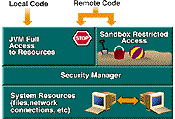
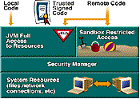
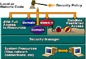
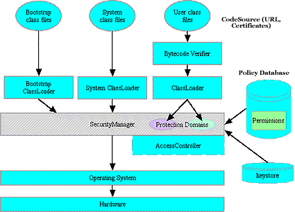

# Java security evolution and concepts, Part 2 Discover the ins and outs of Java security

URL: https://www.javaworld.com/article/2076135/java-security/java-security-evolution-and-concepts--part-2.html

## 1. Language vis-a-vis runtime security

> vis-a-vis  adj.面对面的  
> 标题中包含两个主题：  
> (1) language security  
> (2) runtime security

Although enforcement of **policies** during **code execution** is a substantial part of security, proper security starts at the very beginning, during the **generation of byte code**. A language's **type safety**, which is enforced by **the compiler** and checked by **the runtime environment**, proves critical to an overall secure environment. Many of computing's earliest security breaches(违(约)；不履行(义务)；破坏(法律)；突破) stemmed from the ability to easily overflow buffers or access memory unimpeded, situations caused in part by **a language's poor type safety** and inadequate enforcement in **the executing environment**.

Java security manifests itself in the following forms: **protection built into the language**, **building blocks for a flexible secure environment**, and **protection against accidental or malicious attacks to the language and platform**. Simply put, Java security should ensure that **the specifications** for **the language** and **virtual machine (VM)** are followed.

> the specifications in Java:  
> (1) for the language  
> (2) for the virtual machine (VM)

Despite **the safety checks** enforced by **the compiler**, the **VM** must still be able to deal with **faulty byte code**, whether generated accidentally or maliciously. Below, we'll examine **the enforcement of runtime checks** during execution and **the evolution of the runtime environment** to support the design of a very flexible security policy.

> safety check in Java:  
> (1) **the safety checks** enforced by **the compiler**：源代码->bytecode（运行之前的检查）  
> (2) the **VM** to deal with **faulty byte code**: runtime check（运行过程中的检查）

As for **language security** inherent in the language's design, **Java's design was heavily influenced by `C` and `C++`** -- particularly their weaknesses. Consequently, **the Java compiler** generates warnings for **uninitialized variables**. The language itself is strongly typed, with many unsafe constructs omitted or modified; for example, array accesses are done with index checking. Moreover, because **memory deallocation** in Java is the **garbage collector's responsibility** rather than the programmer's, Java avoids many common programming errors in C and C++ caused by faulty memory deallocation. Finally, **the compiler** enforces **exception-catching**. This discipline of catching and fixing potential errors may not have direct security implications. However, an unhandled error might lead to unpredictable behavior, which, from a security standpoint, should be avoided.

> language security in Java:  
> (1) the **Java compiler** generates warnings for uninitialized variables  
> (2) **memory deallocation** in Java is the **garbage collector's responsibility** rather than the programmer's, Java avoids many common programming errors in C and C++ caused by faulty memory deallocation.  
> (3) **the compiler** enforces **exception-catching**.  

## 2. Evolution of Java security

Some security features touted(吹捧；被吹捧的) in recent Java releases were also available in earlier versions. However, using them involved a considerable amount of additional programming and a good understanding of the security model. Generally, **Java** has provided access to the **language** and the **runtime environment** conservatively(保守地；谨慎地), which is good from a **security perspective**, although somewhat restrictive of the ability to support different policies.

It's necessary for a security designer to understand **Java security evolution**, as many enterprises may have to support pre-Java-2 releases for years to come. So this article will concentrate on Java 2 Security, but only after an overview of security in previous releases.

### 2.1 JDK 1.0 security -- Java security hits the sandbox

**JDK 1.0** featured **the sandbox security model**, as seen in Figure 1. **The sandbox model** confines **Java applets**, potentially dangerous or not, to **a strictly defined arena** where they cannot affect other system resources.



> 上图中的文字信息：  
> Local Code  
> Remote Code  
> JVM Full Access to Resources  
> Sandbox Restricted Access  
> Security Manager  
> System Resources(files, network connections, etc)

Since **applications load locally**, they, unlike applets, need not be deemed untrustworthy and **enjoyed unlimited access to all resources in JDK 1.0**. **A consistent security policy** for **applets** and **applications** was therefore not supported by this model.

> 这里要分清这两个概念：applets和applications  
> applets是来自remote  
> application是来自local  
> JDK 1.0对于applets和application并没有一个统一的安全策略(consistent security policy)

### 2.2 JDK 1.1 Security -- all or nothing

**JDK 1.0's sandbox model** provided virtually **no flexibility**. In an attempt to overcome this, **JDK 1.1** introduced **the signed applet**, illustrated in Figure 2. A signed applet is an applet packaged as a Java Archive (JAR) file and signed with a private key. **The signed applet** enjoys **unlimited access**, just like a local application, provided the corresponding public key is trusted in the executing environment. **Unsigned applets** default back to **the sandbox model**.



> 上图中的文字信息：  
> Local Code  
> Trusted Signed Code  
> Remote Code  
> JVM Full Access to Resources  
> Sandbox Restricted Access  
> Security Manager  
> System Resources(files, network connections, etc)

**JDK 1.1's security model** was less restrictive than **the sandbox model** and provided for slightly more consistent treatment of **applets** and **applications**. However, it had **one major disadvantage**: **applets either received unlimited access or were confined to the sandbox** -- there was no option for selective access to resources. This model was another example of an inflexible implementation where the policy was forced by the mechanism.

### 2.3 Java 2 Security -- fine-grained security

**The Java 2 Security model**, as illustrated in Figure 3, provides for a **consistent** and **flexible** policy for **applets** and **applications**. While applications still run unrestricted by default, they can be subjected to the same policy as applets.

The Java 2 model also introduces the concept of a `ProtectionDomain`, which permits **a highly flexible security policy** decoupled from its implementation.



> 上图中的文字：  
> Local or Remote Code  
> Security Policy  
> JVM Full Access to Resources  
> domain  
> Sandbox Restricted Access  
> Security Manager  
> System Resources(files, network connections, etc)


## 3. Overview of Java 2 security

The various features of the **Java 2 Runtime Environment's security model** can be seen in Figure 4. As a general caveat, some of the issues discussed might not be part of the specification **per se**(本身；本质上), but still peculiar(奇怪的；特有的) to most implementations.



### 3.1 Byte-code verifier

Since Java code can be imported from anywhere in the network, it is critical to screen(筛选；筛查) the code to be sure that it was produced by a trustworthy compiler. The **byte-code verifier**, sometimes referred to as a mini-theorem prover, tries to prove that **a given series of Java byte codes** are **legal**.

> theorem n.（尤指数学）定理

Among other things, **it verifies the format of the class file** - it must have **the right length**, **the correct magic numbers**, **no operand stack overflows and underflows**, and so on. In short, the verifier confirms or denies that the class file is consistent with the specifications. Although Figure 4 appears to indicate that byte-code verification occurs when the class is loaded, **some of these checks may be delayed until just before the byte code is first executed**.

Even though the **byte-code verifier** serves an important purpose, it is not very interesting from a programming standpoint because **its behavior cannot be altered programmatically**. **The behavior may be altered with command line options on the interpreter**, when applicable.

### 3.2 ClassLoader

The **ClassLoader**, which loads **Java byte codes** into the **JVM**, is an important link in the security chain. It works in conjunction with the `SecurityManager` and the `AccessController` to enforce security rules. Notice in Figure 4 that the `ClassLoader` is involved in enforcing some security decisions **earlier** in an object's lifetime than **the security manager**. Also, **information about the URL from which the code originated** and **the code's signers** is initially available to the `ClassLoader`.

It is possible to implement **a customized ClassLoader** or **a subclass** from `java.security.SecureClassLoader` to provide security features beyond those offered by the standard Java 2 Security model.

The `ClassLoader`, as its name indicates, **loads classes into the VM**. It is also responsible for the concept of **namespaces** at **runtime**, which are created by **packages**. With **namespaces**, **identically named identifiers** can refer to **different objects**.

Since a `ClassLoader` is itself a class, some bootstrapping is necessary early on. The `ClassLoader`, referred to as **the primordial(原生的；原始的) class loader** and usually written in **a native language**, loads **the bootstrap classes** in a platform-dependent manner.

Some classes defined in the `java.*` package are essential to the **JVM** and **the runtime system**. These are referred to as **system classes**, loaded by the **System ClassLoader**. The terminology sometimes extends to all classes found in the `CLASSPATH` environment variable. Typically, **a ClassLoader hierarchy** is created as more classes are loaded.

### 3.3 CodeSource

Since Java code can be downloaded over a network, **the code's origin** and **author** are critical to maintaining a secure environment. Consequently, the object `java.security.CodeSource` fully describes a piece of code. The `CodeSource` encapsulates the code's origin, which is specified as an `URL`, and **the set of digital certificates** containing **public keys** corresponding to the set of **private keys** used to sign the code.

Many access-control decisions are based in part on this property.

### 3.4 Permissions

`Permission` classes are at the very core of Java security and represent **access to various system resources** such as **files**, **sockets**, and so on. **A collection of permissions** can be construed as a customizable security **policy** for an installation.

For example, permission may be given to read and write files in the `/tmp` directory. `Permission` classes are **additive** in that they represent approvals, but not denials. It's possible to explicitly permit the reading of a particular file, but not to explicitly deny the reading of that file.

A number of permission classes are subclasses of the abstract `java.security.Permission` class, examples of which include `FilePermission`, `AWTPermission`, and even customized protections like `SendMailPermission`. For an exhaustive list of permissions, see Resources for a link to Li Gong's **Inside Java 2 Platform Security**.

### 3.5 Protection domains

It's possible to associate permissions with classes; however, it's more flexible to group classes into **protection domains** and associate permissions with those domains. **A class** is mapping to **a domain** occurs before the class is usable and is immutable thereafter. For instance, system classes can be effectively grouped under **the system domain**.

This **relationship** between the **class** and the **permissions** via the **protection domain** provides for flexible implementation mechanisms.


### 3.6 Policy

**The numerous mappings** of **permissions** to **classes** are collectively referred to as **policy**. **A policy file** is used to **configure the policy** for a particular implementation. It can be composed by a simple text editor or using `policytool`, a tool bundled with the **Software Development Kit (SDK)**, which we'll discuss in a future article.

### 3.7 SecurityManager

As seen in Figure 4, the class `java.lang.SecurityManager` is at the focal(中心的；很重要的) point of authorization -- the implementation of the sandbox model in JDK 1.0 is a good example.


**Prior to Java 2**, `SecurityManager` was **abstract**; vendors had to create concrete implementations. In **Java 2**, `SecurityManager` is **concrete**, with a public constructor and appropriate checks in place to ensure that it can be invoked in an authorized manner. `SecurityManager` consists of **a number of check methods**. For example, `checkRead(String file)` can determine read access to a file. The `checkPermission(Permission perm, Object context)` method can check to see if the requested access has the given permission based on the policy. This method is relegated(委托) to the `AccessController` in the default implementation. **The access controller** will raise **an exception** if **the requested permission cannot be granted**. 

### 3.8 AccessController

The `java.security.AccessController` class is used for **three purposes**:

- To decide **whether access to a critical system resource should be allowed or denied**, based on the security policy currently in effect
- To **mark code as privileged**(有特权的；受特别优待的), thus affecting subsequent access determinations
- To **obtain a snapshot of the current calling context**, so access-control decisions from a different context can be made with respect to the saved context

While the `SecurityManager` can be overridden, the `static` methods in `AccessController` are always available. If you wish a particular **security check** to always be invoked, regardless of which **security manager** is in vogue, the `AccessController` methods should be called.

### 3.9 The keystore

The **keystore** is a **password-protected database** that holds **private keys** and **certificates**. The **password** is selected at **the time of creation**. Each database entry can be guarded by its own password for extra security. **Certificates** accepted into the keystore are considered to be trusted. **Keystore information** can be used and updated by the security tools provided with the SDK.


## 4. Aspects of Java 2 Security

Aspects of Java 2 Security can be broadly classified as:

- **Core security**: the core classes that deal with security
- **Security extensions**: the optional packages that supplement the platform security
- **Security tools**: the Java 2 Software Development Kit (SDK) tools pertaining(与…有关系的) to security
- **Application, applet, and plugin security**: security deployment

In this article, I have focused on **core security**. I'll discuss the other aspects in subsequent articles.


## 5. Core security

Java 2's security pieces reside primarily in:

- `java.lang`
- `java.security`
- `java.security.cert`
- `java.security.interfaces`
- `java.security.spec`

Another Java 2 package, `java.security.acl`, which exists for historical reasons, has been superseded by classes in the `java.security` package.

Let's examine each major security-related class in more detail.

### 5.1 `java.lang`

The `java.lang` package contains the `SecurityManager` class discussed above, which allows **applications** to implement **a security policy**. Before performing **a sensitive operation**, the `SecurityManager` determines the operation's identity and whether it can be performed in its security context. The manager contains many methods that begin with the word `check`. The invocation of such a check method typically looks like this:

```java
SecurityManager security = System.getSecurityManager();
if (security != null) {
    security.checkXXX(argument,  . . . );
}
```

The special method `checkPermission(java.security.Permission)` determines whether an access request indicated by a specified permission should be granted or denied. The default implementation calls:

```java
AccessController.checkPermission(perm);
```
If a request is allowed, checkPermission returns quietly. If denied, a `SecurityException` is thrown.

### 5.2 `java.security`

`java.security` contains most security classes and interfaces. It contains classes for **access control**, parameters for **the various cryptographic algorithms**, **code source**, **guarded objects**, **key management**, **message digests**, **permission**, **policy**, **protection domains**, **providers**, **secure class loaders**, **random number generators**, and **digital signatures**.

The following Java code can be used to produce a permission to read files in the `/tmp` directory.

```java
FilePermission p = new FilePermission("/tmp/*", "read");
```

**Entries** in **the policy file** can also be used to achieve similar results. The following is a sample entry in the policy file that indicates the granularity of providing access.

```txt
// Sample policy file
grant signedBy "signer_names", codeBase "URL" {
    permission permission_class_name "target_name", "action", 
    signedBy "signer_names";
    };
```

Both the `signedBy` and `codeBase` name and value pairs are optional. The `signedBy` entry is **an alias** corresponding to the public key certificate of the private key used to sign the code. The **alias** name is mapped to the certificate in the keystore. The entry below would grant `read/write` access to all `/tmp` files if the code were signed by "Duke". The URL where the code originated is irrelevant.

```txt
grant signedBy "Duke" {
    permission java.io.FilePermission "/tmp/*", "read,write";
};
```

The entry shown below would provide **unrestricted access** -- clearly not desirable from a security viewpoint.

```txt
grant {
    // Allow everything for now
    permission java.security.AllPermission;
};
```

Many classes provide a **Service Provider Interface (SPI)** for **providers** to plug in their implementations. Examples include `MessageDigest`, `Signature`, `KeyPairGenerator`, and so on.

The `MessageDigest` class supports the `MD5` and `SHA` algorithms. The `getInstance()` method is invoked to select the appropriate algorithm. The method `update()` is called to ready the input buffer, while the `digest()` method generates **a message digest**, the size of which (in this case, 128 bits, or 16 bytes) depends on the algorithm (in this case, MD5). The same `digest()` method would generate 160 bits (20 bytes) for the digest if the `SHA` algorithm was used. The code below is a complete application used to generate a message digest.

```java
// Simple application that generates a Message Digest
import java.security.*;
import java.io.*;
public class md5 {
    public static void main(String args[]) {
        try {
        if (args.length != 1) {
            System.out.println("Usage: java md5 < some_string >");
            System.exit(1);
        }
        // Create an output file "digest"
        FileOutputStream digestStream = new FileOutputStream("digest");
        // Use the MD5 algorithm. SHA will work as well
        MessageDigest md=MessageDigest.getInstance("MD5");
        byte buf[] = args[0].getBytes();
        // Update the data and digest it
        md.update(buf);
        digestStream.write(md.digest());
        } catch (Exception e) {
            System.out.println(e);
        }
    }
}
```

The `Signature` class supports **digital signatures**. The signature algorithm can be, for example, **DSA (digital signature algorithm)**, with **SHA-1 (secure hashing algorithm)** as the hashing algorithm. The `DSA` algorithm using the `SHA-1` message digest algorithm can be specified as `SHA1withDSA`. In the case of `RSA`, there are multiple message digest algorithms possible, so the signing algorithm could be, for example, `MD2withRSA`, `MD5withRSA`, or `SHA1withRSA`. **The algorithm name** **must** be specified, as there is no default. Fragments of code to generate a signature are illustrated here:

```java
// Use SHA-1 as the hashing algorithm with DSA
Signature sig = Signature.getInstance("SHA1withDSA", "SUN");
// Initialize with private key
sig.initSign(privKey);
// Update the buffer with the message
sig.update(buffer, 0, len);
// Generate the signature
String sigString = sig.sign();
```

Fragments of code to verify the signature are illustrated here:

```java
// Use SHA-1 as the hashing algorithm with DSA
Signature sig = Signature.getInstance("SHA1withDSA", "SUN");
// Initialize with public key
sig.initVerify(pubKey);
// Update the buffer with the message
sig.update(buffer, 0, len);
// Verify the signature
boolean verifies = sig.verify(sigToVerify);
```
Notice that **the signature** is **generated** with **the private key** and **verified** with **the public key**. 

**Wrap it up**: `java.security.cert`, `java.security.interfaces`, and `java.security.spec`

The `java.security.cert` package deals with **certificates**. It provides, for instance, an abstract class to **import**, **generate**, and **verify** **X.509 certificates**. The `java.security.interfaces` package is a set of interfaces used to generate `DSA` and `RSA` key pairs. Finally, the `java.security.spec` package may be used to control the parameters for various algorithms, like `DSA` or `RSA`, and their corresponding keys.


