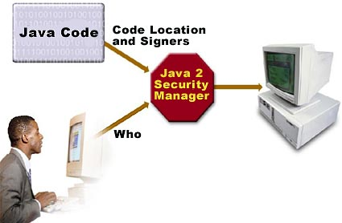
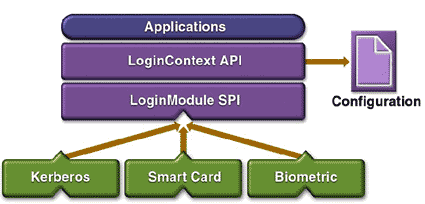
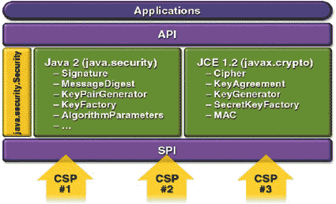
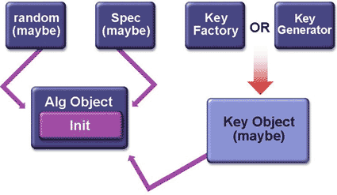
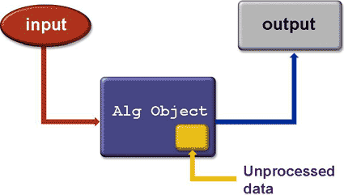
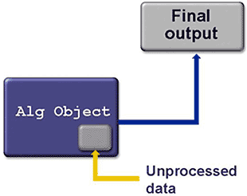

# Java security evolution and concepts, Part 4

Learn how optional packages extend and enhance Java security

The optional packages we will discuss comprise:

- **Java Authentication and Authorization Service (JAAS)**: A framework for user-based authentication
- **Java Cryptography Extension (JCE)**: A framework for using strong ciphers on a global basis
- **Java Secure Socket Extension (JSSE)**: An extension for **SSL** and **Transport Layer Security (TLS)** support

## 1. Java Authentication and Authorization Service (JAAS)

In the earlier articles we examined **Java security** as focused on the `CodeSource` property, which is a combination of **where the code originated (URL)** and **who signed it (certificates)**. This **CodeSource-based access control** lacks the ability to enforce access based on **who is running the code**. **JAAS** supplements the Java 2 security architecture by providing a framework to do so, as illustrated in Figure 1.

> 这段理解2个意思：  
> （1）从获取Java bytecode的角度（CodeSource）：代码来自哪儿、是谁发布的代码  
> （2）从运行Java bytecode的角度（JAAS）




We will examine **JAAS**'s **common classes**, as well as **classes from its two main components**: **authentication** and **authorization**.

### 1.1 JAAS authentication

**JAAS authentication** is performed in **a pluggable fashion** -- illustrated in Figure 2 -- permitting Java applications to remain independent from underlying authentication technologies. 

> JAAS authentication是一个pluggable fashion的实现。



Applications enable the authentication process by instantiating a `LoginContext` object, which in turn references a `Configuration` to determine the authentication technology, or `LoginModule`, to perform the authentication. 

> 几个主要的类

Typical `LoginModules` may prompt for and verify a username and password. More sophisticated authentication schemes may read and verify a voice or a fingerprint, for example. Later we will examine **how multiple authentication schemes can also provide for stack-based authentication**.

> 简单一点的就是，提供用户名和密码；  
> 更复杂一些就是，使用语音或指纹 

**Modules** can be configured via **configuration files**. A sample entry might look like:

```
Login1 {
    sample.SampleLoginModule required debug=true;
};
```

In this case, only one module performs the authentication. An attempt by `Login1` to authenticate a `Subject` will succeed if and only if the `SampleLoginModule` succeeds.

In the code above, `required` represents a `LoginModuleControlFlag`. Let's look at required and its fellow `LoginModuleControlFlag`s in more detail:

- `required`: In this case, the login module must succeed. Regardless of whether it succeeds or fails, however, authentication still proceeds down the login module list.
- `requisite`: The login module must succeed. If login succeeds, authentication continues down. However, if it fails, control returns immediately to the application.
- `sufficient`: The module doesn't have to succeed. If it does succeed, control immediately returns to the application.
- `optional`: This login module doesn't have to succeed. Whether it succeeds or fails, authentication still proceeds down the login module list.

**Stacked authentication** can be achieved by a configuration policy containing **multiple modules**. Here's an example:

```txt
Login2 {
    sample.SampleLoginModule required;
    com.sun.security.auth.module.NTLoginModule sufficient;
    com.foo.SmartCard requisite debug=true;
    com.foo.Kerberos optional debug=true;
};
```

### 1.2 JAAS authorization

Once the user executing the code has been **authenticated**, the JAAS **authorization** component works in conjunction with the existing Java 2 `CodeSource`-based access control model. **JAAS policy** extends the Java 2 policy with the relevant `Subject`-based information. Therefore, **permissions** recognized and understood in Java 2 (`java.io.FilePermission` and `java.net.SocketPermission,` for example) are equally understood and recognized by JAAS. Although the JAAS security policy physically resides separately from the existing Java 2 security policy, the two policies should be treated as one logical policy.

A policy file syntax -- an extension to the Java 2 policy file -- looks like:

```txt
grant signedBy "alias", codeBase "URL",
    principal principalClass "principalName",
    principal principalClass "principalName",
    ... {
    permission Type "name "action", 
        signedBy "alias";
    permission Type "name "action",
        signedBy "alias";
    ....
    };
```

Here's an example entry:

```txt
grant CodeBase "http://foo.com",
    Signedby "foo",
    Principal com.sun.security.auth.NTPrincipal "admin" {
        permission java.io.FilePermission "c:/user/admin", "read, write";
};
```

Notice that **the policy file** entries include a `Principal` entry, the basis for user-based authentication.

### 1.3 JAAS classes

The JAAS classes and interfaces reside in the following **packages**:

- `javax.security.auth`
- `javax.security.auth.callback`
- `javax.security.auth.login`
- `javax.security.auth.spi`

The **classes** and **interfaces** can be categorized as:

- Common classes:
    - `Subject`
    - `Principal`
    - `Credential`
- Authentication classes:
    - `LoginContext`
    - `LoginModule` interface
    - `Callback`
    - `CallbackHandler`
- Authorization classes:
    - `Policy`
    - `AuthPermission`
    - `PrivateCredentialPermission`

Let's examine a few of the important classes and interfaces in more detail.

A `Subject` may be any entity, such as a person or service. Once authenticated, a `Subject` is populated with associated identities, or `Principal`s. A `Subject` may have many `Principal`s. For example, a person may have a name `Principal` ("Jane Doe") and a Social Security Number `Principal` ("111-22-3333"), that distinguish it from other `Subject`s. The `getPrincipals()` method retrieves the `Principal`s associated with a `Subject`. The static method `doAs()` in `Subject` achieves the effect of having an action run as the subject. Based on whether this action is authorized, the action completes successfully or generates an exception.

The `LoginContext` class provides the basic methods to authenticate `Subject`s and a way to develop an application independent of the underlying authentication technology using **a configuration file** (which we studied above). Actual authentication occurs with a call to the `login()` method.

Moving on, the `LoginModule` interface allows you to implement various authentication technologies that can be plugged under an application. Its important methods include:

- `login()`
- `commit()`
- `abort()`
- `logout()`

Next, the `CallbackHandler` communicates with the user to obtain **authentication information using callbacks**.

Finally, the abstract `Policy` class represents the system-wide JAAS **access-control policy**.


### 1.4 JAAS programming model

Having looked at the JAAS classes briefly, let's try to build a `LoginModule`.

To **authenticate** and **authorize** a `Subject`, these steps are performed:

- An application instantiates a `LoginContext`.
- The `LoginContext` consults **a Configuration file**, along the lines of ones discussed above, to load the `LoginModule`s configured for that application.
- The application invokes the `LoginContext`'s `login()` method.
- The `login()` method invokes the loaded `LoginModule`s. Each `LoginModule` attempts to authenticate the `Subject`. Upon success, `LoginModule`s associate relevant `Principal`s and credentials with the `Subject`.
- The `LoginContext` returns **the authentication status** to the application.
- If authentication succeeds, the application retrieves the authenticated `Subject` from the `LoginContext`.
- Upon successful authentication of a `Subject`, fine-grained access controls can be placed upon that `Subject` by invoking the `Subject.doAs()` methods. The **permissions** granted to that `Subject` are configured in a JAAS policy.

The following code outline illustrates **how application code uses the JAAS framework**:

```java
// Instantiate a login context
LoginContext context = new LoginContext("name", CallbackHandler);
// Authenticate the subject
context.login();
// Retrieve the authenticated subject
Subject subject = context.getSubject();
// Enforce Access Controls
Subject.doAs(subject, action);
```

To implement a new login module, follow these suggested steps:

- Understand the authentication technology
- Name the `LoginModule` implementation
- Implement the abstract `LoginModule` method
- Compile the `LoginModule`
- Configure and test the `LoginModule`
- Document and package the `LoginModule` implementation


### 1.5 JAAS example program

The `JAAS 1.0` kit includes a sample program. We will discuss the program without including the code. To run the sample, refer to the kit's policy files, command lines, and other relevant material.

The sample program first instantiates a `LoginContext`. The `LoginContext` consults the login configuration, which in this example points to a single module: `SampleLoginModule`. The `SampleLoginModule`, loaded to perform the authentication, prompts for a username and password. Entering "testUser" for the username and "testPassword" for the password, the `SampleLoginModule` associates a `SamplePrincipal` (with "testUser" as its name) with the current `Subject`, and then executes the `SampleAction` as that `Subject` (by calling `Subject.doAs`).

The `SampleAction`, a privileged action, attempts to access two System properties (`java.home` and `user.home`), and also attempts to access the file `foo.txt` in the current working directory. This process will succeed only for the appropriate users, thereby accomplishing user-based authentication.


## 2. Java Cryptography Extension (JCE)

As we saw in the previous section, **JAAS** supplements Java core security by providing a framework for **user-based authentication and authorization**. Along the same lines, **JCE** enhances core security by adding support for **encryption, key generation and key agreement, and Message Authentication Code (MAC) algorithms**. JCE supplements the algorithms available in core Java security such as **digital signatures** or **one-way hash functions**. **JCE** extends the **Java Cryptography Architecture (JCA)**, with which it is possible to use multiple **CSP**s (**Cryptography Service Provider**), thereby promoting implementation independence, as seen in Figure 3.



The reference implementation, `SunJCE` provider, supports the following ciphers and MACs:

- DES
- DESede
- Blowfish
- PBEWithMD5AndDES
- PBEWithMD5AndTripleDES
- Diffie-Hellman key agreement among multiple parties
- HMACMD5
- HMACSHA1

With JCE 1.2.1, the framework is exportable outside the US and Canada, enabled by mechanisms JCE implements to ensure that only qualified providers can be plugged in. The cryptographic strength can be controlled in the jurisdiction policy files. Several clean-room JCE 1.2 implementations exist as well.

### 2.1 JCE classes

JCE's classes and interfaces exist in the following packages:

- `javax.crypto`
- `javax.crypto.interfaces`
- `javax.crypto.spec`

The classes and interfaces in `javax.crypto.spec` provide key and parameter specifications for the different algorithms like DES, Diffie-Hellman, and so on.

Additionally, JCE employs a number of classes in `java.security`, including:

- `Cipher`
- `Mac`
- Cipher stream classes comprising `CipherInputStream` and `CipherOutputStream`
- `KeyGenerator`
- `SecretKeyFactory`
- `SealedObject`
- `KeyAgreement`

We will take a look at some of these classes later.

The package `javax.crypto.interfaces` contains interfaces to the Diffie-Hellman key.

The `Cipher` class provides the functionality of a cryptographic cipher used for encryption and decryption. It forms the core of the JCE 1.2.1 framework. The `static getInstance()` method serves as a factory method. It takes as its arguments a `transformation`, which represents **the cryptographic algorithm**, and optionally a provider. A `transformation` is of the form:

- "**algorithm**", example: "`DES`"
- "**algorithm/mode/padding**", example: "`DES/CBC/PKCS5Padding`"

If no `mode` or `padding` have been specified, **provider-specific default values** for the `mode` and `padding` scheme are used.

The `init()` method takes a number of arguments including the `mode`, which is one of encrypt, decrypt, wrap or unwrap, key, or random. 

```java
public final void init(int opmode, Key key)
```

If all the data is available, the encryption/decryption can be achieved in one single step using the `doFinal()` method. Otherwise the `update()` method is called repeatedly, culminated by a `doFinal()` method. The `Mac` class has the same methods intended for the same effects as the `Cipher` class.

The snippet code below illustrates **how to associate a stream as an input to a cipher** using the `CipherInputStream` and `CipherOutputStream` classes:

```java
FileInputStream fis = new FileInputStream("/tmp/a.txt");
CipherInputStream cis = new CipherInputStream(fis, cipher1);                         
```

The `KeyGenerator` class generates secret keys for symmetric algorithms. The methods `getInstance()` and `init()` work along the same lines as before. The `generateKey()` method generates the secret key.

Key factories convert keys (opaque cryptographic keys of type `java.security.Key`) into key specifications that initialize the algorithm.

The `javax.crypto.SecretKeyFactory` object operates only on symmetric keys, whereas a `java.security.SecretKeyFactory` object processes the public and private key components of a key pair.

The `KeyAgreement` uses a `doPhase()` to accomplish the key agreement in phases, followed by a `generateSecret()` for computing the shared secret once all the phases complete.

### 2.2 JCE programming model

Having seen the important classes, let's look at the **general methodology** for accomplishing encryption/decryption using **JCE**. Although the details for using individual algorithms vary, the general principles are:

- Get the appropriate **cryptographic provider**.
- Obtain the appropriate cipher using the `getInstance()` method.
- Initialize the cipher with the `init()` method, as seen in Figure 4. The `SecretKeyFactory` and `KeyGenerator` generate the `Key` Object, an input to the algorithm as well as to `Random` classes and the different algorithm and the key specification classes.



- Encrypt or decrypt the data by repeatedly using `update()` methods, as illustrated in Figure 5.



- Depending on how it was initialized, the multiple-part encryption or decryption process finishes using the `doFinal()` method. For example, the process may use up a buffer remaining from the previous update, shown in Figure 6.




### 2.3 JCE example programs

The following program uses the Blowfish cipher to encrypt data:

```java
import java.security.*;
import javax.crypto.*;
import javax.crypto.spec.*;
import java.io.*;
/**
* This program generates a Blowfish key, retrieves its raw bytes, and 
* then reinstantiates a Blowfish key from the key bytes.
* The reinstantiated key is used to initialize a Blowfish cipher for
* encryption.
*/
public class BlowfishKey {
    public static void main(String[] args) throws Exception {
        String message="This is just an example";
        // Install SunJCE provider
        Provider sunJce = new com.sun.crypto.provider.SunJCE();
        Security.addProvider(sunJce);
        // Get the KeyGenerator         
        KeyGenerator kgen = KeyGenerator.getInstance("Blowfish");
        // Generate the secret key specs.
        SecretKey skey = kgen.generateKey();
        byte[] raw = skey.getEncoded();
        SecretKeySpec skeySpec = new SecretKeySpec(raw, "Blowfish");
        // Instantiate the cipher           
        Cipher cipher = Cipher.getInstance("Blowfish");
        cipher.init(Cipher.ENCRYPT_MODE, skeySpec);
        // Encrypt ...
        byte[] encrypted = 
            cipher.doFinal(message.getBytes());
    }
}
```

The slightly modified program below illustrates the use of the SecureRandom class in conjunction with the cipher:

```java
     import java.security.*;
     import javax.crypto.*;
     import javax.crypto.spec.*;
     import java.io.*;
     /**
      * This program generates a Blowfish key, retrieves its raw bytes, and 
      * then reinstantiates a Blowfish key from the key bytes.
      * The reinstantiated key is used to initialize a Blowfish cipher for
      * encryption.
      */
     public class BlowfishKey {
         public static void main(String[] args) throws Exception {
             String message="This is just an example";
             // Install SunJCE provider
             Provider sunJce = new com.sun.crypto.provider.SunJCE();
             Security.addProvider(sunJce);
             // Get the KeyGenerator         
             KeyGenerator kgen = KeyGenerator.getInstance("Blowfish");
             // setup the random class and associate with key Generator
             SecureRandom random = SecureRandom.getInstance("SHA1PRNG");
             kgen.init(random);
             // Generate the secret key specs.
             SecretKey skey = kgen.generateKey();
             byte[] raw = skey.getEncoded();
             SecretKeySpec skeySpec = new SecretKeySpec(raw, "Blowfish");
             // Instantiate the cipher           
             Cipher cipher = Cipher.getInstance("Blowfish");
             cipher.init(Cipher.ENCRYPT_MODE, skeySpec);
             // Encrypt ...
             byte[] encrypted = 
                 cipher.doFinal(message.getBytes());
         }
     }
```

## 3. Java Secure Socket Extension (JSSE)

In keeping with our theme, the **Java Secure Socket Extension (JSSE)** supplements Java core security just as do **JAAS** and **JCE**. **JSSE** enables secure Internet communications by providing a framework supporting the **SSL** and **TLS** protocols, both designed to protect the **privacy** and **integrity** of data while it is transferred across the network. Unlike using **JCE**, the key agreement and the cipher-suite agreements happen transparently over **SSL**.

Table 2 illustrates **the algorithms** and **the key lengths** used by **JSSE** for key agreement and/or authentication.

| **Algorithm**             | **Valid Key Lengths(bits)** |
| ------------------------- | --------------------------- |
| RSA public key            | 2,048 or 512                |
| Diffie-Hellman public key | 1,024 or 512                |
| DSA public key            | 2,048                       |

### 3.1 JSSE classes

JSSE classes can be found in the following packages:

- `javax.net`
- `javax.net.ssl`
- `javax.security.cert`

The main classes comprise:

- `SSLSocket`
- `SSLServerSocket`
- `SocketFactory`
- `ServerSocketFactory`
- `SSLSocketFactory`
- `SSLServerFactory`

The class `javax.net.ssl.SSLSocket` stems from the `java.net.Socket` class. It supports all of the standard socket methods and adds additional methods specific to secure sockets. The `SSLServerSocket` class creates server sockets. The method `createSocket()` can create instances of sockets. Alternatively, the method `accept()` can also create server-side sockets.

The class `SSLSocketFactory`, a concrete implementation of the abstract `SocketFactory`, acts as a factory for creating secure sockets. The `SSLServerSocketFactory` class creates server sockets. We will use its `getDefault()` static method to obtain an instance of the class.

Several other support classes and interfaces exist, as detailed in the API documentation provided with the kit.


### 3.2 JSSE programming model

The programs use a `keyStore` and a `trustStore` for the purposes of authentication, provided via the properties `javax.net.ssl.keyStore` and `javax.net.ssl.trustStore`, respectively. These work in tandem(串联), that is, a **key entry** amongst the **keyStore** entries should correspond to **an entry** in the **trustStore** entry on the other side. For example, a keyEntry, `duke`(只是一个名字) on **the server side**, should have a `trustedCertEntry` for the same key on **the client side** for server authentication to succeed.

The outline for the server code looks like:

```java
import javax.net.ssl.*;
// Provide entries for keyStore which contains server key
// Create an instance of the factory
SSLServerSocketFactory sslSrvFact = (SSLServerSocketFactory) SSLServerSocketFactory.getDefault();
// Create a server socket
SSLServerSocket s =(SSLServerSocket)sslSrvFact.createServerSocket(port);
// Accept connections
SSLSocket in = (SSLSocket)s.accept();
```

Here's the corresponding client code:

```java
import javax.net.ssl.*;
// Provide entries for trustStore to enable server authentication
// Create an instance of the factory
SSLSocketFactory sslFact =(SSLSocketFactory)SSLSocketFactory.getDefault();
// Create a socket and connect
SSLSocket s = (SSLSocket)sslFact.createSocket(host, port);
```

**A session key** and **a cipher suite** are negotiated transparently for use during the session as long as **the handshake process** completes.


### 3.3 JSSE example programs

The following program pairs enable **socket communications** between systems **without the use of SSL**. Using a simple program like snoop on Unix systems, you can see the communications in the clear. Later, we will see how this problem can be avoided by using JSSE.

Below you'll find **the code for the server**. It waits for a connection, communicates once, then terminates. The examples use port `8181`. Any other free port can be used as far as these examples are concerned:

```java
import java.io.*;
import java.net.*;
public class HelloServer {
    public static void main(String[] args) {
        try {
            ServerSocket s = new ServerSocket(8181);
            Socket in = s.accept();
            PrintWriter out = new PrintWriter (in.getOutputStream(),
                                               true);
            out.println("Hello on a socket");
            in.close();
        } catch (Exception e) {}
    }
}
```

You'll find the corresponding client code below. `127.0.0.1` is the localhost. Using it in the program indicated below enables both **the server** and **the client** to run on the same machine, providing an argument will enable a connection to the respective server, if possible:

```java
import java.io.*;
import java.net.*;
public class HelloClient {
    public static void main(String[] args) {
        try {
            Socket s = new Socket(args.length == 0 ? "127.0.0.1" : args[0], 8181);
            OutputStream out = s.getOutputStream();
            BufferedReader in = new BufferedReader (
                                 new InputStreamReader(s.getInputStream()));
            String str = in.readLine();
            System.out.println("Socket message: " + str);
            in.close();
        } catch (Exception e) {}
    }
}
```

From a programming viewpoint, it's easy to convert these simple programs to use SSL. To do so, we employ the `javax.net.ssl` package and the relevant classes. The code for the server and client looks as below, with the bold indicating changes made to the previous programs. **The server** uses the `SSLServerSocket` and `SSLServerSocketFactory` classes for **SSL**:

```java
import java.io.*;
import java.security.*;
import javax.net.ssl.*;
public class HelloServerSSL {
    public static void main(String[] args) {
        SSLServerSocket s;
        try {
            Security.addProvider(
                new com.sun.net.ssl.internal.ssl.Provider());
            SSLServerSocketFactory sslSrvFact =
                (SSLServerSocketFactory)
                    SSLServerSocketFactory.getDefault();
            s =(SSLServerSocket)sslSrvFact.createServerSocket(8181);
            SSLSocket in = (SSLSocket)s.accept();
            PrintWriter out = new PrintWriter (in.getOutputStream(),
                                               true);
            out.println("Hello on a SSL socket");
            in.close();
        } catch (Exception e) {
            System.out.println("Exception" + e);
        }
    }
}
```

Next, you'll find the corresponding client code:

```java
import java.io.*;
import java.security.*;
import javax.net.ssl.*;
public class HelloClientSSL {
    public static void main(String[] args) {
        try {
            Security.addProvider(
                new com.sun.net.ssl.internal.ssl.Provider());            
            SSLSocketFactory sslFact =
                (SSLSocketFactory)SSLSocketFactory.getDefault();
            SSLSocket s =
               (SSLSocket)sslFact.createSocket(args.length == 0 ? "127.0.0.1" : args[0], 8181);
            OutputStream out = s.getOutputStream();
            BufferedReader in = new BufferedReader (
                                 new InputStreamReader(s.getInputStream()));
            String str = in.readLine();
            System.out.println("Socket message: " + str);
            in.close();
        } catch (Exception e) {
            System.out.println("Exception" + e);
        }
    }
}
```

Below, I indicate the **command line options** for both **the server** and **the client**, as well as the command line options used to run the program for providing the `keyStore`, `trustStore` entries, and the corresponding output. 

`jilebi` is the server machine and `jamoon` is the client. If you need more details about the underlying SSL protocol or diagnostic information, substitute all for none in the command line below. The `keyStore` and `testkeys` in the first entry, and `truststore` and `samplecacerts` in the second entry are provided as part of the samples in the JSSE installation. These should be substituted with production-quality entries after the testing and debugging cycle.

The following command line was used to **create SSL sockets on the server**:

```bash
jilebi> java -Djavax.net.debug=none -Djavax.net.ssl.keyStore=testkeys -Djavax.net.ssl.keyStorePassword=passphrase HelloServerSSL
```

Here's the corresponding command line **on the client side**:

```bash
jamoon> java -Djavax.net.debug=none -Djavax.net.ssl.trustStore=samplecacerts HelloClientSSL jilebi
Socket message: Hello on a SSL socket
```

The `keyStore` entries in the server enable server authentication by using **the key**, `duke`. Clients that do not have a trusted entry for the certificate authority (CA) used to sign the corresponding public key cannot authenticate the server and will fail to connect. **The client program** uses the `trustStore` entry for the purposes of trusting the key. The `trustStores` are checked in the following order:

- `trustStore` indicated in the `javax.net.ssl.trustStore` system property
- the `jssecacerts` file in the directory `<java-home>/lib/security`
- the `cacerts` file in the directory `<java-home>/lib/security`, which is a standard part of the JRE installation; this file contains certificates of most CAs

For example, to use the code signing certificates that we used in Part 3, we merely specify the newkeyStore entry in the server as indicated below:

```bash
jilebi> java -Djavax.net.debug=none -Djavax.net.ssl.keyStore=rags.p12 -Djavax.net.ssl.keyStorePassword=changeit -Djavax.net.ssl.keyStoreType=pkcs12 HelloServerSSL
```

Notice that we used the `pkcs12` format rather than the default `JKS` format. JSSE provides limited support for a pkcs12 key and requires an option in the `<java-home>/lib/security/java.security` file to support `pkcs12` entries:

```txt
security.provider.3=com.sun.net.ssl.internal.ssl.Provider
```

When using keys signed by standard CAs, the `trustStrore` entry is not needed on the client side, as the CA used to sign the public key is trusted by default as indicated in the `cacerts` file.

If you desire **client authentication** (optional by default), add a line to the server program, as indicated below:

```java
import java.io.*;
import java.security.*;
import javax.net.ssl.*;
public class HelloServerSSL {
    public static void main(String[] args) {
        SSLServerSocket s;
        try {
            Security.addProvider(
                new com.sun.net.ssl.internal.ssl.Provider());
            SSLServerSocketFactory sslSrvFact =
                (SSLServerSocketFactory)
                    SSLServerSocketFactory.getDefault();
            s =(SSLServerSocket)sslSrvFact.createServerSocket(8181);
            s.setNeedClientAuth(true);
            SSLSocket in = (SSLSocket)s.accept();
            PrintWriter out = new PrintWriter (in.getOutputStream(),
                                               true);
            out.println("Hello on a SSL socket");
            in.close();
        } catch (Exception e) {
            System.out.println("Exception" + e);
        }
    }
}
```

The previous command line options do not work since the client will need to send a key that can be trusted by the server to enable client authentication. Both the server and the client will have to provide the `keyStore` and `trustStore` entries to enable **mutual authentication**. A sample command line is indicated below:

```bash
jilebi> java -Djavax.net.debug=none -Djavax.net.ssl.keyStore=testkeys -Djavax.net.ssl.keyStorePassword=passphrase -Djavax.net.ssl.trustStore=samplecacerts HelloServerSSL
```

Next, we see the corresponding command line on **the client**:

```bash
jamoon> java -Djavax.net.debug=none -Djavax.net.ssl.keyStore=testkeys -Djavax.net.ssl.keyStorePassword=passphrase -Djavax.net.ssl.trustStore=samplecacerts HelloClientSSL jilebi
```


