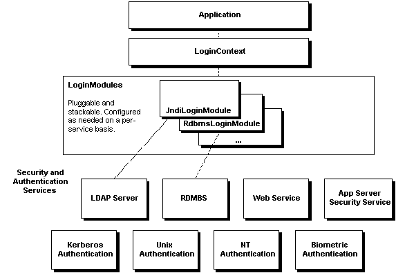
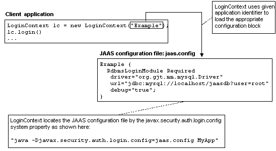

# Scalable Java security with JAAS

URL: https://www.javaworld.com/article/2074873/java-web-development/all-that-jaas.html

JAAS authorization augments the existing **code-centric access controls** with new **user-centric access controls**.

## 1. Java Authentication and Authorization: The big picture

**JAAS** can **simplify your Java security development** by putting **an abstraction layer** between your application and disparate(迥然不同的) underlying authentication and authorization mechanisms. **This independence from platforms and algorithms** allows you to use different security mechanisms without modifying your application-level code. 

> 这段理解出2个意思：  
> （1） JAAS在application和安全机制（underlying authentication and authorization mechanisms）之间提供了一个abstraction layer，使得开发java security简化。  
> （2） JAAS是独立于platform和algorithm的方案，可以使用不同的security mechanisms，而不需要修改代码。  

As with most Java security APIs, **JAAS** achieves this implementation-independence through an extensible framework of pluggable **service provider interfaces (SPIs)**: a set of abstract classes and interfaces to which specific implementations are developed.

> JAAS是基于service provider interfaces (SPIs)，是一个可扩展的框架。  

The following figure below gives **a high-level overview** of **how JAAS achieves this pluggability**. **Your application-layer code** deals primarily with a `LoginContext`. Underneath that `LoginContext` is a set of one or more dynamically configured `LoginModule`s, which handle the actual authentication using the appropriate security infrastructure.



**JAAS** provides some reference `LoginModule` implementations, such as the `JndiLoginModule`; you can also develop your own, as we'll do here with the `RdbmsLoginModule`. We'll also show how you can quickly set up an application with a choice of implementations using **a simple configuration file**.

> 这里体现了JAAS的pluggable特性

In addition to being **pluggable**, **JAAS** is **stackable**: in the context of a single login, **a set of security modules can stack on top of one another**, each called in order and each interacting with a different security infrastructure.

> 这里体现了JAAS的stackable特性。

JAAS's security configuration concepts, including `Policy` files and `Permission`s, come from the J2SE 1.2 security packages. JAAS also borrows ideas from **other established security frameworks**, such as X.509 certificates, from which the name `Subject` is derived.

## 2. Client- and server-side JAAS

You can apply JAAS on both the **client** and the **server**. Using it on **the client side** is straightforward, as we'll demonstrate shortly. On the **server-side** things grow a bit more complex. 

## 3. Core JAAS

This file, `java.security`, is located in the `<jre-home>/lib/security` directory and written in the standard Java properties file format.

Using JAAS authentication from your application typically involves the following steps:

- (1) Create a `LoginContext`
- (2) Optionally pass a `CallbackHandler` to the `LoginContext`, for gathering or processing authentication data
- (3) Perform authentication by calling the `LoginContext`'s `login()` method
- (4) Perform privileged actions using the returned `Subject` (assuming login succeeds)

Here's a minimal example:

```txt
LoginContext lc = new LoginContext("MyExample");
try {
    lc.login();
} catch (LoginException) {
    // Authentication failed.
}
// Authentication successful, we can now continue.
// We can use the returned Subject if we like.
Subject sub = lc.getSubject();
Subject.doAs(sub, new MyPrivilegedAction());
```

Underneath the covers, a few other things occur:

- (1) During **initialization**, the `LoginContext` finds the configuration entry "`MyExample`" in a JAAS configuration file (which you configured) to determine which `LoginModule`s to load 
- (2) During **login**, the `LoginContext` calls each `LoginModule`'s `login()` method
- (3) Each `login()` method performs the authentication or enlists a `CallbackHandler`
- (4) The `CallbackHandler` uses one or more `Callback`s to interact with the user and gather input
- (5) A new `Subject` instance is populated with authentication details such as `Principal`s and credentials

We'll explain further details below, but to begin, let's look at **the key JAAS classes and interfaces** involved in the process. These are typically divided into **the following three groups**:

| Key            | Value                                                        |
| -------------- | ------------------------------------------------------------ |
| Common         | `Subject`, `Principal`, credential (credential is not any specific class, but can be any object) |
| Authentication | `LoginContext`, `LoginModule`, `CallbackHandler`, `Callback` |
| Authorization  | `Policy`, `AuthPermission`, `PrivateCredentialPermission`    |

Most of these classes and interfaces are in the `javax.security.auth` package's subpackages, with some prebuilt implementations in the `com.sun.security.auth` package, included only in J2SE 1.4.

Note: Because we focus on **authentication** in this article, we don't delve into the **authorization** classes.

### 3.1 Common: Subjects, Principals, and Credentials

The `Subject` class represents **an authenticated entity**: an end-user or administrator, or a Web service, device, or another process. The class contains **three sets of security information types**:

- **Identities**: In the form of one or more `Principal`s
- **Public credentials**: Such as name or public keys
- **Private credentials**: Like passwords or private keys

`Principal`s represent `Subject` identities. They implement the `java.security.Principal` interface (which predates JAAS) and `java.io.Serializable`. A `Subject`'s most important method is `getName()`, which returns an identity's string name. Since a `Subject` instance contains an array of `Principal`s, it can thus have multiple names. Because **a social security number, login ID, email address**, and so on, can all represent one user, multiple identities prove common in the real world.

The last element here, **credential**, is not a class or an interface, but can be any object. **Credentials** can include any authentication artifact, such as **a ticket, key, or password**, that specific security systems might require. The `Subject` class maintains unique Sets of **private and public credentials**, which can be retrieved with methods such as `getPrivateCredentials()` and `getPublicCrendentials()`. These methods are more often used by **security subsystems** than at **the application layer**.


### 3.2 Authentication: LoginContext

Your application layer uses `LoginContext` as its primary class for authenticating `Subject`s. `LoginContext` also represents where JAAS's dynamic pluggability comes into play, because when you construct a `LoginContext`, you specify **a named configuration** to load. The `LoginContext` typically loads **the configuration information** from a text file, which in turn tells the `LoginContext` which `LoginModule`s to use during login.

**The three commonly used methods** in `LoginContext` are:

| Key            | Value                                                        |
| -------------- | ------------------------------------------------------------ |
| `login()`      | Performs login, a relatively complex step that invokes all `LoginModule`s specified for this configuration. If it succeeds, it creates an authenticated `Subject`. If it fails, it throws a `LoginException`. |
| `getSubject()` | Returns the authenticated `Subject`.                         |
| `logout()`     | Logs out the authenticated `Subject` and removes its `Principal`s and credentials. |


### 3.3 Authentication: LoginModule

`LoginModule` is the interface to specific authentication mechanisms. J2SE 1.4 ships with a set of ready-to-use `LoginModule`s, including:

| Class             | Memo                                                         |
| ----------------- | ------------------------------------------------------------ |
| `JndiLoginModule` | Verifies against a directory service configured under JNDI (Java Naming and Directory Interface) |
| `Krb5LoginModule` | Authenticates using Kerberos protocols                       |
| `NTLoginModule`   | Uses the current user's NT security information to authenticate |
| `UnixLoginModule` | Uses the current user's Unix security information to authenticate |

Along with these modules comes a set of corresponding concrete `Principal` implementations in the c`om.sun.security.auth` package, such as `NTDomainPrincipal` and `UnixPrincipal`.

The `LoginModule` interface has **five methods**:

| Method         | Info                                                         |
| -------------- | ------------------------------------------------------------ |
| `initialize()` | Called after the `LoginModule` is constructed.               |
| `login()`      | Performs the authentication                                  |
| `commit()`     | Called by the `LoginContext` after it has accepted the results from all `LoginModule`s defined for this application. We assign `Principal`s and credentials to the `Subject` here. |
| `abort()`      | Called when any `LoginModule` for this application fails (even though earlier ones in sequence may have succeeded—thus akin to a 2PC model). No `Principal`s or credentials are assigned to the `Subject`. |
| `logout()`     | Removes the `Principal`s and credentials associated with the `Subject`. |


**The application layer** calls none of these methods directly—the `LoginContext` invokes them as needed. Our example below will elaborate on these methods' implementations.


### 3.4 Authentication: CallbackHandlers and Callbacks

`CallbackHandler`s and `Callback`s let a `LoginModule` gather necessary authentication information from a user or system, while remaining independent of the actual interaction mechanism. We'll leverage that capability in our design—our `RdbmsLoginModule` does not depend on how the user credentials (username/password) are obtained and can thus be used in the different application environments we will illustrate (either from the command line or from a JSP).

JAAS comes with seven built-in `Callback`s in the `javax.security.auth.callback` package: `ChoiceCallback`, `ConfirmationCallback`, `LocaleCallback`, `NameCallback`, `PasswordCallback`, `TextInputCallback`, `TextOutputCallback`. And J2SE 1.4 supplies two `CallbackHandler`s in the `com.sun.security.auth.callback` package: `DialogCallbackHander` and `TextCallbackHandler`. Many `Callback`s resemble each other, and all are oriented towards client-side scenarios. We'll show you below how to develop your own `CallbackHandler` later.


### 3.5 Configuration files

As we mentioned, **much of JAAS's extensibility** comes from its ability to be **dynamically configured**. **This configuration** is typically specified through **a text file** consisting of **one or more configuration blocks**, called **applications**. Each **application** is a set of one or more specified `LoginModule`s.

When your code instantiates a `LoginContext`, you pass it **the name of one of the application blocks in the configuration file**. The `LoginContext` will use `LoginModule`s based on what you specify in the application entry. These specifications drive which `LoginModule`s are invoked, in which order, and according to which rules.

The configuration file has the following structure:

```txt
      Application {
          ModuleClass  Flag    ModuleOptions;
          ModuleClass  Flag    ModuleOptions;
          ...
      };
      Application {
          ModuleClass  Flag    ModuleOptions;
          ...
      };
      ...
```

Here's an example of an application block named `Sample`:

```txt
Sample {
    com.sun.security.auth.module.NTLoginModule Required debug=true;
};
```

This basic application specifies that a `LoginContext` should use the `NTLoginModule` for authentication. The class name is specified in the `ModuleClass` entry. 

The `Flag` entry controls **the login behavior** when multiple modules exist for a single block. `Flag`'s four allowable values: `Required`, `Sufficient`, `Requisite`, and `Optional`. The most common is `Required`, which means the module is always called, and its authentication must pass for the overall authentication to succeed. The `Flag` field's idiosyncrasies(特质；独特性) can grow complex, and, since we're using only one module per block in our example, we won't go into elaborate detail here.

The `ModuleOptions` entry allows any number of module-specific variables to be specified in **name-value pairs**. For example, many prebuilt login modules let you specify a `debug` flag such as `debug=true` to see diagnostic output sent to `System.out`.

**The configuration file** can have any **name** and **location**. A running JAAS framework locates it using the `java.security.auth.login.config` system property. Running our sample application, `JaasTest`, with a configuration file called `jaas.config`, we would specify the location on the command line as follows: 

```bash
java -Djava.security.auth.login.config=jaas.config JaasTest.
```

Figure 2 demonstrates the relationship among these configuration elements.




- subject 主体
- object 客体
- Principal 

**Subject** is any entity that requests access to an **object**. 

**Subject** is the entity that requests a service. It can be a **user** or a **process**. Probably that is why the name Subject was chosen instead of user.

When a subject tries to access a service, the subject has to be authenticated first. Successful authentication ends with loading the **Security Principals** for that Subject. For example, in a Role Based Access Control system, an authenticated (logged-in) user will usually have two principals - userId and roleId. In such systems, the privileges(i.e who can access what) are specified for both roles and for users. During authorization(i.e checking whether the requested service should be permitted), the security system will check for accessibility against both the principals.

**Subjects** may potentially have multiple **identities**. Each **identity** is represented as a **Principal** within the **Subject**. **Principals** simply bind names to a **Subject**. For example, a Subject that happens to be a person, Alice, might have two Principals: one which binds "Alice Bar", the name on her driver license, to the Subject, and another which binds, "999-99-9999", the number on her student identification card, to the Subject. Both Principals refer to the same Subject even though each has a different name.


我想到一个例子：在古代，当官的，有管理钱财的、有管兵马的，


## Reference:

- [JAAS Tutorials](https://www.cs.mun.ca/java-api-1.5/guide/security/jaas/tutorials/)


